# 05 — Data Analysis (exploration)

*Que montrent les données, avant tout indicateur ?*

Ce document correspond à l'étape 07 de la procédure : l'exploration. Il lit les tables préparées par le 04 (`data/processed/`) pour décrire l'offre, la population et les tendances nationales, mesurer les écarts entre territoires et formuler des hypothèses. La procédure en donne la clé : **chercher les écarts, pas les moyennes**, en testant cinq contradictions (section 7).

La référence reste la liste des 5 objectifs de `_PROJECT.txt`. Chaque constat de la section 8 dit quel objectif il éclaire.

**Ce que le 05 ne fait pas** :

- aucune carte : c'est l'objet du 06 (analyse spatiale). **Cartes à produire dans le 06**, pour l'objectif 3, par région, préfecture et commune : points par type (O3-01) ; part des points face à la part de population (O3-02, choroplèthe) ; points mobile money et leur densité (O3-03) ; structure par opérateur des points mobile money et emplacement des DAB. Les effectifs sont prêts dans [s2_offre_par_prefecture] et [s2_offre_par_commune]. **Réalisées dans le 06** (cartes 1 à 8) ;
- aucune classe du 02 appliquée (seuils de O4-01, statut O4-05, bascule haut débit…) : c'est l'étape des indicateurs ;
- aucun score : il n'arrive qu'à l'étape du score (procédure, étape 09).

**Reproductible** : `python3 analyse/p05_eda.py` puis `python3 analyse/figures_05.py`. Chaque chiffre cité renvoie à une table de `data/analysis/05_eda/` (nom entre crochets) ; chaque figure a sa table.

---

## Sommaire

1. Données et règles de lecture
2. L'offre de services
3. La population
4. Les séries nationales
5. Les disparités territoriales
6. Les relations entre variables
7. Les cinq contradictions de la procédure
8. Premiers constats et hypothèses
9. Points à valider

---

## 1. Données et règles de lecture

| Table (04)                                             | Maille                                               | Ce qui est lu                                                                       | Preuve                                                          |
| ------------------------------------------------------ | ---------------------------------------------------- | ----------------------------------------------------------------------------------- | --------------------------------------------------------------- |
| `terr_commune`, `terr_prefecture`, `terr_region` | 117 communes, 39 préfectures, 6 unités régionales | points par type, population (RGPH-5 2022), superficie, couverture 3i                | A (comptages), C (3i)                                           |
| `points_service`                                     | 20 805 points                                        | opérateurs des points mobile money                                                 | A                                                               |
| `serie_nationale`                                    | national, annuel et trimestriel                      | usage d'Internet, abonnements, technologies, CA, investissement, prix, mobile money | A (ARCEP), C (UIT, INSEED publiés)                             |
| `enquetes_region`                                    | national, milieu, région                            | accès et usage d'Internet, mobile banking, alphabétisation                        | B (EHCVM, calculé par nous), C (Afrobaromètre, Findex, MICS6) |
| `benchmark`                                          | pays, agrégats                                      | Afrique subsaharienne, UEMOA                                                        | C                                                               |

**Règles de lecture** :

1. **Les ratios sont descriptifs.** Un territoire sans point a un ratio « habitants par point » **non défini**, jamais 0 ni infini ; il est compté à part.
2. **Un dénominateur par ratio** : population totale pour les points formels (comme O4-01) ; 15 ans et plus pour les points mobile money et les DAB (comme O4-04 et O4-02). Tous viennent du RGPH-5.
3. **Les points sont un stock de 2021/2022** (campagne PRISE) : ils ne décrivent pas l'état actuel.
4. **Les sources d'enquête ne se comparent pas entre elles** : chacune a sa définition et sa population de référence.
5. **Les seuils utilisés en section 7** (quartiles) servent à explorer ; ce ne sont pas ceux du 02.
6. **Pas de sigle seul sur les figures.** Le texte garde les sigles des sources et des décisions (D4, S6, V5…) ; les figures donnent le sens en clair : « points formels (banques, microfinance, assurances) », « distributeurs automatiques de billets (DAB) », « rupture de série » plutôt que « S6 ».

**Vocabulaire** :

- **Point formel** : agence ou guichet en service d'une banque, d'une institution de microfinance (IMF) ou d'une compagnie d'assurance (D4). Les DAB n'en font pas partie (DD7 du 04).
- **Site de DAB** : lieu où se trouve au moins un distributeur automatique de billets (4c). On compte des sites, pas des appareils.
- **Point mobile money** : lieu où un agent mobile money sert la clientèle (D5). Un lieu servi par les deux opérateurs compte une fois (12 649 cas sur 19 788).

---

## 2. L'offre de services

**Effectifs nationaux** [s2_offre_nationale] :

| Type                                                  | Points        | Part du Grand Lomé | Communes à zéro (sur 117) | Préfectures à zéro (sur 39) |
| ----------------------------------------------------- | ------------- | ------------------- | --------------------------- | ------------------------------ |
| Banques                                               | 212           | 41,0 %              | 67                          | 9                              |
| Institutions de microfinance (IMF)                    | 382           | 32,2 %              | 23                          | 1                              |
| Assurances                                            | 62            | 83,9 %              | 105                         | 33                             |
| **Points formels** (banques + IMF + assurances) | **656** | **39,9 %**    | **22**                | **1** (Kpendjal)         |
| Sites de distributeurs automatiques de billets (DAB)  | 184           | 58,2 %              | 81                          | 17                             |
| Points mobile money                                   | 19 788        | 32,9 %              | 0                           | 0                              |
| Poste (variante)                                      | 84            | 33,3 %              | 53                          | 4                              |

Pour comparaison, le Grand Lomé compte 27,0 % de la population. Les assurances n'existent que dans trois unités régionales : Grand Lomé (52), Kara (7), Plateaux (3). La Centrale, les Savanes et Maritime hors Grand Lomé n'en ont aucune.

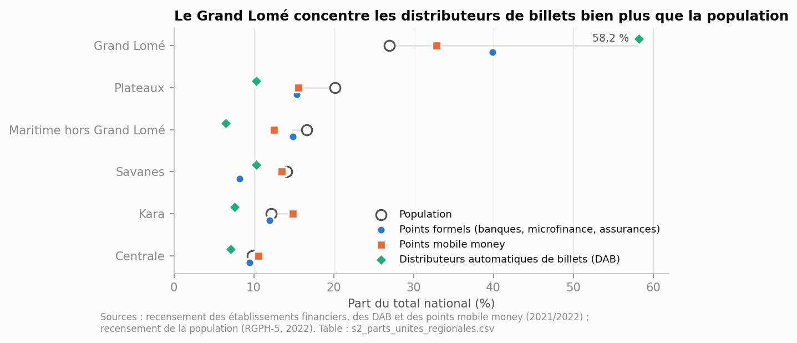

*Figure 1 [s2_parts_unites_regionales]. Le Grand Lomé concentre 58,2 % des sites de distributeurs automatiques de billets et 39,9 % des points formels pour 27,0 % de la population. Les Plateaux sont l'inverse : 20,2 % de la population, 15,4 % des points formels, 10,3 % des sites de DAB.*

**Concentration** [s2_concentration, s2_top_communes_formels]. **L'indice de Gini mesure l'inégalité de la répartition des points de service par rapport à la population.** Il vaut 0 quand chaque commune a la même part des points que de la population ; plus il s'approche de 1, plus les points se concentrent dans quelques communes. La courbe de concentration le montre : elle range les communes de la moins à la mieux dotée par habitant, et plus elle s'écarte de la diagonale, plus la répartition est inégale. L'encadré de la figure 2 reprend cette définition.

| Type                | Gini (communes) | Gini (préfectures) |
| ------------------- | --------------- | ------------------- |
| Points mobile money | 0,38            | 0,31                |
| Points formels      | 0,43            | 0,28                |
| Sites de DAB        | 0,70            | 0,57                |

Lecture : les sites de DAB sont de loin les plus inégalement répartis (0,70 entre communes). Points formels et points mobile money sont proches, et leur ordre s'inverse selon la maille (0,43 contre 0,38 entre communes, 0,28 contre 0,31 entre préfectures) : on ne conclut pas que l'un est plus concentré que l'autre.

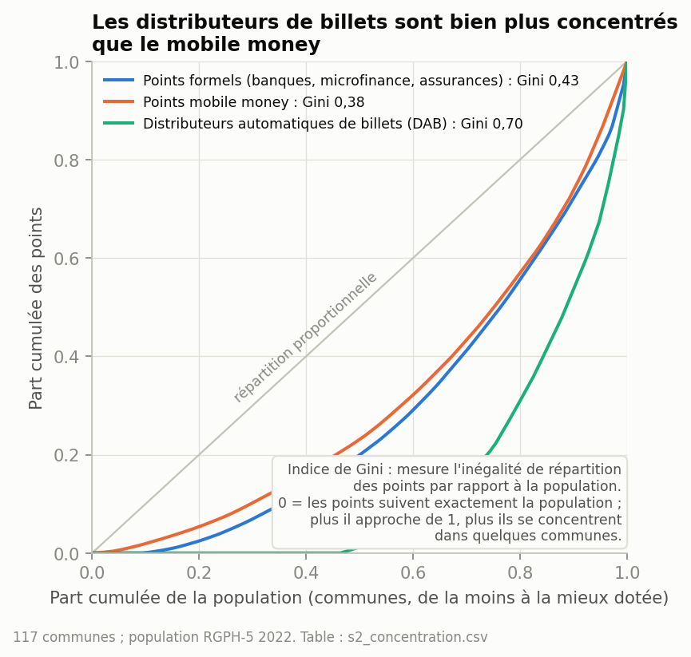

*Figure 2. Les 10 communes qui comptent le plus de points formels (dont 6 du Grand Lomé) ont 44,1 % des points formels pour 25,0 % de la population ; les 5 premières, 29,6 % des points pour 13,3 % de la population.*

**Par type et par unité régionale** [s2_parts_unites_regionales] :

| Unité                    | Population          | Banques       | IMF           | Assurances   | Points formels | Sites de DAB  | Points mobile money |
| ------------------------- | ------------------- | ------------- | ------------- | ------------ | -------------- | ------------- | ------------------- |
| Grand Lomé               | 2 188 376           | 87            | 123           | 52           | 262            | 107           | 6 519               |
| Plateaux                  | 1 635 946           | 22            | 76            | 3            | 101            | 19            | 3 079               |
| Maritime hors Grand Lomé | 1 346 615           | 26            | 72            | 0            | 98             | 12            | 2 467               |
| Savanes                   | 1 143 520           | 22            | 32            | 0            | 54             | 19            | 2 679               |
| Kara                      | 985 512             | 35            | 37            | 7            | 79             | 14            | 2 951               |
| Centrale                  | 795 529             | 20            | 42            | 0            | 62             | 13            | 2 093               |
| **Togo**            | **8 095 498** | **212** | **382** | **62** | **656**  | **184** | **19 788**    |

Les IMF sont le premier type de point formel dans chaque unité, Grand Lomé compris. Hors du Grand Lomé, elles font deux points formels sur trois (259 sur 394). Les mêmes effectifs existent par préfecture (39 lignes) et par commune (117 lignes) [s2_offre_par_prefecture, s2_offre_par_commune], avec la structure par opérateur et l'emplacement des DAB. Ils serviront aux cartes du 06 et au tableau de bord.

**Réseau mobile money par opérateur** [s2_mm_operateurs] :

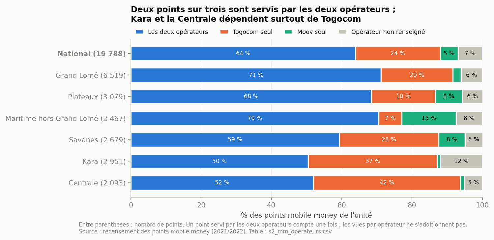

*Figure 12. Les vues par opérateur ne s'additionnent pas : un point servi par les deux opérateurs compte une fois (DD2 du 04).*

- **Au niveau national** : 12 649 points (63,9 %) sont servis par les deux opérateurs, 4 773 (24,1 %) par Togocom seul, 1 018 (5,1 %) par Moov seul ; 1 348 (6,8 %) n'ont pas d'opérateur renseigné. Togocom est présent dans 88,0 % des points, Moov dans 69,1 %.
- **Kara et la Centrale reposent surtout sur Togocom** : Moov n'y est présent que dans 51,3 % et 53,0 % des points, et Togocom seul en sert 36,8 % et 41,9 %. Le Maritime hors Grand Lomé est l'inverse : 15,4 % des points n'ont que Moov.
- **Kara a la part la plus forte d'opérateurs non renseignés** (11,8 %) : sa structure est la moins sûre. Ces points restent une catégorie à part, jamais répartie entre les opérateurs.
- À la commune, une seule (Tchaoudjo 4) a moins de 20 % de points Moov (section 7, contradiction 5).

**Emplacement des DAB** [s2_dab_emplacement] :

| Unité                    | Dans une banque | Indépendants | Dans un autre établissement | Total         |
| ------------------------- | --------------- | ------------- | ---------------------------- | ------------- |
| Grand Lomé               | 61              | 41            | 5                            | 107           |
| Plateaux                  | 14              | 5             | 0                            | 19            |
| Savanes                   | 16              | 3             | 0                            | 19            |
| Kara                      | 12              | 2             | 0                            | 14            |
| Centrale                  | 13              | 0             | 0                            | 13            |
| Maritime hors Grand Lomé | 10              | 2             | 0                            | 12            |
| **Togo**            | **126**   | **53**  | **5**                  | **184** |

41 des 53 DAB indépendants (77 %) sont dans le Grand Lomé. Hors du Grand Lomé, 65 DAB sur 77 (84 %) sont dans une banque : ils doublent l'agence plus qu'ils n'étendent l'accès. La Centrale n'a aucun DAB indépendant. Rappel : un DAB installé dans une banque n'est pas compté comme un second point formel (DD7 du 04).

---

## 3. La population

**Par unité régionale** [s3_population_unites_regionales] :

| Unité                    | Population | Part   | 15 ans et plus | Part urbaine | Densité (hab/km²) |
| ------------------------- | ---------- | ------ | -------------- | ------------ | ------------------- |
| Grand Lomé               | 2 188 376  | 27,0 % | 65,6 %         | 100 %        | 5 296               |
| Plateaux                  | 1 635 946  | 20,2 % | 56,1 %         | 22,6 %       | 96                  |
| Maritime hors Grand Lomé | 1 346 615  | 16,6 % | 57,7 %         | 13,8 %       | 226                 |
| Savanes                   | 1 143 520  | 14,1 % | 51,7 %         | 21,2 %       | 134                 |
| Kara                      | 985 512    | 12,2 % | 56,0 %         | 28,9 %       | 87                  |
| Centrale                  | 795 529    | 9,8 %  | 56,3 %         | 25,5 %       | 59                  |

Le Grand Lomé réunit 27,0 % de la population sur 0,7 % du territoire. Les Savanes ont la population la plus jeune (51,7 % d'adultes) : un ratio par adulte y pèse autrement qu'un ratio par habitant.

**Par commune** [s3_distribution_population] : de 9 933 à 351 550 habitants ; densité médiane de 105 hab/km² (de 28 à 11 493).

**Par strate** [s3_strates] :

| Strate (seuil 50 %) | Communes | Part de la population | Part des points formels | Part des points mobile money | Part des DAB |
| ------------------- | -------- | --------------------- | ----------------------- | ---------------------------- | ------------ |
| Grand Lomé         | 13       | 27,0 %                | 39,9 %                  | 32,9 %                       | 58,2 %       |
| Autres villes       | 13       | 16,0 %                | 22,9 %                  | 30,6 %                       | 30,4 %       |
| Rural               | 91       | 56,9 %                | 37,2 %                  | 36,5 %                       | 11,4 %       |

---

## 4. Les séries nationales

### 4.1 Usage d'Internet

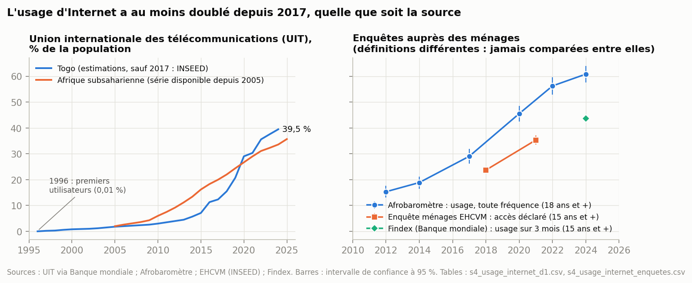

*Figure 4 [s4_usage_internet_d1, s4_usage_internet_enquetes].*

- **Série de l'UIT** (D1, estimations sauf 2017, niveau C) : elle couvre 1990-2024. L'usage est nul de 1990 à 1995 ; **les premiers utilisateurs apparaissent en 1996** (0,01 % de la population), puis 0,8 % en 2000, 1,8 % en 2005, 12,4 % en 2017 et 39,5 % en 2024 (× 3,2 depuis 2017). La figure part donc de 1996. L'agrégat Afrique subsaharienne de la Banque mondiale ne commence qu'en 2005 (rien avant dans la réponse de l'API, interrogée sur 2000-2025) ; le Togo passe au-dessus en 2020.
- **Avant 2005, les taux de croissance ne sont pas lus** : ils portent sur des niveaux inférieurs à 2 % (+1 836 % en 1997). Celui de 1996 est non défini (départ de zéro).
- **Croissance annuelle** : +33,7 % (2019), +40,0 % (2020), puis +4,5 % (2021), +17,4 % (2022), +5,5 % (2023), +5,1 % (2024). Le rythme ralentit nettement après 2020, **sur une série estimée**. La lecture en classes relève de O1-02 : elle est faite dans le 07, sur la période 2010-2024 (P1, validé). Accélérations en 2016 et 2020, ralentissements en 2021, 2023 et 2024 ; seules 2016 et 2021 gardent leur classe sur 2015-2024.
- **Enquêtes**, chacune avec sa définition :
  - Afrobaromètre (usage, toute fréquence, 18 ans et plus) : 29,0 % (2017), 45,5 % (2020), 60,8 % (2024), soit × 2,1 depuis 2017. La hausse ralentit aussi, mais plus tard que dans la série de l'UIT : +16,2 % par an de 2017 à 2020, +11,2 % de 2020 à 2022 (proche de sa moyenne, +11,5 %), +4,0 % de 2022 à 2024 [07 : o1_02_enquetes_periodes] ;
  - EHCVM (accès déclaré, 15 ans et plus) : 23,7 % (2018/19), 35,3 % (2021/22) ;
  - Findex (usage sur 3 mois, 15 ans et plus, définition de O1-01) : 43,7 % (2024) ;
  - MICS6 (usage sur 3 mois, 15-49 ans, 2017) : 14,1 % des femmes, 27,6 % des hommes.

**Face aux pays de l'UEMOA** [s4_benchmark_usage_internet] : la figure 4 compare déjà le Togo à la moyenne de l'Afrique subsaharienne ; la figure 11 ajoute les 7 autres pays de l'UEMOA (source C5b, décision S1 du 03).

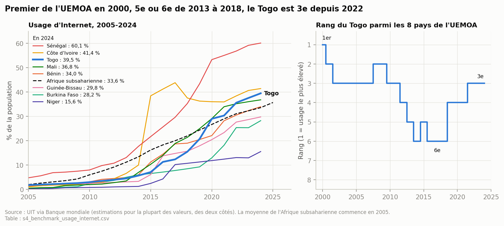

*Figure 11. Une couleur par pays ; le Togo en trait épais ; légende triée par valeur 2024. Le Togo est premier de l'UEMOA en 2000 (0,8 %), 2e ou 3e jusqu'en 2011, puis 5e ou 6e de 2013 à 2018 : ses voisins progressent plus vite pendant cette période. Il remonte à la 4e place en 2019 et à la 3e depuis 2022 (39,5 % en 2024, derrière le Sénégal, 60,1 %, et la Côte d'Ivoire, 41,4 %).*

Limite : des deux côtés, la plupart des valeurs sont des estimations de l'UIT (niveau C). Les rangs comparent des estimations entre elles, pas des mesures. La ligne de référence à 40 % (seuil de O1-01, hypothèse du sujet) sera ajoutée à l'étape des indicateurs.

### 4.2 Abonnements et technologies

[s4_abonnements_data, s4_mix_technologique_T4]

| Année           | Abonnements data mobile | Pour 100 habitants (IN1) | Part du haut débit | Croissance |
| ---------------- | ----------------------- | ------------------------ | ------------------- | ---------- |
| 2017 (2b)        | 2 605 249               | 36,3                     | 77,4 %              | +71,2 %    |
| 2019 (ARCEP, T4) | 4 671 179               | 62,1                     | 71,1 %              | +27,6 %    |
| 2020             | 4 891 899               | 63,5                     | 62,9 %              | +4,7 %     |
| 2021             | 4 651 596               | 59,0                     | 63,7 %              | -4,9 %     |
| 2022             | 4 870 282               | 60,4                     | 69,0 %              | +4,7 %     |
| 2025             | 6 346 056               | 73,6                     | 81,3 %              | +12,8 %    |

Les abonnements plafonnent de 2020 à 2022, au moment où deux ruptures touchent la série : le reclassement de la 3G de Togocel au T1 2020 (S6) et la révision de 2021 par l'ARCEP. **Abonnements et usage ne se comparent pas en taux** (bases différentes, P3) : 73,6 abonnements pour 100 habitants en 2025 ne disent pas que 73,6 % des habitants utilisent Internet.

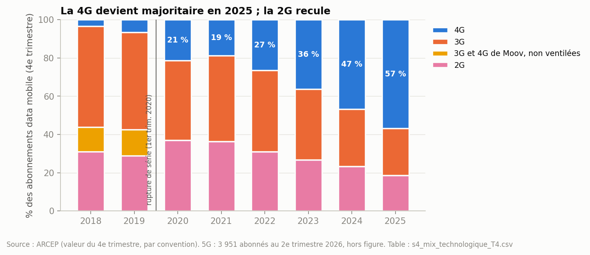

*Figure 5. La 4G passe de 3,4 % des abonnements (T4 2018) à 56,9 % (T4 2025) ; la 2G, de 31,0 % à 18,7 %. Avant 2020, la 3G et la 4G de Moov ne sont pas ventilées.*

**Passage à la fibre** [s4_fibre] :

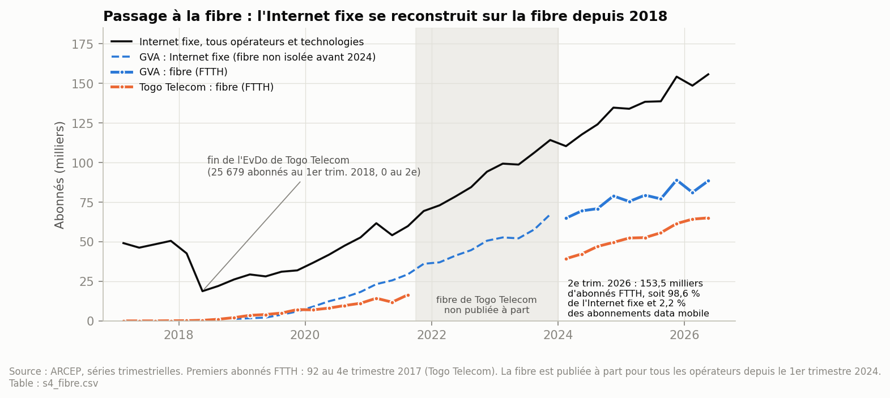

*Figure 13. Séries trimestrielles de l'ARCEP.*

- **L'Internet fixe se reconstruit sur la fibre.** Il chute au 2e trimestre 2018 (de 42 633 à 18 767 abonnés), quand l'EvDo de Togo Telecom s'arrête (25 679 abonnés, puis 0). Il remonte ensuite jusqu'à 155 708 abonnés au 2e trimestre 2026.
- **La fibre (FTTH) en fait désormais presque tout** : 153 499 abonnés au 2e trimestre 2026, soit 98,6 % de l'Internet fixe (94,4 % au 1er trimestre 2024). GVA en compte 88 440 (58 %) et Togo Telecom 65 059.
- **Chronologie** : 92 premiers abonnés chez Togo Telecom au 4e trimestre 2017, 16 484 au 3e trimestre 2021. GVA entre sur le marché fin 2018 ; tout son Internet fixe est en fibre quand l'ARCEP la publie à part, depuis 2024.
- **Mais la fibre reste marginale face au mobile** : 2,2 % des abonnements data mobile.
- **Limites** : la fibre de Togo Telecom n'est pas publiée à part du 4e trimestre 2021 au 4e trimestre 2023. Celle de GVA ne l'est pas avant 2024 : on affiche son Internet fixe, sans le supposer égal à sa fibre.

### 4.3 Marché : parts, chiffre d'affaires, investissement, prix

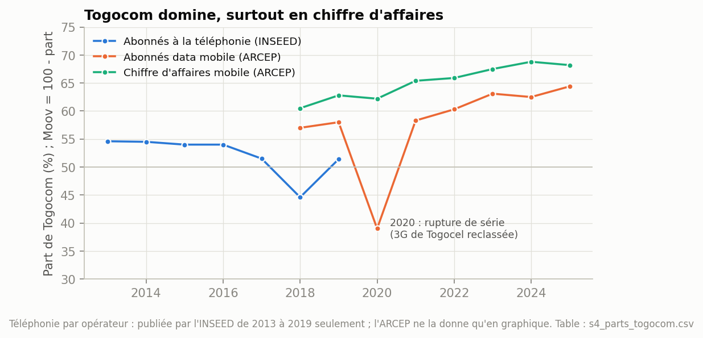

*Figure 6 [s4_parts_togocom]. Togocom détient 64,4 % des abonnements data et 68,2 % du CA mobile en 2025. Le creux de 2020 (39,0 %) est un artefact de la rupture S6, pas un mouvement du marché. Les parts en abonnés à la téléphonie s'arrêtent en 2019 (D3 ; décision V5 du 04).*

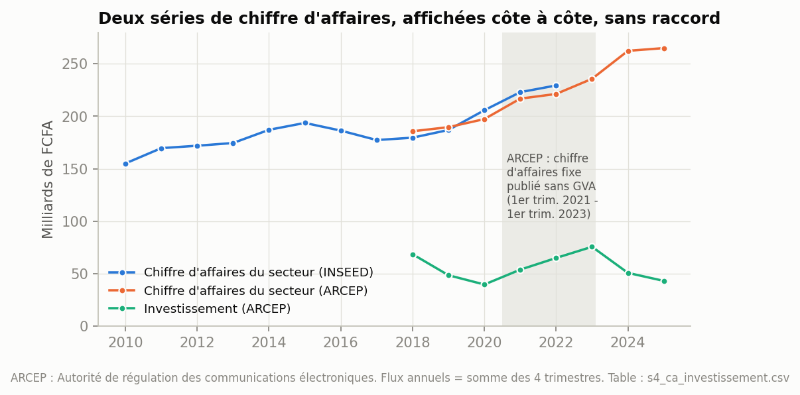

*Figure 7 [s4_ca_investissement]. CA du secteur (ARCEP) : 185,6 Md FCFA en 2018, 264,9 en 2025 (+43 %). Investissement : 68,5 (2018), 39,7 (2020), 75,6 (2023), 43,1 (2025). Du T1 2021 au T1 2023, l'ARCEP publie le CA fixe sans GVA, qui pèse de 2,4 à 3,3 Md FCFA par trimestre quand il est inclus : une partie des hausses de 2023 (+6,5 %) et de 2024 (+11,3 %) tient à son retour dans le total.*

**Prix** [s4_paniers_uit, s4_indice_communication] :

- 1 Go de data mobile : 5,85 % du RNB mensuel par habitant (2023), 5,45 % (2024), 5,30 % (2025). Le panier de 2 Go passe de 11,37 % (2021) à 5,68 % (2025). Chaque panier se lit séparément (décision V6).
- Indice des prix de la communication (moyenne annuelle) : 91,7 (2019), 95,9 (2020), 101,8 (2021). Le saut de 2020 n'est pas lu comme une hausse des prix tant que sa cause n'est pas vérifiée (S7).

### 4.4 Mobile money

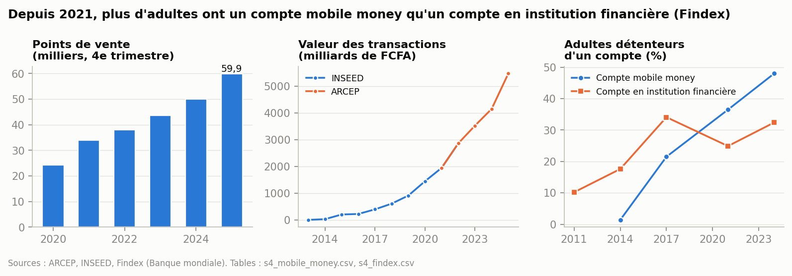

*Figure 8 [s4_mobile_money, s4_findex].*

- **Points de vente** (ARCEP, T4) : 24 289 (2020), 59 855 (2025), × 2,5.
- **Valeur des transactions** : 1 948 Md FCFA (2021), 5 481 (2025), × 2,8. Dans 2b, elle part de 0,75 Md en 2013.
- **Comptes** (ARCEP, T4) : 2,61 millions (2021), 5,10 millions (2025) ; rupture au T1 2021 (révision de l'ARCEP).
- **Findex** : les adultes titulaires d'un compte mobile money passent de 1,4 % (2014) à 48,0 % (2024). Depuis 2021, ils sont plus nombreux que ceux qui ont un compte en institution financière (32,4 % en 2024). Ce dernier taux baisse de 34,1 % (2017) à 24,9 % (2021), un recul à vérifier.
- **EHCVM** : 16,0 % des adultes ont un compte de mobile banking (2018/19) ; 36,9 % font du mobile banking (2021/22). Les deux questions diffèrent : ce n'est pas une tendance.

---

## 5. Les disparités territoriales

**Distribution des ratios** [s5_distribution_ratios] :

| Ratio                                                                       | Maille      | Non défini | Minimum | 1er quartile | Médiane | 3e quartile | Maximum | P90 / P10 |
| --------------------------------------------------------------------------- | ----------- | ----------- | ------- | ------------ | -------- | ----------- | ------- | --------- |
| Habitants par point formel                                                  | commune     | 22          | 1 702   | 8 914        | 14 420   | 23 357      | 101 866 | 6,0       |
| Habitants par point formel                                                  | préfecture | 1           | 6 528   | 10 875       | 14 053   | 22 543      | 73 830  | 3,6       |
| Points mobile money pour 10 000 adultes                                     | commune     | 0           | 2,4     | 18,7         | 31,7     | 48,3        | 121,6   | 5,0       |
| Points mobile money pour 10 000 adultes                                     | préfecture | 0           | 9,7     | 21,4         | 29,5     | 53,7        | 102,0   | 3,7       |
| Points mobile money par point formel (≈ agents par guichet, voir plus bas) | commune     | 22          | 4,5     | 18,9         | 28,0     | 44,3        | 101,0   | 7,0       |

Les écarts entre communes (P90 / P10 de 5 à 7) sont plus forts qu'entre préfectures (3,6 à 4,0) : la moyenne préfectorale en efface une partie.

**Préfectures extrêmes** [s5_extremes_prefectures] :

- points formels pour 10 000 habitants : Kpendjal (0), Akébou (0,14), Est-Mono (0,18) contre Golfe (1,53), Sotouboua (1,30), Cinkassé (1,24) ;
- points mobile money pour 10 000 adultes : Kpendjal (9,7), Blitta (9,8), Mô (11,8) contre Tchaoudjo (102,0), Kozah (85,4), Cinkassé (77,3).

**Par unité régionale** [s5_unites_regionales_ratios] :

| Unité                    | Habitants par point formel | Points mobile money pour 10 000 adultes | DAB pour 100 000 adultes | Points mobile money par point formel |
| ------------------------- | -------------------------- | --------------------------------------- | ------------------------ | ------------------------------------ |
| Grand Lomé               | 8 353                      | 45,4                                    | 7,45                     | 24,9                                 |
| Kara                      | 12 475                     | 53,5                                    | 2,54                     | 37,4                                 |
| Centrale                  | 12 831                     | 46,7                                    | 2,90                     | 33,8                                 |
| Maritime hors Grand Lomé | 13 741                     | 31,7                                    | 1,54                     | 25,2                                 |
| Plateaux                  | 16 197                     | 33,6                                    | 2,07                     | 30,5                                 |
| Savanes                   | 21 176                     | 45,3                                    | 3,21                     | 49,6                                 |
| **Togo**            | **12 341**           | **41,9**                          | **3,90**           | **30,2**                       |

**Agents mobile money par guichet financier (objectif 4)** : c'est la dernière colonne. Trois précisions sur le glissement de libellé :

- **Des lieux, pas des agents.** L'objectif parle d'agents ; le recensement D5 compte des lieux (décision A8). Un lieu peut abriter un agent de chaque opérateur : 19 788 lieux, mais 31 089 si l'on compte chaque opérateur séparément. Le ratio en lieux est donc un minimum du ratio en agents.
- **Le guichet financier est le point formel** : banque, IMF ou assurance. Les DAB n'en font pas partie (DD7 du 04).
- **Le ratio n'est pas défini là où il n'y a aucun guichet** : ce sont les 22 communes desservies uniquement par le mobile money (section 7). Les seuils de O4-03 (moins de 5, de 5 à 20, plus de 20) s'appliqueront à l'étape des indicateurs.

**Nombre de types présents** (banque, IMF, assurance, DAB) [s5_diversite_types] :

| Types présents | Communes | Part de la population | Préfectures | Part de la population |
| --------------- | -------- | --------------------- | ------------ | --------------------- |
| 0               | 22       | 9,4 %                 | 1 (Kpendjal) | 1,1 %                 |
| 1               | 43       | 25,8 %                | 7            | 8,2 %                 |
| 2               | 18       | 13,4 %                | 10           | 17,7 %                |
| 3               | 23       | 29,5 %                | 15           | 33,7 %                |
| 4               | 11       | 21,9 %                | 6            | 39,3 %                |

Seules 11 communes, qui réunissent 21,9 % de la population, ont les quatre types. Un habitant sur trois (35,2 %) vit dans une commune qui en a au plus un. Ce sont des effectifs : la règle « diversité = 4 » de O4-05 est une classe, appliquée à l'étape des indicateurs.

**Par strate** [s5_strates_ratios] :

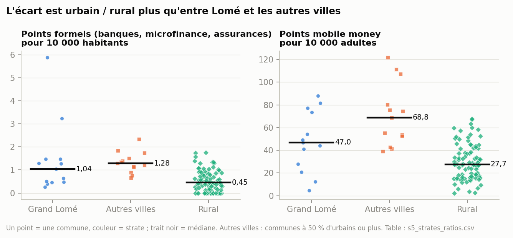

*Figure 3. Un point par commune, une couleur et une forme par strate (bleu : Grand Lomé ; orange : autres villes ; vert : rural) ; le trait noir est la médiane des communes de la strate.*

Deux lectures, qui ne se confondent pas [s5_strates_ratios] :

| Strate        | Points formels pour 10 000 habitants : agrégé / médiane des communes | Points mobile money pour 10 000 adultes : agrégé / médiane | Sites de DAB pour 100 000 adultes : agrégé / médiane |
| ------------- | ----------------------------------------------------------------------- | ------------------------------------------------------------- | ------------------------------------------------------- |
| Grand Lomé   | 1,20 / 1,04                                                             | 45,4 / 47,0                                                   | 7,45 / 4,20                                             |
| Autres villes | 1,15 / 1,28                                                             | 78,7 / 68,8                                                   | 7,28 / 7,63                                             |
| Rural         | 0,53 / 0,45                                                             | 28,7 / 27,7                                                   | 0,83 / 0                                                |

L'agrégé rapporte le total des points de la strate à sa population ; la médiane décrit la commune du milieu. Les deux placent le rural loin derrière. En revanche, l'ordre entre le Grand Lomé et les autres villes s'inverse pour les points formels selon la lecture : aucune des deux strates urbaines n'est « mieux dotée » que l'autre. En milieu rural, la médiane des sites de DAB est nulle : 77 communes rurales sur 91 n'en ont aucun.

**Enquêtes par région** (EHCVM 2021/22, 15 ans et plus) [s5_enquetes_regions] :

| Région     | Accès à Internet déclaré | Mobile banking | Alphabétisation |
| ----------- | ---------------------------- | -------------- | ---------------- |
| Grand Lomé | 66,7 %                       | 57,4 %         | 90,2 %           |
| Maritime    | 25,3 %                       | 31,6 %         | 69,0 %           |
| Centrale    | 25,6 %                       | 19,9 %         | 67,8 %           |
| Plateaux    | 19,6 %                       | 30,0 %         | 68,8 %           |
| Kara        | 21,2 %                       | 28,5 %         | 60,2 %           |
| Savanes     | 14,3 %                       | 23,5 %         | 41,2 %           |

Intervalles de confiance de ± 2 à 5 points ; coefficients de variation de 3 à 13 %, sous le seuil de 30 % du 02.

---

## 6. Les relations entre variables

**Corrélations de rang de Spearman** [s6_correlations_spearman] :

| Relation                                             | Communes (117) | Préfectures (39)      |
| ---------------------------------------------------- | -------------- | ---------------------- |
| Population ↔ points formels                         | 0,64           | 0,76                   |
| Population ↔ points mobile money                    | 0,70           | 0,67                   |
| Points formels ↔ points mobile money                | 0,77           | 0,79                   |
| Densité ↔ points mobile money au km²              | 0,84           | 0,84                   |
| Part urbaine ↔ points formels pour 10 000 habitants | 0,50           | 0,56                   |
| Points formels ↔ mobile money, par habitant         | 0,50           | 0,54                   |
| Couverture 3i ↔ densité                            | —             | 0,69 (36 préfectures) |
| Couverture 3i ↔ mobile money pour 10 000 adultes    | —             | 0,35 (36 préfectures) |

- **L'offre suit la population, mais pas proportionnellement** : les territoires les plus peuplés ont plus de points, sans en avoir plus par habitant.
- **Le mobile money suit l'offre formelle** : là où il y a beaucoup de points formels par habitant, il y a aussi beaucoup de points mobile money (0,50). Il ne s'y substitue que là où l'offre formelle est absente (22 communes, section 7).
- **La couverture 3i suit la densité** (0,69) bien plus que l'offre de mobile money (0,35). C'est un proxy de niveau C, sans 3 préfectures non déterminables.

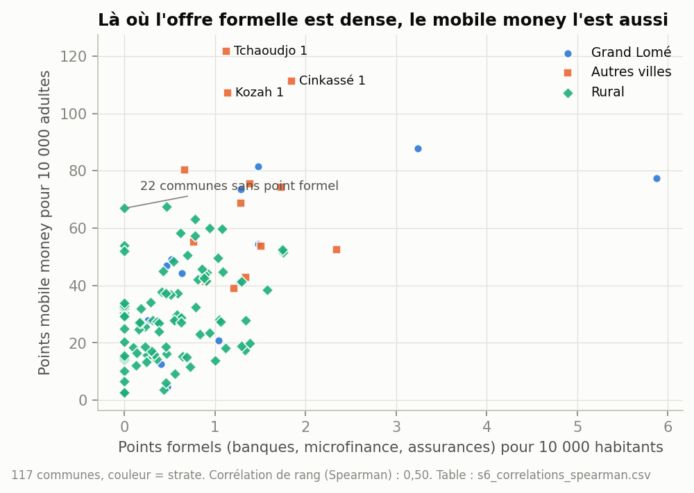

*Figure 10. Un point par commune, couleur et forme selon la strate (bleu : Grand Lomé ; orange : autres villes ; vert : rural). Tchaoudjo 1, Cinkassé 1 et Kozah 1, communes urbaines hors Lomé, ont les plus fortes densités de mobile money. Les 22 communes sans point formel, toutes rurales, sont alignées sur l'axe vertical.*

**Offre et usage du mobile money, par région** [s6_offre_demande_regions] :

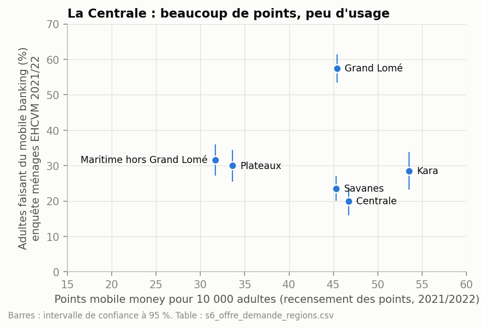

*Figure 9. À offre voisine (45 à 47 points pour 10 000 adultes), le Grand Lomé déclare 57,4 % d'usage et la Centrale 19,9 %. Six points seulement : c'est un constat, pas une corrélation.*

---

## 7. Les cinq contradictions de la procédure

| # | Contradiction                                         | Règle d'exploration                                                                                           | Résultat                                                                                                                                                                                                                                                                                                                                                                                              |
| - | ----------------------------------------------------- | -------------------------------------------------------------------------------------------------------------- | ------------------------------------------------------------------------------------------------------------------------------------------------------------------------------------------------------------------------------------------------------------------------------------------------------------------------------------------------------------------------------------------------------ |
| 1 | **Population forte, offre faible**              | communes du quartile le plus peuplé et du quartile le moins doté en points formels par habitant              | **3 communes, 257 931 habitants** : Est-Mono 2 (101 866 habitants, 1 point formel), Anié 2 (79 413, 1), Dankpen 3 (76 652, 0) [s7_c1]                                                                                                                                                                                                                                                           |
| 2 | **Offre correcte, usage ou couverture faible**  | offre de mobile money au-dessus de la médiane, couverture ou usage faible                                     | **Centrale** : 46,7 points mobile money pour 10 000 adultes, mais le plus faible usage du mobile banking (19,9 %), pour une alphabétisation moyenne (67,8 %). Préfecture de **Sotouboua** : 43,3 points pour 10 000 adultes, couverture 3i de 27,0 % [s7_c2, s6_offre_demande_regions]                                                                                                   |
| 3 | **Territoires voisins très différents**       | 275 paires de communes contiguës ; plus grands écarts de densité par habitant                               | Mobile money : Tchaoudjo 1 (121,6 pour 10 000 adultes) face à Tchamba 1 (11,6), Tchamba 2 (24,6) et Sotouboua 2 (28,9) ; Cinkassé 1 (111,2) face à Cinkassé 2 (26,9) ; Kozah 1 (107,1) face à Kozah 3 (24,8) ; Agoè-Nyivé 3 (81,5) face à Agoè-Nyivé 2 (4,7). Points formels : Golfe 3 (5,87 pour 10 000 habitants) face à Golfe 2 (0,51) ; Sotouboua 1 (2,35) face à Mô 1 (0,33) [s7_c3] |
| 4 | **Taux élevé et volume faible, et l'inverse** | ≥ 3e quartile de points par habitant avec ≤ 2 points ; ≥ 9e décile de points avec un taux sous la médiane | Kloto 3 : 1,75 point pour 10 000 habitants avec 2 points (11 433 habitants). Zio 1 : 17 points, mais 0,55 pour 10 000 habitants (307 292 habitants) [s7_c4]                                                                                                                                                                                                                                            |
| 5 | **Service unique**                              | communes où un seul service existe                                                                            | **22 communes (759 599 habitants, 9,4 % de la population) n'ont que le mobile money** ; 19 communes ont un seul point formel (821 536 habitants) ; 45 n'ont qu'un type de point formel ; **81 communes (3,76 millions d'habitants, 46,5 %) n'ont aucun site de DAB**. Dépendance à un opérateur : une seule commune (Tchaoudjo 4) a moins de 20 % de points Moov [s7_c5]                |

**Communes desservies uniquement par le mobile money** [s7_c5_communes_sans_point_formel] : les plus peuplées sont Dankpen 3 (76 652 habitants, 37 points), Tône 4 (66 577, 175), Haho 3 (58 695, 105) et Kéran 2 (53 305, 38). Trois ont un réseau de mobile money très mince : Blitta 3 (45 218 habitants, 6 points), Kpendjal 2 (40 462, 5) et Kéran 3 (30 983, 10). Si ce service unique tombe, ces habitants n'ont plus aucun point d'accès financier.

Liste complète, par population [s7_c5_communes_sans_point_formel]. Ces 22 communes n'ont ni point formel ni DAB. Elles sont toutes rurales et se trouvent dans quatre unités : Kara (9 communes, 280 699 habitants), Savanes (4, 205 121), Plateaux (5, 165 907) et Centrale (4, 107 872). Aucune n'est dans le Maritime ni dans le Grand Lomé.

| Commune         | Préfecture | Unité   | Population        | 15 ans et plus | Points mobile money | Pour 10 000 adultes |
| --------------- | ----------- | -------- | ----------------- | -------------- | ------------------- | ------------------- |
| Dankpen 3       | Dankpen     | Kara     | 76 652            | 36 357         | 37                  | 10,2                |
| Tône 4         | Tône       | Savanes  | 66 577            | 33 697         | 175                 | 51,9                |
| Haho 3          | Haho        | Plateaux | 58 695            | 31 056         | 105                 | 33,8                |
| Kéran 2        | Kéran      | Kara     | 53 305            | 25 794         | 38                  | 14,7                |
| Tône 2         | Tône       | Savanes  | 50 179            | 25 901         | 76                  | 29,3                |
| Kpendjal 1      | Kpendjal    | Savanes  | 47 903            | 23 333         | 36                  | 15,4                |
| Blitta 3        | Blitta      | Centrale | 45 218            | 25 028         | 6                   | 2,4                 |
| Kpendjal 2      | Kpendjal    | Savanes  | 40 462            | 19 038         | 5                   | 2,6                 |
| Dankpen 2       | Dankpen     | Kara     | 32 716            | 15 286         | 31                  | 20,3                |
| Kéran 3        | Kéran      | Kara     | 30 983            | 15 174         | 10                  | 6,6                 |
| Wawa 3          | Wawa        | Plateaux | 29 699            | 16 653         | 56                  | 33,6                |
| Akébou 2       | Akébou     | Plateaux | 29 634            | 16 181         | 24                  | 14,8                |
| Agou 2          | Agou        | Plateaux | 27 465            | 16 359         | 50                  | 30,6                |
| Tchaoudjo 2     | Tchaoudjo   | Centrale | 24 891            | 13 973         | 45                  | 32,2                |
| Kozah 3         | Kozah       | Kara     | 23 755            | 13 690         | 34                  | 24,8                |
| Kozah 4         | Kozah       | Kara     | 20 654            | 11 938         | 35                  | 29,3                |
| Wawa 2          | Wawa        | Plateaux | 20 414            | 11 340         | 16                  | 14,1                |
| Tchaoudjo 4     | Tchaoudjo   | Centrale | 20 279            | 10 428         | 33                  | 31,6                |
| Tchaoudjo 3     | Tchaoudjo   | Centrale | 17 484            | 9 712          | 65                  | 66,9                |
| Bassar 4        | Bassar      | Kara     | 16 657            | 8 880          | 29                  | 32,7                |
| Assoli 3        | Assoli      | Kara     | 16 044            | 8 498          | 28                  | 32,9                |
| Assoli 2        | Assoli      | Kara     | 9 933             | 5 749          | 31                  | 53,9                |
| **Total** |             |          | **759 599** |                | **965**       |                     |

**Territoires signalés par l'exploration** [s7_territoires_signales]. Ce tableau prépare le diagnostic par territoire (étape 10). **Il ne classe rien** : la priorité viendra du score O5-01 (étape 09), calculé par préfecture avec ses propres règles. L'ordre est celui des unités, puis des communes. Le nombre de contradictions n'est pas un score.

Règles de sélection :

- une ligne par commune nommée par les contradictions 1, 3, 4 et 5 ;
- pour la contradiction 3, seule la commune la moins dotée de chaque paire est retenue (10 plus grands écarts pour les points formels, 10 pour le mobile money) ;
- la contradiction 2 porte sur des préfectures (8 préfectures) : elle figure dans la dernière colonne ;
- les comptages larges de la contradiction 5 (19 communes à un seul point formel, 81 sans DAB) n'y figurent pas : ils sont décrits en section 5.

| Commune           | Préfecture  | Unité                    | Population | Points formels | Points mobile money | Sites de DAB | Couverture 3i     | Contradictions                                          | Préfecture en C2 |
| ----------------- | ------------ | ------------------------- | ---------- | -------------- | ------------------- | ------------ | ----------------- | ------------------------------------------------------- | ----------------- |
| Blitta 3          | Blitta       | Centrale                  | 45 218     | 0              | 6                   | 0            | 9,9 %             | C5 mobile money seul                                    |                   |
| Mô 1             | Mô          | Centrale                  | 30 522     | 1              | 25                  | 0            | non déterminable | C3 formels                                              |                   |
| Mô 2             | Mô          | Centrale                  | 21 926     | 1              | 7                   | 0            | non déterminable | C3 formels                                              |                   |
| Sotouboua 2       | Sotouboua    | Centrale                  | 64 187     | 4              | 107                 | 1            | non déterminable | C3 mobile money                                         | oui               |
| Tchamba 1         | Tchamba      | Centrale                  | 82 451     | 6              | 52                  | 0            | non déterminable | C3 mobile money                                         |                   |
| Tchamba 2         | Tchamba      | Centrale                  | 64 930     | 1              | 85                  | 0            | non déterminable | C3 formels, C3 mobile money                             |                   |
| Tchaoudjo 2       | Tchaoudjo    | Centrale                  | 24 891     | 0              | 45                  | 0            | 81,0 %            | C3 mobile money, C5 mobile money seul                   | oui               |
| Tchaoudjo 3       | Tchaoudjo    | Centrale                  | 17 484     | 0              | 65                  | 0            | 99,9 %            | C5 mobile money seul                                    | oui               |
| Tchaoudjo 4       | Tchaoudjo    | Centrale                  | 20 279     | 0              | 33                  | 0            | 56,9 %            | C3 mobile money, C5 mobile money seul, C5 un opérateur | oui               |
| Agoè-Nyivé 1 † | Agoè-Nyivé | Grand Lomé               | 317 255    | 33             | 446                 | 9            | 100,0 %           | C3 formels                                              |                   |
| Agoè-Nyivé 2 † | Agoè-Nyivé | Grand Lomé               | 128 164    | 6              | 37                  | 0            | 100,0 %           | C3 mobile money                                         |                   |
| Agoè-Nyivé 3 † | Agoè-Nyivé | Grand Lomé               | 47 554     | 7              | 263                 | 1            | 100,0 %           | C3 formels                                              |                   |
| Agoè-Nyivé 5 † | Agoè-Nyivé | Grand Lomé               | 125 097    | 5              | 97                  | 1            | 100,0 %           | C3 formels, C3 mobile money                             |                   |
| Golfe 2 †        | Golfe        | Grand Lomé               | 136 153    | 7              | 454                 | 14           | 100,0 %           | C3 formels                                              |                   |
| Golfe 4 †        | Golfe        | Grand Lomé               | 155 842    | 20             | 809                 | 18           | 100,0 %           | C3 formels                                              |                   |
| Golfe 7 †        | Golfe        | Grand Lomé               | 257 813    | 12             | 777                 | 2            | 100,0 %           | C3 formels                                              |                   |
| Assoli 2          | Assoli       | Kara                      | 9 933      | 0              | 31                  | 0            | 100,0 %           | C5 mobile money seul                                    | oui               |
| Assoli 3          | Assoli       | Kara                      | 16 044     | 0              | 28                  | 0            | 100,0 %           | C5 mobile money seul                                    | oui               |
| Bassar 4          | Bassar       | Kara                      | 16 657     | 0              | 29                  | 0            | 100,0 %           | C5 mobile money seul                                    | oui               |
| Dankpen 2         | Dankpen      | Kara                      | 32 716     | 0              | 31                  | 0            | 47,7 %            | C5 mobile money seul                                    |                   |
| Dankpen 3         | Dankpen      | Kara                      | 76 652     | 0              | 37                  | 0            | 65,6 %            | C1, C5 mobile money seul                                |                   |
| Kozah 3           | Kozah        | Kara                      | 23 755     | 0              | 34                  | 0            | 99,8 %            | C3 formels, C3 mobile money, C5 mobile money seul       |                   |
| Kozah 4           | Kozah        | Kara                      | 20 654     | 0              | 35                  | 0            | 100,0 %           | C3 mobile money, C5 mobile money seul                   |                   |
| Kéran 2          | Kéran       | Kara                      | 53 305     | 0              | 38                  | 0            | 1,5 %             | C5 mobile money seul                                    |                   |
| Kéran 3          | Kéran       | Kara                      | 30 983     | 0              | 10                  | 0            | non déterminable | C5 mobile money seul                                    |                   |
| Zio 1             | Zio          | Maritime hors Grand Lomé | 307 292    | 17             | 508                 | 4            | 100,0 %           | C4 volume élevé                                       |                   |
| Agou 2            | Agou         | Plateaux                  | 27 465     | 0              | 50                  | 0            | 38,1 %            | C5 mobile money seul                                    | oui               |
| Akébou 2         | Akébou      | Plateaux                  | 29 634     | 0              | 24                  | 0            | 27,2 %            | C5 mobile money seul                                    |                   |
| Anié 2           | Anié        | Plateaux                  | 79 413     | 1              | 48                  | 0            | 5,2 %             | C1                                                      |                   |
| Est-Mono 2        | Est-Mono     | Plateaux                  | 101 866    | 1              | 99                  | 0            | 55,3 %            | C1                                                      |                   |
| Haho 3            | Haho         | Plateaux                  | 58 695     | 0              | 105                 | 0            | 96,0 %            | C5 mobile money seul                                    |                   |
| Kloto 3           | Kloto        | Plateaux                  | 11 433     | 2              | 36                  | 0            | 100,0 %           | C4 taux élevé                                         |                   |
| Wawa 2            | Wawa         | Plateaux                  | 20 414     | 0              | 16                  | 0            | 100,0 %           | C5 mobile money seul                                    |                   |
| Wawa 3            | Wawa         | Plateaux                  | 29 699     | 0              | 56                  | 0            | 100,0 %           | C5 mobile money seul                                    |                   |
| Cinkassé 2       | Cinkassé    | Savanes                   | 52 967     | 2              | 76                  | 0            | 100,0 %           | C3 mobile money                                         |                   |
| Kpendjal 1        | Kpendjal     | Savanes                   | 47 903     | 0              | 36                  | 0            | non déterminable | C5 mobile money seul                                    |                   |
| Kpendjal 2        | Kpendjal     | Savanes                   | 40 462     | 0              | 5                   | 0            | non déterminable | C5 mobile money seul                                    |                   |
| Tône 2           | Tône        | Savanes                   | 50 179     | 0              | 76                  | 0            | 100,0 %           | C5 mobile money seul                                    |                   |
| Tône 4           | Tône        | Savanes                   | 66 577     | 0              | 175                 | 0            | 100,0 %           | C5 mobile money seul                                    |                   |

† Commune du Grand Lomé : signalée seulement par comparaison avec ses voisines de l'agglomération. L'avertissement de P2 s'applique : population résidente, pas fréquentation. Pour le Grand Lomé, la lecture de référence reste l'agrégat.

Couverture 3i : proxy de niveau C. Elle est « non déterminable » quand 3i donne 0 % alors que des points mobile money prouvent qu'un réseau existe (A13, V4 du 04). 8 des 39 communes sont dans ce cas, sur 9 au niveau national.

---

## 8. Premiers constats et hypothèses

**Constats** (chacun porte sa source et sa limite) :

| #   | Constat                                                                                                                                                                                                                                      | Objectif | Preuve               | Limite                                                                                                                     |
| --- | -------------------------------------------------------------------------------------------------------------------------------------------------------------------------------------------------------------------------------------------- | -------- | -------------------- | -------------------------------------------------------------------------------------------------------------------------- |
| C1  | L'usage d'Internet a au moins doublé depuis 2017, selon toutes les sources (UIT : × 3,2 ; Afrobaromètre : × 2,1)                                                                                                                         | 1        | C                    | série de l'UIT estimée ; enquêtes aux définitions différentes                                                         |
| C2  | Le ralentissement apparaît dans les deux sources, mais pas au même moment : la série de l'UIT ralentit dès 2021 ; l'Afrobaromètre garde son rythme moyen de 2020 à 2022 et ne ralentit nettement qu'entre 2022 et 2024 (+4,0 % par an) | 1        | C                    | classes calculées dans le 07 (O1-02) ; 2023 et 2024 dépendent de la période de référence                              |
| C3  | La 4G devient majoritaire en 2025 (56,9 % des abonnements data) ; les abonnements plafonnent de 2020 à 2022                                                                                                                                 | 1, 2     | A                    | ruptures S6 (2020) et révision de 2021                                                                                    |
| C4  | Togocom domine et renforce sa position : 64,4 % des abonnements data, 68,2 % du CA mobile en 2025                                                                                                                                            | 2        | A                    | téléphonie par opérateur arrêtée en 2019                                                                              |
| C5  | Le CA croît (+43 % de 2018 à 2025), l'investissement fluctue (de 39,7 à 75,6 Md FCFA)                                                                                                                                                     | 2        | A                    | périmètre du CA fixe variable : GVA exclu du T1 2021 au T1 2023                                                          |
| C6  | L'offre formelle est concentrée : Grand Lomé 39,9 % des points formels et 58,2 % des DAB pour 27,0 % de la population ; le mobile money l'est moins (32,9 %)                                                                               | 3        | A                    | stock de 2021/2022                                                                                                         |
| C7  | L'écart est urbain / rural bien plus qu'entre Lomé et les autres villes : 1,20 et 1,15 point formel pour 10 000 habitants, contre 0,53 en rural (médianes des communes : 1,04, 1,28 et 0,45)                                              | 3, 4     | B                    | strates au seuil de 50 % d'urbains ; l'ordre entre Lomé et les autres villes dépend de la lecture (agrégé ou médiane) |
| C8  | 22 communes (759 599 habitants) ne sont desservies que par le mobile money                                                                                                                                                                   | 4        | A                    | vrai zéro prouvé par D5 (A13)                                                                                            |
| C9  | Le mobile money complète l'offre formelle plus qu'il ne la remplace (Spearman 0,50)                                                                                                                                                         | 3, 4     | B                    | corrélation, pas causalité                                                                                               |
| C10 | Offre et usage divergent : la Centrale a autant de points mobile money par adulte que le Grand Lomé, mais trois fois moins d'usage                                                                                                          | 3, 5     | A (offre), B (usage) | 6 régions : constat, pas corrélation                                                                                     |
| C11 | Le réseau mobile money est servi par les deux opérateurs dans deux points sur trois ; Kara et la Centrale reposent surtout sur Togocom (Moov présent dans 51 et 53 % des points)                                                          | 3, 4     | A                    | 6,8 % des points sans opérateur renseigné (11,8 % à Kara) ; stock de 2021/2022                                          |
| C12 | Hors du Grand Lomé, 84 % des DAB sont dans une banque ; 77 % des DAB indépendants sont dans le Grand Lomé                                                                                                                                 | 3        | A                    | stock de 2021/2022                                                                                                         |
| C13 | La fibre remplace les anciens accès fixes : 98,6 % de l'Internet fixe en 2026 (153 499 abonnés), mais 2,2 % des abonnements data mobile                                                                                                    | 2        | A                    | fibre non publiée à part de fin 2021 à fin 2023 (Togo Telecom) et avant 2024 (GVA)                                      |

**Hypothèses à tester dans le 06 et à l'étape des indicateurs** :

| #  | Hypothèse                                                                                                                                                                                                                                          | Où la tester                               |
| -- | --------------------------------------------------------------------------------------------------------------------------------------------------------------------------------------------------------------------------------------------------- | ------------------------------------------- |
| H1 | Le déficit d'accès formel est d'abord rural, pas propre à Lomé : O3-02 conclura plutôt à un « gradient urbain » qu'à un « effet Lomé »                                                                                                  | indicateurs (O3-02), 06                     |
| H2 | Dans le Grand Lomé, les ratios par commune reflètent les lieux d'activité, pas les lieux de résidence : Golfe 3, quartier d'affaires, a 5,87 points formels pour 10 000 résidents, Golfe 2 voisin 0,51                                         | 06 (voisinage), P2                          |
| H3 | Le faible usage du mobile money dans la Centrale ne s'explique ni par l'offre ni par l'alphabétisation : d'autres freins (coût, confiance, couverture, concurrence limitée : Moov n'est présent que dans 53 % des points, C11) sont à chercher | 06 (couverture), indicateurs (O3-05, O1-06) |
| H4 | Les pôles urbains hors Lomé (Sokodé, Kara, Cinkassé) concentrent le mobile money de leur préfecture, et leurs communes voisines en manquent                                                                                                    | 06 (voisinage)                              |
| H5 | La dépendance au mobile money touche des communes rurales du Nord et du Centre (Dankpen, Kéran, Kpendjal, Blitta), avec un réseau de points très mince                                                                                          | 06, statut O4-05                            |
| H6 | La couverture 3i suit la densité : son usage comme 3e dimension du score (A11) risque de doubler l'information de densité                                                                                                                         | étape du score (A11)                       |

**Leviers suggérés par les écarts (à chiffrer, pas encore des recommandations)**. Le 02 impose une règle aux recommandations de l'objectif 5 (O5-02, O5-03) : chacune cite l'indicateur qui chiffre l'écart qu'elle vise, et elle est rejetée si aucun indicateur ne l'étaie. Le tableau prépare cette règle : il relie chaque constat à un levier et à l'indicateur qui devra le chiffrer. Il ne désigne aucun territoire d'action et ne fixe aucune cible. Les territoires viendront du score (O5-01), les cibles de O5-04.

| Volet                         | Constat                                                                                                                                                                           | Levier possible                                                         | Indicateur du 02 qui chiffrera l'écart | Preuve               | Recevable en l'état ?                                       |
| ----------------------------- | --------------------------------------------------------------------------------------------------------------------------------------------------------------------------------- | ----------------------------------------------------------------------- | --------------------------------------- | -------------------- | ------------------------------------------------------------ |
| Internet (O5-02)              | 1 Go de data mobile coûte 5,30 % du revenu mensuel en 2025, pour un seuil d'accessibilité de 2 % [s4_paniers_uit] ; le Findex 2024 cite le coût parmi les freins (03, W3)      | tarification                                                            | O2-05b                                  | C                    | oui                                                          |
| Internet (O5-02)              | La couverture 3i suit la densité (0,69 entre préfectures) ; Sotouboua est à 27,0 % [s6_correlations_spearman, s7_c2_offre_correcte_couverture_faible]                          | infrastructure réseau                                                  | O2-06, O4-06                            | C                    | en partie : proxy, 9 communes non déterminables             |
| Internet (O5-02)              | 45,1 % des adultes ont un smartphone (Findex 2024, 03, W3)                                                                                                                        | équipement                                                             | O1-06 (composante optionnelle)          | C                    | en partie : national seulement                               |
| Internet (O5-02)              | Alphabétisation des 15 ans et plus : 41,2 % dans les Savanes, 90,2 % dans le Grand Lomé [s5_enquetes_regions]                                                                   | compétences numériques                                                | O1-06                                   | B                    | oui, par un proxy de compétence                             |
| Internet (O5-02)              | L'usage ralentit depuis 2021 (07, O1-02)                                                                                                                                          | aucun levier désigné par ce seul constat : il dit quand, pas pourquoi | O1-02                                   | C                    | sans objet : à relier aux lignes ci-dessus                  |
| Inclusion financière (O5-03) | 22 communes sans guichet (759 599 habitants) ; 3 d'entre elles ont un réseau mobile money très mince (2,4 à 6,6 points pour 10 000 adultes) [s7_c5_communes_sans_point_formel] | réseau d'agents                                                        | O4-04, O4-05                            | A                    | oui                                                          |
| Inclusion financière (O5-03) | Accès formel rural : 0,53 point pour 10 000 habitants, contre 1,20 dans le Grand Lomé et 1,15 dans les autres villes ; 77 communes rurales sur 91 sans DAB [s5_strates_ratios]  | infrastructure financière                                              | O4-01, O4-02                            | A                    | oui                                                          |
| Inclusion financière (O5-03) | Centrale : autant de points mobile money par adulte que le Grand Lomé (46,7 contre 45,4), mais trois fois moins d'usage (19,9 % contre 57,4 %) [s6_offre_demande_regions]        | compétences ou tarification des opérations ; cause non établie (H3)  | O3-05, O3-06, O1-06                     | A (offre), B (usage) | en partie : O3-06 reste à calculer (Flooz ; Mixx en partie) |
| Inclusion financière (O5-03) | Kara et Centrale : Moov n'est présent que dans 51,3 % et 53,0 % des points [s2_mm_operateurs]                                                                                    | interopérabilité ou concurrence                                       | aucun                                   | A                    | **non** : aucun indicateur du 02 ne la chiffre         |

Deux leviers sont donc fragiles avant même l'étape des recommandations. L'interopérabilité ne serait pas recevable en l'état. Les frais du mobile money (O3-06) doivent être calculés avant de fonder un levier « tarification » pour l'inclusion financière.

---

## 9. Points à valider

| #  | Question                                                                                                     | Proposition                                                                                                                                                                                                                                                                                                                                                                                                                                                                                                                                                                                                                                                                                                                                                                                                           |
| -- | ------------------------------------------------------------------------------------------------------------ | --------------------------------------------------------------------------------------------------------------------------------------------------------------------------------------------------------------------------------------------------------------------------------------------------------------------------------------------------------------------------------------------------------------------------------------------------------------------------------------------------------------------------------------------------------------------------------------------------------------------------------------------------------------------------------------------------------------------------------------------------------------------------------------------------------------------- |
| P1 | Période de référence de la classe « ralentissement » de O1-02 (moyenne et écart-type de la croissance) | 2010-2024 : période commune à D1 et aux abonnements (2b, puis ARCEP). Ce choix s'appuie sur la couverture des sources, pas sur le résultat, et doit être fixé avant le calcul.**Validé (26/09/2026)** ; appliqué dans le 07 (O1-02), avec 2015-2024 en sensibilité                                                                                                                                                                                                                                                                                                                                                                                                                                                                                                                                      |
| P2 | Maille des ratios (H2)                                                                                       | **Validé (26/09/2026)**. Les indicateurs par habitant sont calculés par commune, préfecture et unité régionale, avec les mêmes dénominateurs issus du recensement : population totale pour les points formels, 15 ans et plus pour le mobile money et les DAB. **Grand Lomé** : l'agrégat est la lecture de référence ; Golfe, Agoè-Nyivé et leurs 13 communes sont affichés à côté, avec l'avertissement « population résidente, pas fréquentation ». Le même avertissement s'applique aux 13 communes « autres villes ». **Divergence** : une commune diverge de sa préfecture quand elles tombent dans deux classes différentes du 02 (O4-01, O4-03, O4-04). La divergence est mesurée ; sa cause reste une hypothèse. Le score O5-01 reste calculé par préfecture |
| P3 | Définition du voisinage pour le 06                                                                          | Contiguïté des contours des communes (275 paires), déjà utilisée ici.**Validé (26/09/2026)** : définition standard                                                                                                                                                                                                                                                                                                                                                                                                                                                                                                                                                                                                                                                                                       |
| P4 | Suite du projet                                                                                              | Garder l'ordre de la procédure : 06 analyse spatiale, puis indicateurs, score,**diagnostic par territoire** (étape 10), recommandations chiffrées, puis tableau de bord, qui restitue sans découvrir, et **validation** (étape 13). Le plan proposé pour la suite omettait le diagnostic et la validation, et plaçait le tableau de bord avant les recommandations. **Validé (26/09/2026)**                                                                                                                                                                                                                                                                                                                                                                                                 |
