# 06 — Data Spatial Analysis

*Où se trouvent l'offre, les écarts et les déficits ?*

Ce document est la partie spatiale de l'exploration (étape 07 de la procédure). Le 05 a montré ce que disent les données ; le 06 montre **où**. Il lit les tables préparées par le 04 (`data/processed/`), les contours administratifs et quelques tables du 05, puis cartographie l'offre aux trois mailles demandées par l'objectif 3 (région, préfecture, commune), la rapporte à la population (objectif 4) et teste les hypothèses que le 05 lui a confiées (H1 à H6).

La référence reste la liste des 5 objectifs de `_PROJECT.txt`. Le 06 sert surtout les objectifs 3 et 4, l'objectif 1 pour l'accès à Internet par région, et prépare le 5.

**Ce que le 06 ne fait pas** :
- aucune classe du 02 : les seuils de O4-01, O4-03 et O4-04, le statut O4-05, la matrice statut × couverture O4-06 et la règle de divergence de P2 relèvent de l'étape des indicateurs (07) ;
- aucun score et aucune priorité : le score O5-01 arrive à l'étape 09.

**Reproductible** : `python3 analyse/p06_spatial.py` puis `python3 analyse/cartes_06.py`. Chaque chiffre cité renvoie à une table de `data/analysis/06_spatial/` (nom entre crochets), ou du 05 quand c'est précisé.

**Écarts au plan proposé** :

| Plan proposé | Ce qui change | Pourquoi |
| ------------ | ------------- | -------- |
| Cartes à points avec la Poste | Poste retirée | Décision Q5 du 03 et choix du 26/09/2026 : la Poste reste une variante |
| Choroplèthes par commune et préfecture | Trois mailles, avec les mêmes classes pour la commune et la préfecture ; encart du Grand Lomé | P2 (validé) : la commune montre où, la préfecture l'ordre de grandeur, l'agrégat du Grand Lomé est la lecture de référence |
| Couverture 3i « par préfecture », cinq territoires non déterminables | Couverture par commune et par préfecture ; **9 communes** non déterminables (celles de Mô, Tchamba et Kpendjal, plus Sotouboua 2 et Kéran 3) | 3i est publié jusqu'à la commune ; A13 et V4 du 04 |
| Matrice statut d'accès × couverture | Renvoyée au 07 | C'est l'indicateur O4-06, construit sur le statut O4-05 : deux classes du 02 |
| Zones blanches | Non identifiables ; remplacées par la distance au point formel le plus proche | 3i ne donne jamais une vraie zone blanche : ses 0 % sont contredits par des points mobile money (A13) |
| — | Ajout : voisinage et grappes (indice de Moran, LISA) | P3 (validé) a défini le voisinage pour le 06 ; H2 et H4 demandent une lecture de voisinage |
| — | Ajout : test des hypothèses H1 à H6 du 05 | Le 05 les a confiées au 06 |
| — | Ajout : carte de l'accès à Internet par région (EHCVM, deux vagues) | Objectif 1 (évolution) et objectif 5 (« où l'usage est-il le plus faible ? ») ; demandé le 27/09/2026 |
| — | Ajouts validés le 27/09/2026 : structure par opérateur du mobile money (carte 10), fibre par commune (carte 11), alphabétisation et mobile banking par région (carte 12) ; libellé « agents par guichet » sur la carte 5 ; numéros des 22 communes sur la carte 8 | Objectifs 2, 3, 4 et 5. Écartés : couverture IMT (aucune donnée par localité), sites radio (national seulement), carte des leviers (relève des recommandations, étape 11) |
| Synthèse « quelles préfectures, quelles communes » | Synthèse des signaux, **sans classement** | Un classement serait un score avant l'étape 09 |

---

## Sommaire

1. Données et règles de lecture
2. Où sont les établissements financiers ?
3. Offre rapportée à la population
4. Sur- et sous-représentation des points formels
5. Le mobile money comme accès unique : ratio et distance
6. Internet : accès déclaré et couverture réseau
7. Structure spatiale : voisinage et grappes
8. Test des hypothèses du 05
9. Synthèse : où se cumulent les signaux ?
10. Points à valider

---

## 1. Données et règles de lecture

| Donnée | Maille | Ce qui est lu |
| ------ | ------ | ------------- |
| `terr_commune`, `terr_prefecture`, `terr_region` (04) | 117 communes, 39 préfectures, 6 unités régionales | points par type, population (RGPH-5 2022), superficie, couverture 3i |
| `points_service` (04) | 20 805 points géolocalisés | position des points formels, des DAB et des points mobile money |
| Contours `geo/` (04) | communes, préfectures, unités régionales | cartes et voisinage |
| 05 : `s7_territoires_signales` | 39 communes | signaux de l'exploration, repris dans la synthèse |

**Règles de lecture** (fixées avant les calculs) :
1. **Trois mailles (P2).** Les cartes vont par paires, commune et préfecture ; l'unité régionale est donnée en tableau. Pour le Grand Lomé, l'agrégat est la lecture de référence. Les communes du Grand Lomé et des « autres villes » (26 communes, marquées †) portent l'avertissement « population résidente, pas fréquentation ».
2. **Dénominateurs** : les mêmes que dans le 05. Population totale pour les points formels, 15 ans et plus pour le mobile money et les DAB, recensement 2022.
3. **Classes des cartes** : une classe « 0 » à part quand elle existe, puis les quartiles des valeurs positives des communes. Les mêmes bornes servent pour les préfectures, pour que les deux mailles se comparent. Le quotient de localisation et la couverture ont des bornes fixées à l'avance. Aucune de ces bornes n'est un seuil du 02.
4. **Ratio non défini** (aucun point au dénominateur) : hachures, jamais une couleur de valeur.
5. **Couleurs** : rampe bleue quand « plus foncé » veut dire mieux doté, rampe orange quand « plus foncé » veut dire moins bien doté (habitants par point, points mobile money par point formel).
6. **Voisinage (P3)** : deux communes sont voisines si leurs contours se touchent (275 paires). Chaque commune a au moins une voisine.
7. **Autocorrélation spatiale** : indice de Moran global et indicateurs locaux (LISA). Poids normalisés par ligne, 999 permutations, seuil de 5 %, graine fixe. Aucune correction pour tests multiples : une grappe locale est un signal à vérifier, pas une preuve.
8. **Distances** : à vol d'oiseau, en projection à surfaces égales. Les seuils de 5 km et 10 km (environ une et deux heures de marche) sont des **conventions de lecture**, pas des normes (point P5). Ce ne sont pas des temps de trajet.
9. **Date** : les points sont un stock de 2021/2022 (campagne PRISE).

---

## 2. Où sont les établissements financiers ?

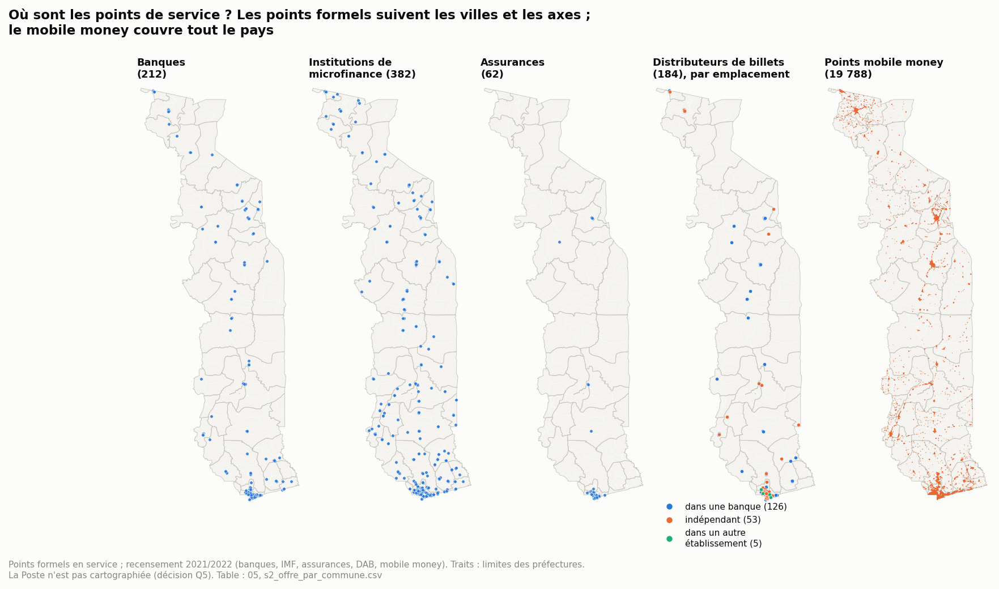

*Carte 1 (O3-01, O3-03). Une carte par type ; les DAB sont colorés selon leur emplacement.*

- **Les points formels suivent les chefs-lieux.** Banques et IMF dessinent un semis de villes, avec une forte concentration à Lomé. Les assurances n'existent que dans le Grand Lomé, à Kara et dans les Plateaux (05, section 2).
- **Le mobile money couvre tout le pays** : aucune commune n'en est privée (05). Il forme des grappes denses autour des villes, et un semis continu dans les campagnes.
- **Les DAB indépendants sont presque tous à Lomé** (41 sur 53) ; ailleurs, le DAB est dans une agence (05, C12).

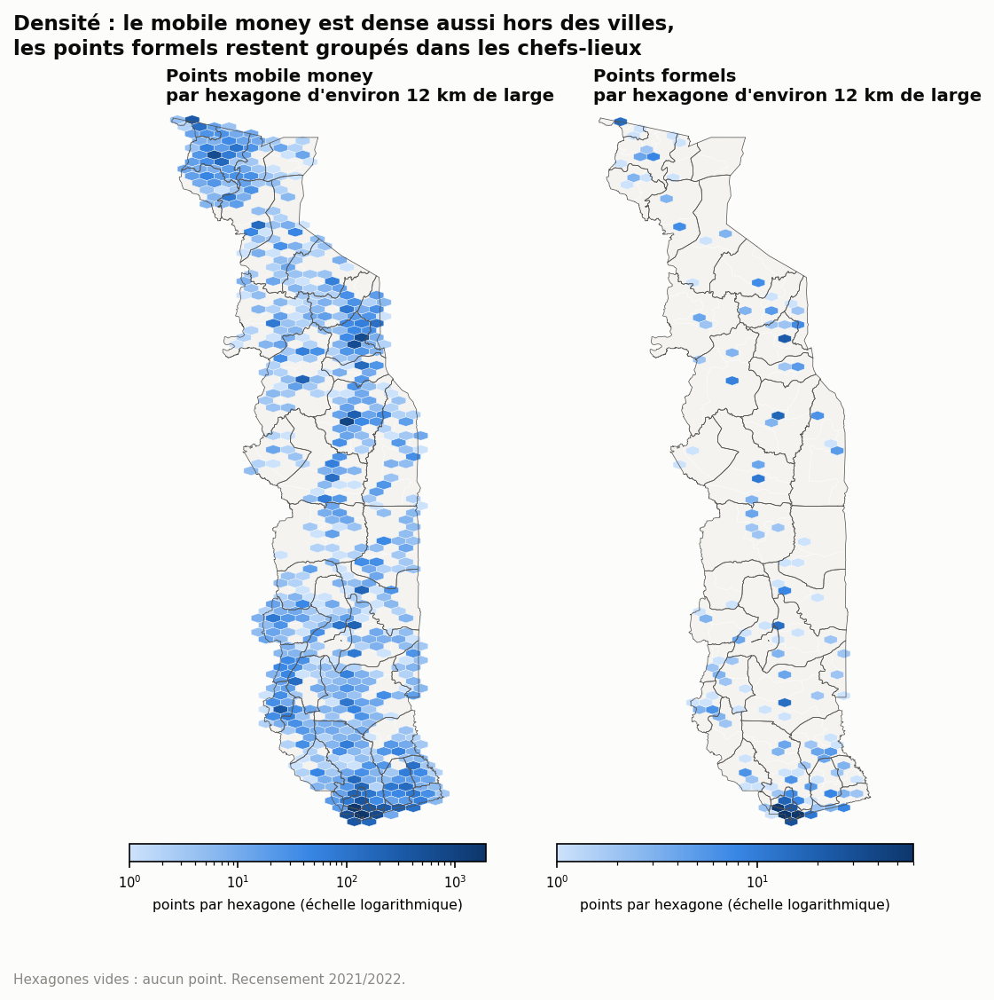

*Carte 2 (O3-03, carte de densité). Hexagones d'environ 12 km de large, échelle logarithmique.*

La différence de forme se voit à la même échelle. Le mobile money remplit presque tous les hexagones habités. Les points formels n'en occupent qu'une petite partie, surtout ceux des chefs-lieux.

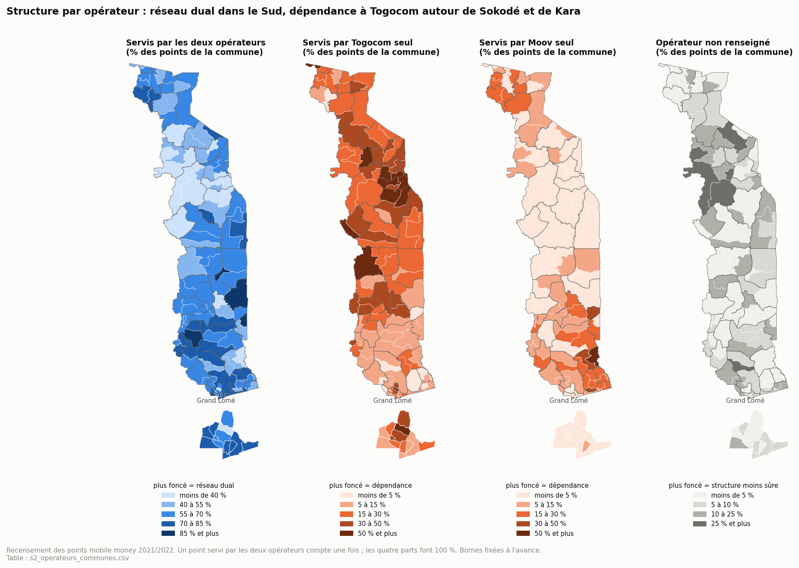

*Carte 10 (objectif 3) [s2_operateurs_communes]. Part des points mobile money de chaque commune servis par les deux opérateurs, par Togocom seul, par Moov seul, et sans opérateur renseigné. Les quatre parts font 100 %.*

- **Réseau dual dans le Sud** : plus de 55 % des points sont servis par les deux opérateurs dans 29 communes sur 32 des Plateaux, 13 sur 19 du Maritime hors Grand Lomé et 12 sur 13 du Grand Lomé, contre 6 sur 22 à Kara. 4 communes dépassent 85 % (Anié 2, Est-Mono 3, Kpélé 1, Moyen-Mono 2).
- **Dépendance à Togocom autour de Sokodé et de Kara** : dans 11 communes, Togocom seul sert la moitié des points ou plus. C'est le cas de Tchaoudjo 4 (81,8 %), Mô 2 (71,4 %), Kozah 3 (70,6 %), Tchaoudjo 3, Assoli 1 et 3, Kozah 4, Dankpen 2 et Blitta 3, mais aussi de Cinkassé 1 et d'Agoè-Nyivé 4 (Grand Lomé).
- **Moov seul** ne dépasse 30 % que dans 4 communes du Sud-Est et de l'Ogou (Yoto 3 : 51,9 % ; Vo 2 ; Ogou 4 ; Yoto 1).
- **Limite** : dans 7 communes, plus d'un quart des points n'ont pas d'opérateur renseigné, et 6 d'entre elles sont dans la région de Kara (Bassar 1 : 49,8 %). La dépendance à un opérateur y est donc moins sûre qu'ailleurs.

---

## 3. Offre rapportée à la population

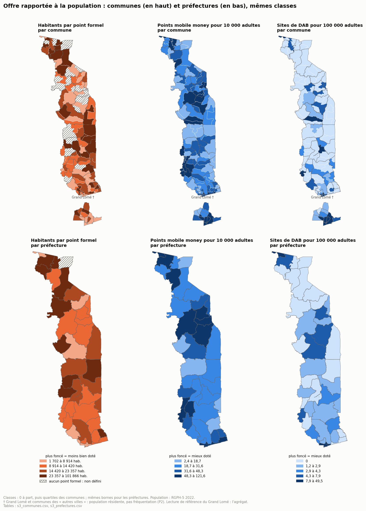

*Carte 3 (O4-01, O4-02, O4-04) [s3_communes, s3_prefectures]. En haut les communes, en bas les préfectures, avec les mêmes classes.*

**Ce que change la maille** : la préfecture resserre les écarts.

| Ratio | Communes : minimum à maximum | Préfectures : minimum à maximum |
| ----- | ---------------------------- | ------------------------------- |
| Habitants par point formel | 1 702 à 101 866 (22 non définies) | 6 528 à 73 830 (1 non définie, Kpendjal) |
| Points mobile money pour 10 000 adultes | 2,4 à 121,6 | 9,7 à 102,0 |
| Points mobile money par point formel | 4,5 à 101,0 (22 non définies) | 8,4 à 87,0 (1 non définie) |

Les communes les moins dotées disparaissent dans la moyenne de leur préfecture. C'est l'argument de P2 : la commune montre où sont les problèmes.

**Par unité régionale** [s3_unites_regionales] :

| Unité | Habitants par point formel | Points mobile money pour 10 000 adultes | Sites de DAB pour 100 000 adultes | Points formels pour 1 000 km² | Points mobile money pour 1 000 km² |
| ----- | -------------------------- | --------------------------------------- | --------------------------------- | ----------------------------- | ---------------------------------- |
| Grand Lomé | 8 353 | 45,4 | 7,45 | 634,0 | 15 775 |
| Kara | 12 475 | 53,5 | 2,54 | 6,9 | 259 |
| Centrale | 12 831 | 46,7 | 2,90 | 4,6 | 156 |
| Maritime hors Grand Lomé | 13 741 | 31,7 | 1,54 | 16,5 | 414 |
| Plateaux | 16 197 | 33,6 | 2,07 | 6,0 | 181 |
| Savanes | 21 176 | 45,3 | 3,21 | 6,3 | 314 |

La densité au km² (O4-02) sépare le Grand Lomé de tout le reste : 39 à 137 fois plus de points formels au km² que les autres unités. Rapporté à la population, le mobile money de Kara (53,5) et de la Centrale (46,7) égale ou dépasse celui du Grand Lomé (45,4).

**Limite** : la règle de divergence de P2 (commune et préfecture dans deux classes différentes du 02) sera appliquée dans le 07, avec les seuils de O4-01, O4-03 et O4-04.

---

## 4. Sur- et sous-représentation des points formels

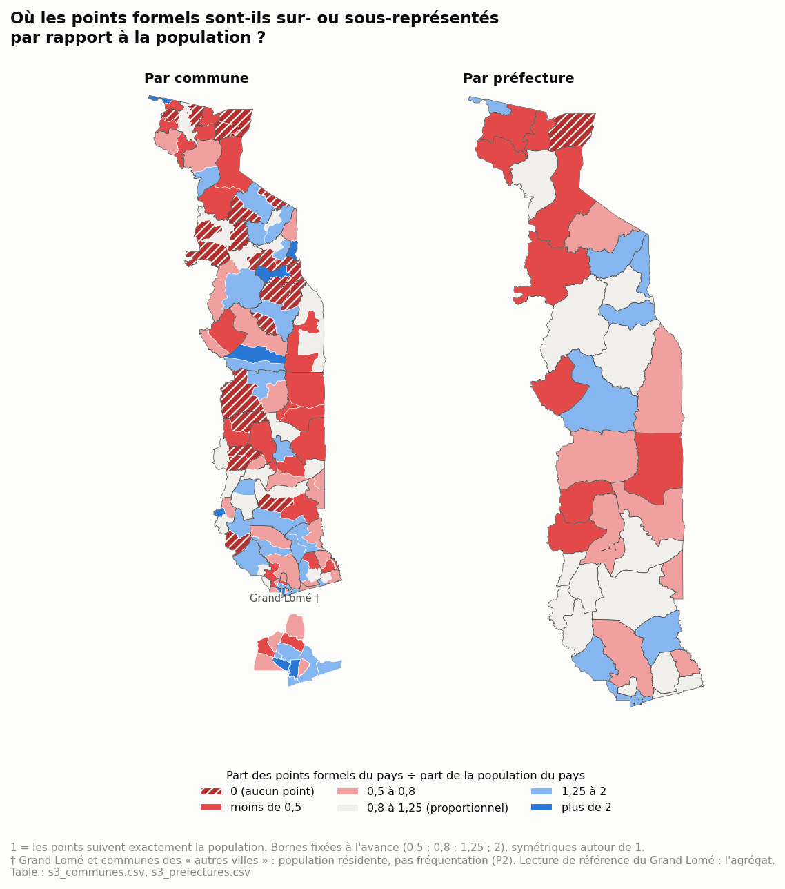

*Carte 4 (O3-02) [s3_communes, s3_prefectures]. Quotient de localisation : part des points formels du pays divisée par part de la population du pays. À 1, les points suivent la population.*

- **Par commune** : 22 communes à 0, 22 autres sous 0,5 ; 7 au-dessus de 2. Ces 7 communes sont des quartiers d'affaires du Grand Lomé (Golfe 3, Golfe 5), des chefs-lieux (Sotouboua 1, Assoli 1, Binah 2, Cinkassé 1) et une petite commune de 2 points (Kloto 3).
- **Par préfecture** : 18 préfectures sur 39 sont sous 0,8, et 8 au-dessus de 1,25 (Golfe, Avé, Yoto, Sotouboua, Assoli, Binah, Doufelgou, Cinkassé). Plusieurs petites préfectures sont « surdotées » parce que leur chef-lieu concentre tous leurs points.
- **Par unité** : Grand Lomé 1,48 ; Kara 0,99 ; Centrale 0,96 ; Maritime hors Grand Lomé 0,90 ; Plateaux 0,76 ; Savanes 0,58.

Les classes de O3-02 (« concentration urbaine confirmée », « gradient urbain ») seront appliquées dans le 07.

---

## 5. Le mobile money comme accès unique : ratio et distance

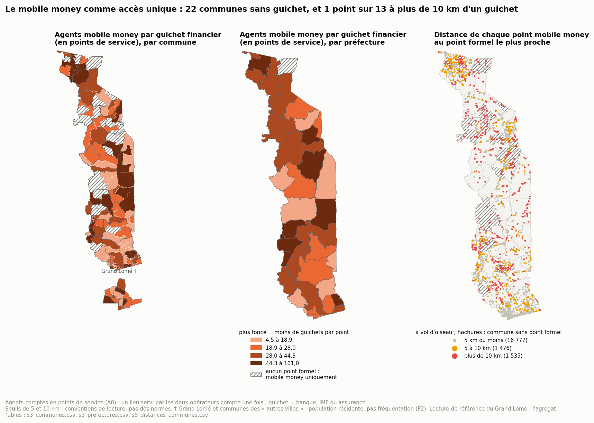

*Carte 5 (O4-03, objectif 4) [s3_communes, s3_prefectures, s5_distances_communes]. À gauche et au centre, les agents mobile money par guichet financier, libellé de l'objectif 4 ; les agents sont comptés en points de service (A8), les guichets sont les banques, IMF et assurances. À droite, chaque point mobile money coloré selon la distance au point formel le plus proche.*

La limite communale est une frontière administrative, pas une distance. Une commune sans guichet peut toucher une ville bien dotée, et une commune avec un guichet peut avoir des villages à 20 km. La distance point à point corrige en partie ce biais.

**Distance des points mobile money au point formel le plus proche** [s5_distances_unites] :

| Unité | Points mobile money | Distance médiane au point formel | À plus de 5 km d'un point formel | À plus de 10 km d'un point formel | À plus de 10 km d'un DAB |
| ----- | ------------------- | -------------------------------- | -------------------------------- | --------------------------------- | ------------------------ |
| Grand Lomé | 6 519 | 0,5 km | 0,0 % | 0,0 % | 0,0 % |
| Maritime hors Grand Lomé | 2 467 | 1,0 km | 15,6 % | 3,9 % | 49,0 % |
| Plateaux | 3 079 | 1,0 km | 26,5 % | 14,0 % | 47,8 % |
| Centrale | 2 093 | 1,2 km | 22,7 % | 15,4 % | 28,4 % |
| Kara | 2 951 | 1,3 km | 20,1 % | 10,8 % | 28,9 % |
| Savanes | 2 679 | 0,9 km | 27,7 % | 13,7 % | 46,2 % |
| **National** | 19 788 | 0,7 km | 15,2 % | 7,8 % | 27,1 % |

- **Au niveau national**, 1 535 points mobile money sur 19 788 (7,8 %) sont à plus de 10 km d'un point formel. Ce sont les lieux où le mobile money est, de fait, le seul accès proche.
- **La Centrale, les Plateaux et les Savanes** en ont la plus forte part (13,7 à 15,4 %). Le Maritime hors Grand Lomé est bien plus maillé (3,9 %).
- **Le DAB est plus loin** : 27,1 % des points mobile money sont à plus de 10 km d'un DAB, près de la moitié dans le Maritime hors Grand Lomé, les Plateaux et les Savanes.

**Les 22 communes sans point formel** [s5_communes_sans_guichet_distance, s7_communes_sans_guichet_voisinage] :

| Commune | Préfecture | Unité | Population | Points mobile money | Distance médiane au point formel le plus proche | Distance maximale | Commune de ce point formel (la plus fréquente) | Voisines avec un point formel |
| ------- | ---------- | ----- | ---------- | ------------------- | ----------------------------------------------- | ----------------- | --------------------------------------------- | ----------------------------- |
| Kpendjal 1 | Kpendjal | Savanes | 47 903 | 36 | 37,8 km | 43,6 km | Kpendjal-Ouest 2 | 2 sur 3 |
| Akébou 2 | Akébou | Plateaux | 29 634 | 24 | 30,5 km | 30,7 km | Akébou 1 | 4 sur 5 |
| Kpendjal 2 | Kpendjal | Savanes | 40 462 | 5 | 27,2 km | 29,3 km | Kpendjal-Ouest 1 | 4 sur 5 |
| Kéran 3 | Kéran | Kara | 30 983 | 10 | 19,9 km | 21,2 km | Kéran 1 | 3 sur 3 |
| Kéran 2 | Kéran | Kara | 53 305 | 38 | 18,9 km | 25,9 km | Oti-Sud 2 | 4 sur 5 |
| Blitta 3 | Blitta | Centrale | 45 218 | 6 | 17,5 km | 39,1 km | Blitta 1 | 4 sur 5 |
| Tchaoudjo 3 | Tchaoudjo | Centrale | 17 484 | 65 | 16,6 km | 18,9 km | Tchaoudjo 1 | 3 sur 6 |
| Tchaoudjo 2 | Tchaoudjo | Centrale | 24 891 | 45 | 15,8 km | 16,6 km | Tchaoudjo 1 | 2 sur 2 |
| Dankpen 2 | Dankpen | Kara | 32 716 | 31 | 14,3 km | 19,4 km | Doufelgou 3 | 3 sur 5 |
| Tchaoudjo 4 | Tchaoudjo | Centrale | 20 279 | 33 | 13,9 km | 14,7 km | Tchamba 1 | 2 sur 4 |
| Dankpen 3 | Dankpen | Kara | 76 652 | 37 | 12,8 km | 34,7 km | Bassar 2 | 3 sur 4 |
| Wawa 2 | Wawa | Plateaux | 20 414 | 16 | 12,3 km | 17,7 km | Wawa 1 | 4 sur 5 |
| Tône 4 | Tône | Savanes | 66 577 | 175 | 12,0 km | 14,5 km | Tône 1 | 3 sur 3 |
| Agou 2 | Agou | Plateaux | 27 465 | 50 | 11,9 km | 21,2 km | Avé 1 | 5 sur 5 |
| Assoli 3 | Assoli | Kara | 16 044 | 28 | 11,6 km | 14,4 km | Assoli 1 | 1 sur 5 |
| Kozah 4 | Kozah | Kara | 20 654 | 35 | 11,5 km | 20,0 km | Kozah 1 | 4 sur 6 |
| Bassar 4 | Bassar | Kara | 16 657 | 29 | 10,3 km | 14,9 km | Bassar 3 | 3 sur 4 |
| Kozah 3 | Kozah | Kara | 23 755 | 34 | 9,3 km | 18,3 km | Kozah 1 | 3 sur 5 |
| Haho 3 | Haho | Plateaux | 58 695 | 105 | 9,1 km | 14,7 km | Haho 1 | 4 sur 4 |
| Tône 2 | Tône | Savanes | 50 179 | 76 | 9,0 km | 13,8 km | Tône 1 | 3 sur 3 |
| Wawa 3 | Wawa | Plateaux | 29 699 | 56 | 7,7 km | 12,1 km | Akébou 1 | 4 sur 5 |
| Assoli 2 | Assoli | Kara | 9 933 | 31 | 6,4 km | 11,6 km | Assoli 1 | 1 sur 3 |

- **17 des 22 communes (587 338 habitants)** ont leurs points mobile money, en médiane, à plus de 10 km d'un point formel. Kpendjal 1 (37,8 km), Akébou 2 (30,5 km) et Kpendjal 2 (27,2 km) sont les plus isolées.
- **Les 5 autres ont un point formel entre 6,4 et 9,3 km en médiane** : Assoli 2, Wawa 3, Tône 2, Haho 3 et Kozah 3.
- **Voisinage** : Assoli 2 et Assoli 3 n'ont qu'une voisine dotée d'un point formel. Toutes les autres en ont au moins deux. Mais une voisine dotée peut rester loin : Kéran 2 a 4 voisines dotées sur 5, et un guichet à 18,9 km en médiane.

---

## 6. Internet : accès déclaré et couverture réseau

**Accès déclaré à Internet par région** [s6_usage_internet_regions] :

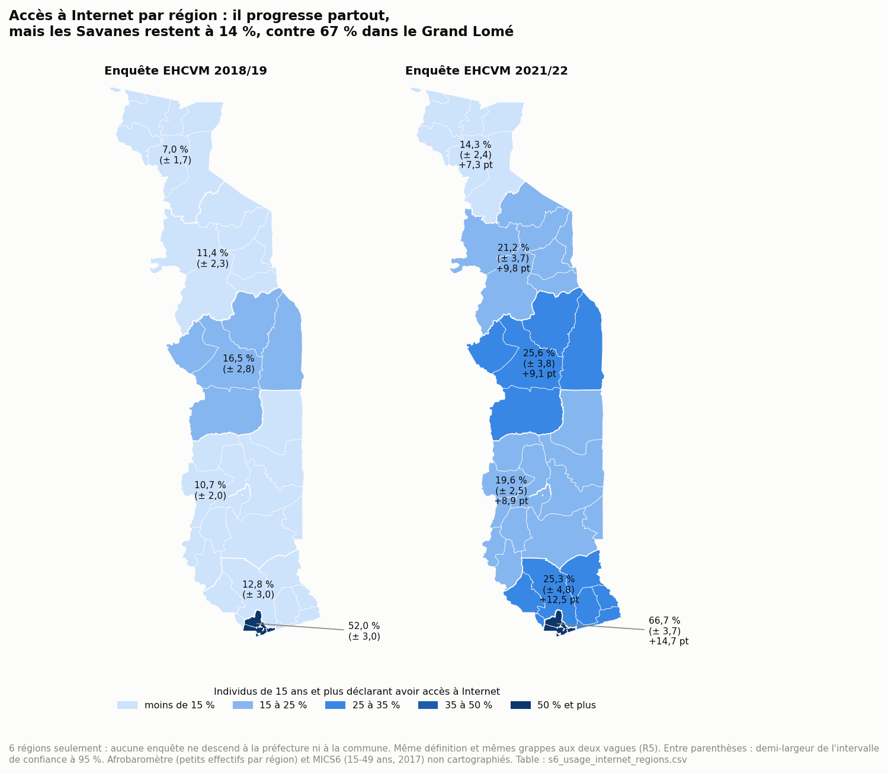

*Carte 9 (objectif 1, O1-05) [s6_usage_internet_regions]. Individus de 15 ans et plus déclarant avoir accès à Internet, enquête EHCVM (niveau B, calculé par nous), avec la marge d'erreur à 95 % et le gain en points entre les deux vagues.*

- **L'accès progresse dans toutes les régions** entre 2018/19 et 2021/22 : de +7,3 points (Savanes) à +14,7 points (Grand Lomé).
- **L'écart se creuse** entre le Grand Lomé et les Savanes : 45,0 points en 2018/19 (52,0 % contre 7,0 %), 52,3 points en 2021/22 (66,7 % contre 14,3 %).
- **Hors du Grand Lomé**, l'accès va de 14,3 % (Savanes) à 25,6 % (Centrale) ; la Centrale et le Maritime hors Grand Lomé sont en tête.
- **Accès et couverture ne vont pas ensemble** (6 régions : un constat, pas une corrélation). Les Savanes ont une couverture de 89,1 %, mais le plus faible accès (14,3 %) : le réseau n'y est pas le premier frein, et l'alphabétisation (41,2 %, 05) est une piste. La Centrale a la couverture la plus faible (75,5 %), mais l'un des meilleurs accès hors Lomé (25,6 %).
- **Limites** : 6 régions seulement, aucune enquête ne descend plus bas ; « avoir accès » n'est pas « utiliser » ; l'Afrobaromètre (petits effectifs par région, erreur parfois au-delà du seuil du 02) et la MICS6 (15-49 ans, 2017, 7 domaines) ne sont pas cartographiés.

**Couverture réseau (proxy 3i)** :

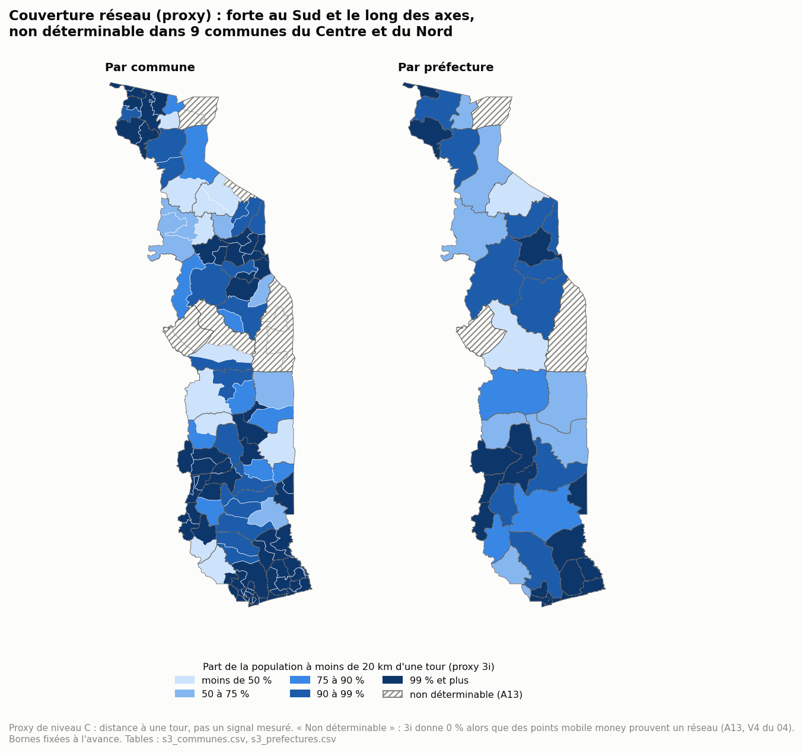

*Carte 6 (O2-06, proxy de niveau C) [s3_communes, s3_prefectures]. Part des habitants à moins de 20 km d'une tour, toutes technologies confondues.*

**Par unité** [s6_couverture_unites] :

| Unité | Couverture pondérée par la population | Communes non déterminables | Communes sous 50 % |
| ----- | ------------------------------------- | -------------------------- | ------------------ |
| Grand Lomé | 100 % | 0 sur 13 | 0 |
| Maritime hors Grand Lomé | 96,3 % | 0 sur 19 | 1 |
| Savanes | 89,1 % | 2 sur 16 | 2 |
| Plateaux | 86,1 % | 0 sur 32 | 3 |
| Kara | 82,0 % | 1 sur 22 | 3 |
| Centrale | 75,5 % | **6 sur 15** | 2 |

- **La couverture suit la densité** [s6_couverture_correlations] : corrélation de rang de 0,64 avec la densité de population (108 communes déterminables), contre 0,32 avec les points mobile money par adulte et 0,22 avec les points formels par habitant.
- **La Centrale a la couverture la plus faible**, et c'est là que le proxy est le moins sûr : 6 communes sur 15 y sont non déterminables.
- **Zones blanches** : elles ne sont pas identifiables avec 3i. Là où 3i donne 0 %, des points mobile money prouvent qu'un réseau existe (A13).
- **Limite supplémentaire** : 3i donne aussi moins de 10 % dans 3 communes qui ont des points mobile money (Kéran 2 : 1,5 %, 38 points ; Anié 2 : 5,2 %, 48 points ; Blitta 3 : 9,9 %, 6 points). Le critère A13 ne vise que les 0 %. Ces trois valeurs sont probablement sous-estimées aussi (point P6).

**Fibre recensée par commune (3i)** [s6_fibre_communes] :

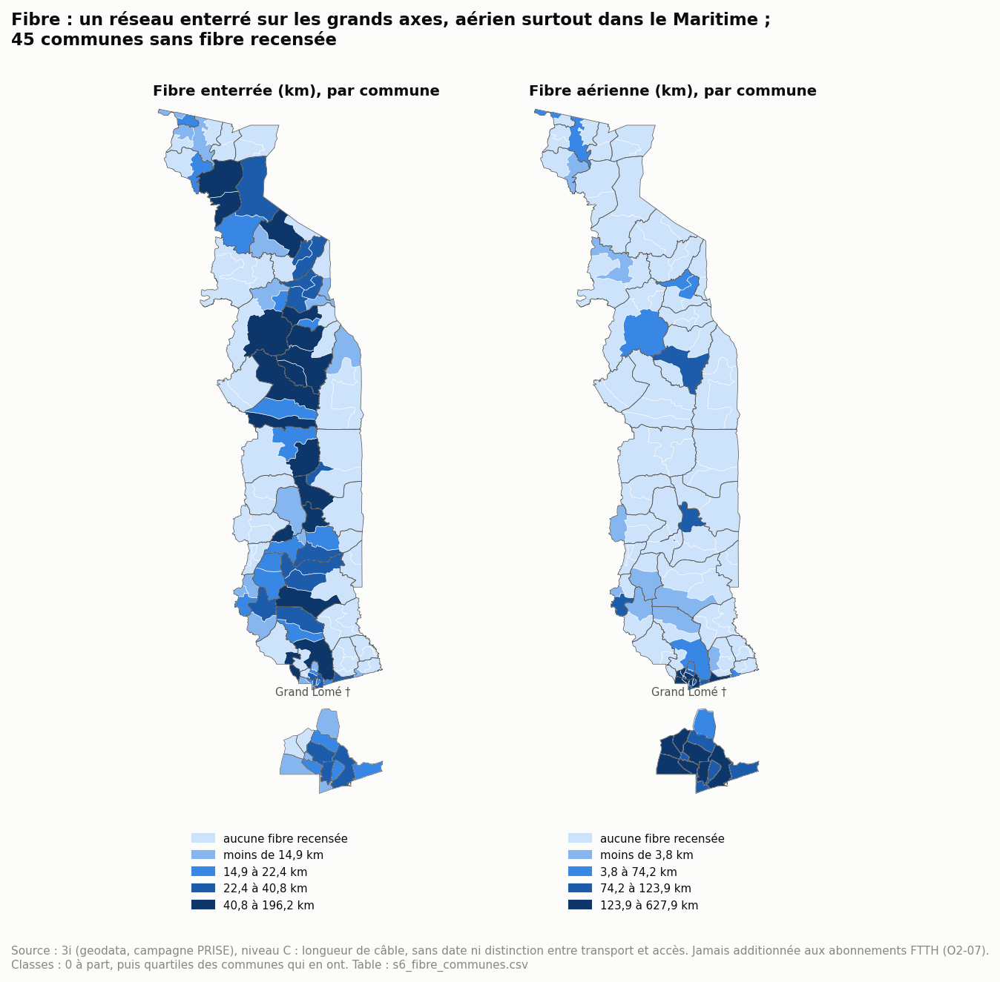

*Carte 11 (objectif 2, O2-07). Longueur de câble recensée par 3i, en km, par commune.*

- **La fibre enterrée dessine un axe nord-sud** qui traverse toutes les régions : de 180 km (Grand Lomé) à 481 km (Plateaux, Kara) par unité, 2 162 km au total.
- **La fibre aérienne est concentrée dans le Grand Lomé** : 2 373 km sur 3 071 (77 %), dont 628 km à Agoè-Nyivé 1.
- **45 communes n'ont aucune fibre recensée**, toutes rurales (2,19 millions d'habitants). 12 d'entre elles n'ont pas non plus de point formel.
- **Limites** : 3i donne une longueur de câble, sans date, sans distinguer le réseau de transport de la fibre d'accès. Ce n'est pas un nombre d'abonnés : les 153 499 abonnés FTTH (ARCEP, 2026) ne sont pas répartis par territoire. Une commune traversée par un câble n'est pas pour autant raccordée à domicile.

---

## 7. Structure spatiale : voisinage et grappes

**Autocorrélation globale** [s7_moran_global] :

| Variable | Communes | Indice de Moran | Probabilité (999 permutations) | Lecture |
| -------- | -------- | --------------- | ------------------------------ | ------- |
| Points formels pour 10 000 habitants | 117 | −0,001 | 0,42 | aucune structure : les écarts ne forment pas de blocs |
| Points mobile money pour 10 000 adultes | 117 | 0,168 | 0,005 | grappes modérées |
| Couverture 3i | 108 | 0,261 | 0,001 | grappes nettes |

**L'accès formel n'a pas de géographie régionale, il a une géographie locale.** Une commune bien dotée côtoie aussi souvent une commune vide qu'une autre commune dotée. Le déficit se joue entre le chef-lieu et les communes rurales d'une même préfecture, pas entre grandes régions. C'est ce qui rend la maille communale indispensable (P2).

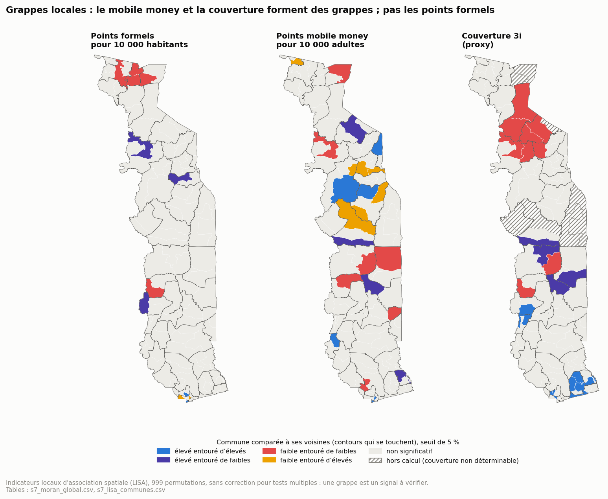

*Carte 7 [s7_lisa_communes]. Chaque commune comparée à ses voisines. Seuil de 5 %, sans correction pour tests multiples.*

| Variable | Faible entouré de faibles | Faible entouré d'élevés | Élevé entouré de faibles | Élevé entouré d'élevés |
| -------- | ------------------------- | ----------------------- | ------------------------ | ---------------------- |
| Points formels | Akébou 1, Kpendjal 2, Kpendjal-Ouest 1, Kpendjal-Ouest 2, Tône 1 | Golfe 2 †, Golfe 7 † | Assoli 1, Dankpen 1, Wawa 1 | Agoè-Nyivé 1 †, Golfe 4 † |
| Mobile money | Akébou 2, Blitta 2, Dankpen 1, Est-Mono 2, Kpendjal 1, Ogou 4, Zio 2 | Bassar 4, Cinkassé 2, Kozah 3, Kozah 4, Sotouboua 2, Tchaoudjo 2, Tchaoudjo 4 | Anié 1, Bas-Mono 1, Kéran 1, Sotouboua 3 | Bassar 1, Binah 1, Golfe 2 †, Golfe 4 †, Kloto 2, Tchaoudjo 3 |
| Couverture 3i | Akébou 1, Blitta 2, Dankpen 1, Dankpen 2, Doufelgou 3, Kéran 1, Kéran 2, Oti-Sud 1, Oti-Sud 2 | — | Anié 1, Blitta 1, Est-Mono 1, Sotouboua 3 | Agoè-Nyivé 2 †, Agoè-Nyivé 5 †, Bas-Mono 2, Danyi 2, Golfe 5 †, Lacs 1, Lacs 3, Vo 1, Vo 3, Vo 4, Wawa 2 |

- **Points formels** : deux grappes de communes faibles, l'une à l'extrême nord (Kpendjal, Kpendjal-Ouest, Tône), l'autre dans l'Akébou. La grappe du nord comprend Dapaong (Tône 1, 211 743 habitants) : un chef-lieu classé « autres villes », mais avec 0,66 point formel pour 10 000 habitants, à peine plus de la moitié du niveau des autres villes (1,15). Dans le Grand Lomé, Golfe 2 et Golfe 7 sont « faibles entourés d'élevés » : c'est le motif résidence / activité de H2.
- **Mobile money** : les communes voisines des pôles urbains sont « faibles entourées d'élevées » (Tchaoudjo 2 et 4 autour de Sokodé, Kozah 3 et 4 autour de Kara, Cinkassé 2, Bassar 4, Sotouboua 2). C'est le motif de H4.
- **Couverture** : un bloc faible dans l'Ouest de Kara (Dankpen, Kéran, Oti-Sud, Doufelgou), un bloc fort au Sud (Vo, Lacs, Bas-Mono, Grand Lomé).

---

## 8. Test des hypothèses du 05

| # | Hypothèse du 05 | Test dans le 06 | Résultat | Verdict |
| - | --------------- | --------------- | -------- | ------- |
| H1 | Le déficit d'accès formel est d'abord rural, pas propre à Lomé | Quotient de localisation et grappes | Quotient 1,48 dans le Grand Lomé, mais au-dessus de 2 dans plusieurs chefs-lieux hors Lomé ; aucune structure régionale (Moran ≈ 0) ; 4 des 5 communes des grappes faibles sont rurales, la 5e est Dapaong, ville peu dotée | **Soutenue, avec une exception** : l'écart oppose surtout les chefs-lieux à leurs campagnes, mais Dapaong montre qu'une ville peut aussi décrocher. Les classes de O3-02 trancheront dans le 07 |
| H2 | Dans le Grand Lomé, les ratios par commune reflètent les lieux d'activité | Grappes locales dans le Grand Lomé | Golfe 2 et Golfe 7 « faibles entourés d'élevés », Golfe 4 et Agoè-Nyivé 1 « élevés entourés d'élevés » | **Compatible, non démontrée** : aucune donnée de fréquentation. P2 s'applique |
| H3 | Le faible usage du mobile money dans la Centrale a d'autres freins que l'offre et l'alphabétisation | Couverture et distance dans la Centrale | Couverture la plus faible (75,5 %) ; 15,4 % des points mobile money à plus de 10 km d'un point formel (la plus forte part) ; mais 6 communes sur 15 non déterminables | **Piste de la couverture renforcée, non démontrée** : le proxy est le moins sûr là où il compte le plus. Et l'accès à Internet déclaré y est l'un des plus élevés hors Lomé (25,6 %, carte 9) : le faible usage du mobile money n'y tient pas à un faible accès à Internet |
| H4 | Les pôles urbains hors Lomé concentrent le mobile money de leur préfecture, et leurs voisines en manquent | Part du pôle dans sa préfecture [s7_poles_urbains] et grappes | Sokodé (Tchaoudjo 1) : 89,9 % des points pour 73,9 % de la population, 121,6 points pour 10 000 adultes contre 41,9 dans le reste de la préfecture. Kara (Kozah 1) : 87,5 % pour 68,2 % ; 107,1 contre 35,4. Cinkassé 1 : 86,0 % pour 58,9 % ; 111,2 contre 26,9. Voisines « faibles entourées d'élevées » | **Confirmée** (descriptif) |
| H5 | La dépendance au mobile money touche des communes rurales du Nord et du Centre, avec un réseau mince | Distance au point formel et grappes | Kpendjal 1 et 2, Kéran 2 et 3, Dankpen 2 et 3, Blitta 3 : guichet à 12,8 à 37,8 km en médiane. Akébou 2 (Plateaux, 30,5 km) s'y ajoute | **Confirmée, et élargie** à l'Akébou |
| H6 | La couverture 3i suit la densité et risque de doubler cette information dans le score | Corrélation par commune | Rang de 0,64 avec la densité (108 communes), contre 0,32 avec le mobile money | **Confirmée.** La décision revient à l'étape du score (A11) |

---

## 9. Synthèse : où se cumulent les signaux ?

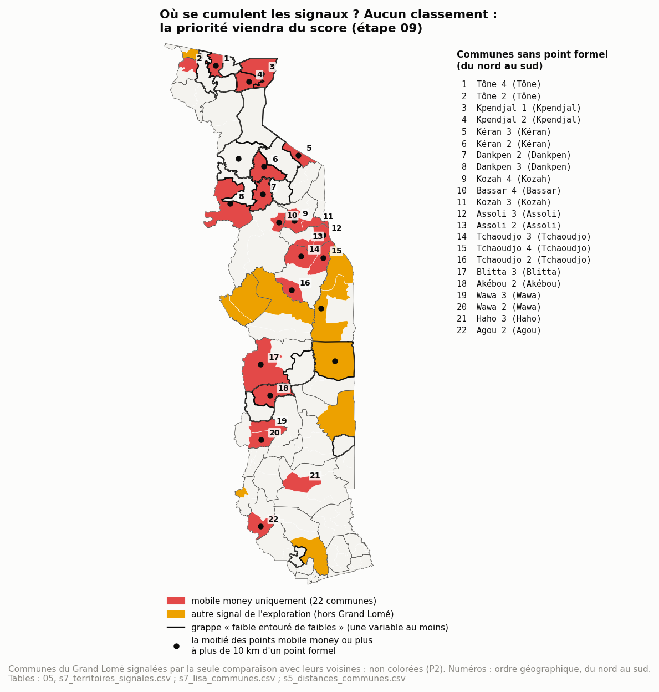

*Carte 8. Aucun classement. Rouge : les 22 communes sans point formel, numérotées du nord au sud et nommées à droite ; jaune : les autres communes signalées par le 05, hors Grand Lomé ; contour noir : une grappe « faible entouré de faibles » ; point noir : la moitié des points mobile money ou plus à plus de 10 km d'un point formel.*

**Capacités et usage par région, entrée des leviers de l'objectif 5** [s9_capacites_usage_regions] :

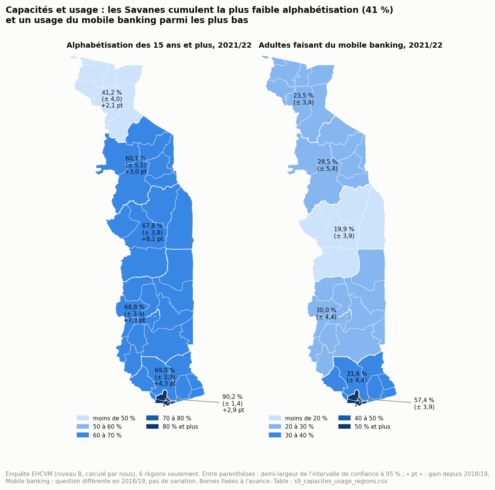

*Carte 12. Enquête EHCVM 2021/22 (niveau B), 15 ans et plus, avec la marge d'erreur à 95 %. Pour l'alphabétisation, gain en points depuis 2018/19.*

- **Alphabétisation** : 71,0 % au niveau national. Les Savanes sont très en dessous (41,2 %, +2,1 points seulement depuis 2018/19), Kara aussi (60,2 %). La Centrale et les Plateaux progressent le plus (+8,1 et +7,3 points).
- **Mobile banking** : 36,9 % au niveau national. Le Grand Lomé est au-dessus (57,4 %) ; le Maritime hors Grand Lomé n'est pas distinct du national ; les quatre autres régions sont en dessous, la Centrale la plus bas (19,9 %).
- **Les Savanes cumulent** la plus faible alphabétisation, l'accès à Internet le plus faible (14,3 %, carte 9) et un usage du mobile banking parmi les plus bas (23,5 %). C'est là que le levier « compétences » de la section 8 du 05 trouve son terrain.
- **Limites** : 6 régions seulement ; l'alphabétisation n'est qu'un proxy de compétence ; la question sur le mobile banking a changé entre les deux vagues : pas de variation.

**Ce que le 06 établit** (chaque point cite sa source) :

| # | Constat spatial | Objectif | Preuve | Limite |
| - | --------------- | -------- | ------ | ------ |
| S1 | L'accès formel n'a pas de géographie régionale : Moran ≈ 0. Le déficit est local, entre chefs-lieux et campagnes d'une même préfecture | 3, 4 | A (points), B (ratios) | contiguïté seule ; 117 communes |
| S2 | 7,8 % des points mobile money sont à plus de 10 km d'un point formel ; jusqu'à 15,4 % dans la Centrale | 4 | A | vol d'oiseau ; seuil conventionnel |
| S3 | 17 des 22 communes sans point formel (587 338 habitants) ont leurs points mobile money à plus de 10 km d'un guichet en médiane | 4, 5 | A | idem |
| S4 | Les pôles hors Lomé concentrent le mobile money de leur préfecture ; leurs voisines en manquent | 3, 4 | A | stock de 2021/2022 |
| S5 | La couverture (proxy) suit la densité et forme un bloc faible dans l'Ouest de Kara | 2, 5 | C | 9 communes non déterminables, 3 valeurs douteuses |
| S6 | L'accès à Internet progresse dans toutes les régions, mais l'écart entre le Grand Lomé et les Savanes se creuse (45,0 puis 52,3 points) ; dans les Savanes, la couverture (89 %) n'explique pas le faible accès (14 %) | 1, 5 | B (accès), C (couverture) | 6 régions ; accès déclaré, pas usage |
| S7 | Le réseau mobile money est dual au Sud, dépendant de Togocom autour de Sokodé et de Kara (11 communes où Togocom seul sert la moitié des points ou plus) | 3, 5 | A | opérateur non renseigné pour plus d'un quart des points dans 7 communes, dont 6 à Kara |
| S8 | 45 communes rurales n'ont aucune fibre recensée ; la fibre aérienne est à 77 % dans le Grand Lomé | 2, 5 | C | longueur de câble, pas de raccordement ni d'abonnés par territoire |
| S9 | Les Savanes cumulent la plus faible alphabétisation (41,2 %), le plus faible accès à Internet et un usage du mobile banking parmi les plus bas | 1, 5 | B | 6 régions ; alphabétisation = proxy de compétence |

**Communes où se cumulent trois signaux** : aucun point formel, points mobile money à plus de 10 km d'un guichet en médiane, et grappe « faible entouré de faibles ». Elles sont 5 (ordre alphabétique) : Akébou 2, Dankpen 2, Kéran 2, Kpendjal 1, Kpendjal 2. Ce n'est pas un classement. Le score O5-01 est calculé par préfecture, avec ses propres règles ; ce cumul servira de contrôle pour ce score.

**Pour la suite** :
- **07 (indicateurs)** : classes de O3-02, O4-01, O4-03, O4-04 ; statut O4-05 et matrice O4-06 ; règle de divergence de P2 ;
- **09 (score)** : H6 et A11 pour la 3e dimension ; S1 pour le choix de la maille ;
- **10 (diagnostic)** : les 39 communes signalées par le 05 et les 5 communes où se cumulent trois signaux.

---

## 10. Points à valider

| # | Question | Proposition | Objectif concerné |
| - | -------- | ----------- | ----------------- |
| P5 | Seuils de lecture des distances | Garder 5 km et 10 km comme conventions, jamais comme seuils de classe. Une norme d'accès, si elle est voulue, se fixe à l'étape des indicateurs. **Validé (27/09/2026)** | 4 |
| P6 | Valeurs de 3i sous 10 % là où des points mobile money existent (Kéran 2, Anié 2, Blitta 3) | Les marquer « douteuses » dans le 07, sans les passer en « non déterminable » (A13 ne vise que 0 %). À trancher avant O2-06, O4-06 et O5-01. **Validé (27/09/2026)** | 2, 5 |
| P7 | Usage des grappes locales (LISA) | Les garder comme signaux descriptifs, sans correction pour tests multiples, hors du score. **Validé (27/09/2026)** | 5 |
| P8 | Suite | Passer au 07 : indicateurs des objectifs 3 et 4 (O1-02 y est déjà), avec la règle de divergence de P2. **Validé (27/09/2026)** | 3, 4 |
