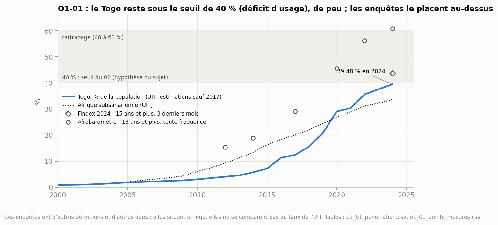
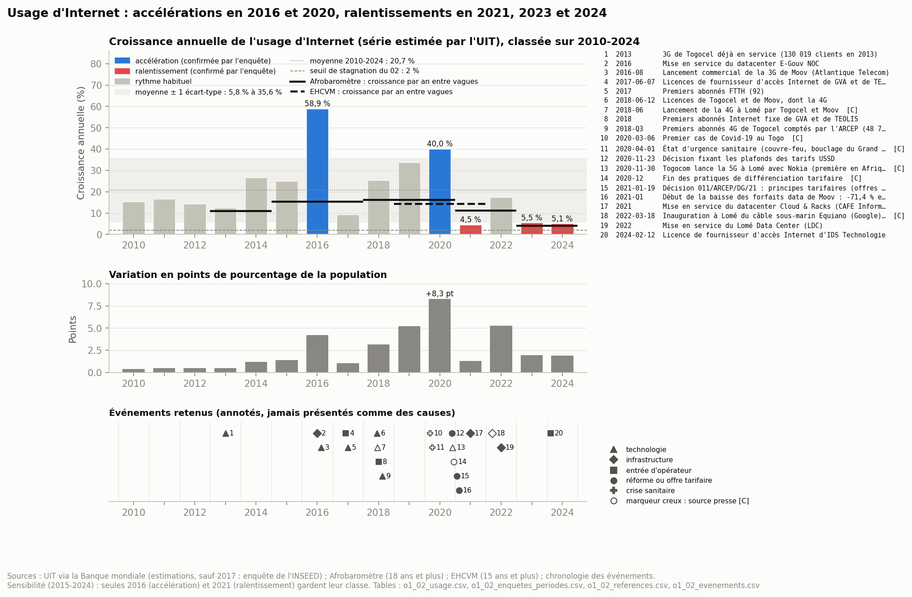
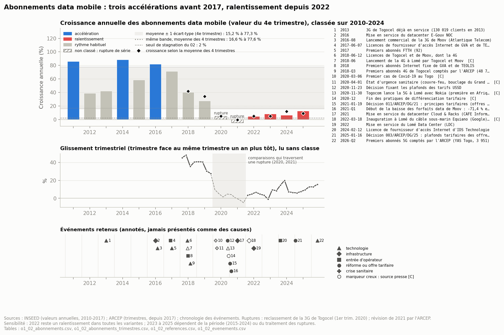
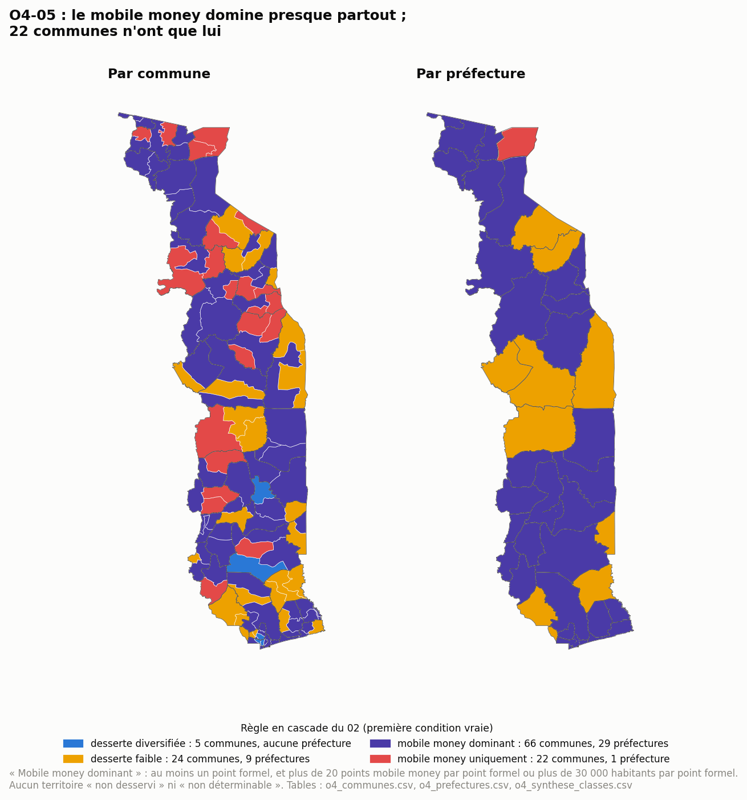
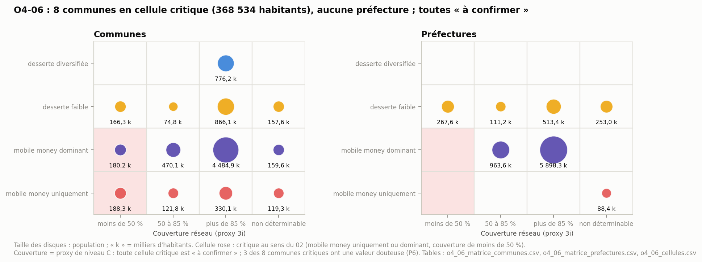

# 07 — Indicateurs

*Construire les indicateurs décisionnels : chaque indicateur du 02, calculé avec ses règles, ses classes et ses limites.*

Ce document correspond à l'étape 08 de la procédure, « indicators & metrics ». La procédure en attend un **catalogue d'indicateurs** : pour chacun, sa définition, sa maille, sa source, son sens de lecture, son niveau de preuve, et sa justification tirée de l'exploration (05 et 06). Il applique les classes du 02, ce que le 05 et le 06 s'interdisaient, avec les écarts déclarés dans le 03, le 05 et le 06.

**Périmètre** : les 27 indicateurs des objectifs 1 à 4 (O1-01 à O4-06). Les indicateurs de l'objectif 5 relèvent des étapes suivantes : le score O5-01 à l'étape 09, les recommandations O5-02 à O5-04 à l'étape 11.

**Ce que le 07 ne fait pas** : aucun score, aucune normalisation en rang percentile (étape 09), aucune recommandation. Une classe du 02 n'est pas une priorité.

**Reproductible** : `python3 analyse/p07_indicateurs.py` puis `python3 analyse/figures_07.py`. Chaque chiffre renvoie à une table de `data/analysis/07_indicateurs/` (nom entre crochets).

**Règles communes** :
1. **Les classes du 02 sont appliquées telles quelles.** Quand une règle du 02 ne peut pas conclure ou qu'elle écrase l'information, c'est dit, et une variante est montrée à côté, jamais à la place.
2. **Trois mailles (P2)** : commune, préfecture, unité régionale. Pour le Grand Lomé, l'agrégat est la lecture de référence.
3. **Zéro n'est pas une absence de donnée** : un ratio au dénominateur nul est « non défini », et sa classe est celle que le 02 prévoit (« non défini et critique », « mobile money uniquement »).
4. **Couverture** : 3i reste un proxy de niveau C. Ses 0 % sont « non déterminables » (A13), et ses valeurs sous 10 % là où des points mobile money existent sont « douteuses » (P6, validé le 27/09/2026).
5. **Date** : les points sont un stock de 2021/2022 ; les séries nationales vont jusqu'en 2025 ou 2026.

---

## Sommaire

1. Catalogue des indicateurs
2. Objectif 1 — Usage d'Internet
3. Objectif 2 — Marché des télécommunications
4. Objectif 3 — Établissements financiers et mobile money
5. Objectif 4 — Rapport à la population
6. Ce qui reste ouvert et points à valider

---

## 1. Catalogue des indicateurs

Niveau de preuve : A = mesuré, B = calculé, C = estimé ou proxy. Sens de lecture : ↑ = plus haut est mieux ; ↓ = plus bas est mieux.

| ID | Indicateur | Maille | Source (preuve) | Sens | Statut | Résultat clé |
| -- | ---------- | ------ | --------------- | ---- | ------ | ------------ |
| O1-01 | Part de la population utilisant Internet | national | UIT (C) ; enquêtes en repère | ↑ | calculé | **39,48 % en 2024 : déficit d'usage** (seuil 40 %), au-dessus de l'Afrique subsaharienne depuis 2020 |
| O1-02 | Croissance annuelle et ruptures | national | UIT (C), INSEED puis ARCEP (A) | — | calculé | accélérations 2016 et 2020 ; ralentissement depuis 2021 (usage) et 2022 (abonnements) ; aucune stagnation |
| O1-03 | Abonnements data face aux utilisateurs (en nombres) | national | ARCEP (A), UIT × population Banque mondiale (C) | — | calculé | écart croissant de 2010 à 2017 (multi-SIM), décroissant de 2018 à 2024 (les utilisateurs rattrapent) |
| O1-04 | Part des abonnements par technologie | national | ARCEP (A) | ↑ | calculé | **bascule haut débit acquise en 2025** (81,3 % en 3G et 4G) ; fibre : 2,3 % des abonnements Internet |
| O1-05 | Accès à Internet par région (optionnel) | région | EHCVM (B) | ↑ | calculé | 14,3 % (Savanes) à 66,7 % (Grand Lomé) ; toutes les régions distinctes de la moyenne nationale |
| O1-06 | Freins : alphabétisation, compétences TIC, smartphone | région ; smartphone national | EHCVM (B), MICS6 (C), Findex (C) | — | calculé en partie | frein de capacité présumé dans les Savanes et les Plateaux ; frein de coût présumé partout où la règle s'applique |
| O2-01 | Parts de marché et indice HHI | national | ARCEP (A), INSEED (A) | ↓ HHI | calculé | **duopole très concentré** (HHI > 5 000) tous les ans et sur tous les segments ; Togocom 64,4 % des abonnés data en 2025 |
| O2-02 | Part de CA moins part d'abonnés | national | ARCEP (A) | — | calculé | Togocom entre « alignement » et « haut de marché » (+3,5 à +7,2 points selon l'année) |
| O2-03 | Chiffre d'affaires et croissance | national | INSEED, ARCEP (A) ; inflation (C) | ↑ | calculé | 264,9 Md FCFA en 2025 ; +1,0 % en 2025 : stagnation |
| O2-04 | Investissement / CA (optionnel) | national | ARCEP (A) | — | calculé | 36,9 % en 2018, **16,3 % en 2025** : du cycle d'extension au régime normal |
| O2-05 | ARPU (a) et coût de 1 Go (b) | national | ARCEP (B) ; UIT (C) | ↓ coût | calculé | ARPU 2 183 FCFA par mois (2025) ; **1 Go = 5,30 % du revenu mensuel : non abordable** (seuil 2 %) |
| O2-06 | Couverture réseau par territoire | commune, préfecture, région | 3i (C) ; réception déclarée EHCVM (B) | ↑ | calculé (proxy) | 11 communes sous 50 % (dont 3 douteuses), 9 non déterminables ; 2 préfectures sous 50 % (Sotouboua, Kéran) |
| O2-07 | Fibre : FTTH pour 100 habitants ; km de fibre ; territoires raccordés | national ; préfecture | ARCEP (A) ; 3i (C) | ↑ | calculé | 1,74 abonnement FTTH pour 100 habitants (2025, +17 %) ; 8 préfectures sur 39 sans fibre recensée |
| O2-08 | Sites radio et ajouts nets | national | ARCEP, rapport 2025 (A) | ↑ | national seulement | 1 840 sites en 2025 ; ajouts nets de 215 (2022) à 21 (2025) |
| O2-09 | Qualité de service mesurée (optionnel) | — | ARCEP (national) | ↑ | non déterminable par territoire | aucun territoire mesuré (S9) ; « couverture de façade » non calculable |
| O3-01 | Points formels par type et par territoire | commune, préfecture | recensement PRISE (A) | ↑ | calculé | assurances absentes de 105 communes sur 117 ; banques de 67 ; IMF de 23 |
| O3-02 | Concentration urbaine et gradient | strates, région | recensement (A), RGPH (A) | — | calculé | concentration urbaine **non confirmée** (règle du 02) ; **gradient urbain confirmé** (1,48 > 1,43 > 0,65) |
| O3-03 | Points mobile money par territoire | commune, préfecture | recensement (A) | ↑ | calculé (points, pas agents) | aucun territoire sans point ; classes par quartiles |
| O3-04 | Comptes, activité et transactions mobile money | national | ARCEP (A), BCEAO (C), Findex (C) | ↑ | calculé | **taux d'activité 48,3 % : accès acquis mais usage faible** ; détention 48,0 % des adultes (seuil de 50 % non atteint) |
| O3-05 | Usage du mobile money par région (optionnel) | région | EHCVM (B) | ↑ | calculé | 19,9 % (Centrale) à 57,4 % (Grand Lomé) ; 4 régions sous la moyenne nationale |
| O3-06 | Frais d'une opération de référence | national | grilles publiées (A) | ↓ | calculé en partie | retrait Flooz : 7,5 % à 1 000 F, 1,0 % à 100 000 F : **structure régressive** ; Mixx : retrait non publié |
| O4-01 | Habitants par point formel ; par type ; diversité | commune, préfecture, région | recensement (A), RGPH (A) | ↓ | calculé | communes : 31 bien desservies, 47 tendues, 17 sous-desservies, 22 non définies (critiques) |
| O4-02 | Points pour 10 000 adultes et pour 1 000 km² | préfecture, région | recensement (A) ; FAS (C) | ↑ | calculé | Togo au-dessus de la moyenne UEMOA (agences 4,38 contre 3,52 pour 100 000 adultes) ; 21 préfectures sur 39 en dessous |
| O4-03 | Points mobile money par guichet formel | commune, préfecture, région | recensement (A) | — | calculé | communes : 66 en « suppléance quasi totale » (65,4 % de la population), 22 « mobile money uniquement » |
| O4-04 | Habitants par point mobile money ; points pour 10 000 adultes | commune, préfecture, région | recensement (A), RGPH (A) | ↓ | calculé | 87 communes en maillage dense ; 3 en maillage insuffisant (Blitta 2, Blitta 3, Kpendjal 2) |
| O4-05 | Statut d'accès financier (règle en cascade) | commune, préfecture | O4-01, O4-03 (A) | — | calculé | « mobile money dominant » pour 66 communes et 29 préfectures ; « desserte diversifiée » pour 5 communes seulement ; variante P9 (règle 5 avant la règle 4) : 11 communes et la préfecture de Golfe |
| O4-06 | Matrice statut × couverture | préfecture ; commune en complément | O4-05 (A) × 3i (C) | — | calculé, à confirmer | **8 communes en cellule critique** (368 534 habitants), aucune préfecture |

---

## 2. Objectif 1 — Usage d'Internet

### 2.1 O1-01 — Part de la population utilisant Internet

**Règle du 02** : utilisateurs / population ; moins de 40 % = déficit d'usage (hypothèse du sujet), 40 à 60 % = rattrapage, plus de 60 % = usage généralisé ; repère : Afrique subsaharienne.

*Figure 3 [o1_01_penetration, o1_01_points_mesures].*

- **39,48 % en 2024 : déficit d'usage**, à 0,5 point du seuil. Le Togo n'a encore jamais atteint 40 % dans la série de l'UIT : l'hypothèse du sujet (« moins de 4 personnes sur 10 ») est confirmée, de justesse.
- **Face à l'Afrique subsaharienne** : sous la moyenne jusqu'en 2019 (−3,7 points), au-dessus depuis 2020, +5,9 points en 2024 (33,6 %).
- **Les enquêtes situent le Togo au-dessus du seuil**, avec d'autres définitions : Findex 2024 43,7 % (15 ans et plus, 3 derniers mois : « rattrapage ») ; Afrobaromètre 2024 60,8 % (18 ans et plus, toute fréquence : « usage généralisé »). Elles ne se comparent pas au taux de l'UIT, qui porte sur toute la population.
- **Limite** : la série de l'UIT est estimée (niveau C), sauf 2017.

### 2.2 O1-02 — Croissance et ruptures

**Question du 02** : où se situent les ruptures de rythme, et à quels événements correspondent-elles ?

**Réponse** :
- **Usage d'Internet** : deux accélérations, en 2016 et en 2020 ; un ralentissement depuis 2021 (2021, 2023, 2024), que l'Afrobaromètre confirme. Seules 2016 et 2021 résistent au changement de période de référence.
- **Abonnements data mobile** : trois accélérations pendant la phase de lancement (2011, 2014, 2016), puis un ralentissement depuis 2022. Seul 2022 résiste à toutes les variantes. 2020 et 2021 ne sont pas classés : deux ruptures de série les touchent.
- **Stagnation** : aucune au sens du 02 (croissance inférieure à 2 % en valeur absolue), sur aucune des deux séries.
- **Événements** : 22 événements datés sont affichés à côté des séries. Ils ne sont jamais présentés comme des causes.

#### Règles, fixées avant le calcul

| Règle | Choix | Origine |
| ----- | ----- | ------- |
| Croissance | (Vt − Vt−1) / Vt−1, plus la variation en points de pourcentage pour l'usage | 02 |
| Période de référence (moyenne et écart-type) | **2010-2024**. Écart-type d'échantillon (n − 1) | P1 du 05, validé le 26/09/2026 |
| Variante de sensibilité | 2015-2024 (dix dernières années) | convention déclarée ici |
| Classes, dans cet ordre | 1. rupture de série : non classé ; 2. **régression** : g < 0 ; 3. **stagnation** : \|g\| < 2 % ; 4. **ralentissement** : g < moyenne − 1 écart-type ; 5. **accélération** : g > moyenne + 1 écart-type ; 6. sinon, **rythme habituel** | 02 (1, 2, 3, 5) ; écart déclaré au 02 dans le 03 (4) ; l'ordre de priorité est une convention |
| Usage : contrôle par l'enquête | La série annuelle de l'UIT est estimée (sauf 2017). Une accélération ou un ralentissement n'est retenu que si l'Afrobaromètre va dans le même sens : sa croissance par an, entre les deux vagues qui encadrent l'année, doit être au-dessus (accélération) ou au-dessous (ralentissement) de sa propre moyenne entre vagues (+11,5 % par an). L'EHCVM n'a qu'une période (2018/19 à 2021/22) : elle est affichée, sans repère | D-15 ; le 03 prévoit de lire le ralentissement « d'abord sur les points mesurés » |
| Abonnements : deux conventions | Valeur du 4e trimestre et moyenne des 4 trimestres. Une année n'est classée que si les deux concordent, sinon « dépend de la convention ». Avant 2018, une seule valeur annuelle publiée (INSEED) : les deux conventions sont identiques par construction. La moyenne de 2017, base de la croissance de 2018, vient des 4 trimestres de l'ARCEP | R6 ; P4 du 03 |
| Abonnements : ruptures | 2020 (reclassement de la 3G de Togocel au 1er trimestre, S6) et 2021 (révision de l'ARCEP : les 4 trimestres de 2021 abaissés de 13 à 21 %, 2020 non révisé) : **non classés et exclus de la moyenne et de l'écart-type**. Sensibilité : ruptures comptées | 03 (sections 2 et 9) |
| Abonnements : périmètre | Data mobile seul (78 % des abonnements Internet en 2011, 97,6 % en 2025). Sensibilité : data mobile + Internet fixe | convention déclarée ici |
| Glissement trimestriel | Trimestre face au même trimestre un an plus tôt, depuis 2018 : lu, non classé | R6 |
| Événements | Tirés de la chronologie CH1 selon les catégories du 02 : technologies, entrées d'opérateur, réformes et offres tarifaires, crise sanitaire, plus les infrastructures. Ils sont **annotés, jamais présentés comme des causes** | 02 ; D-16 |

**Références calculées** [o1_02_references] :

| Série | Convention | Période | Années | Moyenne | Écart-type | Ralentissement sous | Accélération au-dessus de |
| ----- | ---------- | ------- | ------ | ------- | ---------- | ------------------- | ------------------------- |
| Usage (UIT) | publiée | 2010-2024 | 15 | 20,7 % | 14,9 | 5,8 % | 35,6 % |
| Usage (UIT) | publiée | 2015-2024 (sensibilité) | 10 | 22,5 % | 17,9 | 4,6 % | 40,4 % |
| Abonnements data mobile | 4e trimestre | 2010-2024, hors ruptures | 12 | 46,3 % | 31,0 | 15,2 % | 77,3 % |
| Abonnements data mobile | moyenne des 4 trimestres | 2010-2024, hors ruptures | 12 | 47,1 % | 30,5 | 16,6 % | 77,6 % |

Pour les abonnements, la moyenne est tirée par la phase de lancement : de 2011 à 2017, la croissance dépasse 39 % chaque année. Toute année de maturité passe donc sous le seuil bas. C'est le sens de la variante 2015-2024.

#### Usage d'Internet

*Figure 1 [o1_02_usage, o1_02_enquetes_periodes, o1_02_evenements]. En haut, la croissance annuelle de la série de l'UIT, colorée selon sa classe ; la bande grise va de la moyenne − 1 écart-type à la moyenne + 1 écart-type ; les traits noirs donnent la croissance par an des enquêtes entre deux vagues. Au milieu, le gain en points de pourcentage de la population. En bas, les événements retenus, numérotés et listés à droite.*

| Année | Croissance | Gain en points | Classe (2010-2024) | Contrôle par l'Afrobaromètre | Classe (2015-2024) |
| ----- | ---------- | -------------- | ------------------ | ---------------------------- | ------------------ |
| 2016 | +58,9 % | +4,2 | accélération | confirmée : +15,4 % par an de 2014 à 2017 | accélération |
| 2020 | +40,0 % | +8,3 | accélération | confirmée : +16,2 % par an de 2017 à 2020 | rythme habituel (seuil : 40,4 %) |
| 2021 | +4,5 % | +1,3 | ralentissement | confirmée **de justesse** : +11,2 % par an de 2020 à 2022, pour une moyenne de +11,5 % | ralentissement (seuil : 4,57 %, soit 0,04 point d'écart) |
| 2023 | +5,5 % | +2,0 | ralentissement | confirmée : +4,0 % par an de 2022 à 2024 | rythme habituel |
| 2024 | +5,1 % | +1,9 | ralentissement | confirmée : +4,0 % par an de 2022 à 2024 | rythme habituel |

Les 10 autres années sont au rythme habituel. Aucune n'est une stagnation (la plus faible croissance est de +4,5 %) ni une régression.

**Lecture** :
- **Le plus gros gain est celui de 2020** : +8,3 points de pourcentage de la population, devant 2022 (+5,3) et 2019 (+5,2). Depuis 2023, le gain est d'environ 2 points par an.
- **Le ralentissement est net dans l'enquête, mais plus tardif** : l'Afrobaromètre garde son rythme moyen de 2020 à 2022 et ne ralentit franchement qu'entre 2022 et 2024 (+4,0 % par an). Le ralentissement de 2021 dans la série de l'UIT n'est donc confirmé que de justesse. L'écart de 0,4 point est bien plus petit que la marge d'erreur de l'enquête (± 3 points sur chaque vague).
- **Deux classes sur cinq tiennent quelle que soit la période** : l'accélération de 2016 et le ralentissement de 2021, ce dernier à 0,04 point près. L'accélération de 2020 et les ralentissements de 2023 et 2024 dépendent de la période de référence.

**Limites** :
- La série est estimée par l'UIT, sauf 2017 (enquête de l'INSEED). Les croissances de 2017 (+9,3 %) et de 2018 (+25,4 %) rapprochent une mesure et des estimations.
- Le contrôle par l'enquête porte sur des périodes de 2 à 3 ans, pas sur une année : il confirme une tendance, il ne date pas une rupture.
- L'Afrobaromètre couvre les 18 ans et plus, la série de l'UIT toute la population : on compare des sens d'évolution, jamais des niveaux.

#### Abonnements data mobile

*Figure 2 [o1_02_abonnements, o1_02_abonnements_trimestres, o1_02_evenements]. En haut, la croissance annuelle selon la valeur du 4e trimestre (barres), et selon la moyenne des 4 trimestres (losanges, depuis 2018). Les barres hachurées sont les années de rupture. Au milieu, le glissement trimestriel ; la zone grise signale les comparaisons qui traversent une rupture.*

| Année | 4e trimestre | Moyenne des 4 trimestres | Classe retenue | 2015-2024 | Ruptures comptées | Data mobile + fixe |
| ----- | ------------ | ------------------------ | -------------- | --------- | ----------------- | ------------------ |
| 2011 | +85,9 % | (une seule valeur) | accélération | — | accélération | accélération |
| 2014 | +88,6 % | (une seule valeur) | accélération | — | accélération | accélération |
| 2016 | +81,8 % | (une seule valeur) | accélération | accélération | accélération | accélération |
| 2017 | +71,2 % | (une seule valeur) | rythme habituel | accélération | rythme habituel | accélération |
| 2020 | +4,7 % | +5,1 % | non classé (rupture) | non classé | ralentissement | non classé |
| 2021 | −4,9 % | −0,6 % | non classé (rupture) | non classé | régression | non classé |
| 2022 | +4,7 % | +4,9 % | ralentissement | ralentissement | ralentissement | ralentissement |
| 2023 | +8,4 % | +5,1 % | ralentissement | dépend de la convention | dépend de la convention | ralentissement |
| 2024 | +6,5 % | +11,8 % | ralentissement | dépend de la convention | rythme habituel | ralentissement |
| 2025 | +12,8 % | +9,0 % | ralentissement | rythme habituel | rythme habituel | ralentissement |

2012, 2013, 2015, 2018 et 2019 sont au rythme habituel dans toutes les variantes. Dans la lecture retenue, les deux conventions concordent chaque année : aucune n'est « dépend de la convention ».

**Lecture** :
- **La phase de lancement s'achève en 2019** : le glissement trimestriel passe de +45 % au 1er trimestre 2018 à +27,6 % au 4e trimestre 2019.
- **2022 est la seule année de ralentissement solide** : +4,7 %, sous le seuil dans toutes les variantes. De 2023 à 2025, la lecture dépend de la période et du traitement des ruptures : le rythme reprend (+5 à +13 % selon l'année et la convention), sans retrouver celui d'avant 2020.
- **Le glissement trimestriel remonte depuis fin 2025** : +12,8 % au 4e trimestre 2025, +15,6 % au 2e trimestre 2026. L'année 2026 est incomplète : rien n'est classé. Le pic de +20,0 % au 2e trimestre 2024 tient en partie au creux du 2e trimestre 2023, qui sert de base.
- **2020 et 2021 ne disent rien de sûr** : si on comptait les ruptures, 2021 serait une régression (−4,9 %). Mais cette baisse compare un 2021 révisé à la baisse avec un 2020 non révisé.

**Limites** : avant 2018, une seule valeur annuelle publiée (INSEED), sans contrôle par la deuxième convention. Le taux pour 100 habitants (base IN1) figure dans la table ; il ne se compare pas au taux d'usage de l'UIT, qui a une autre base (P3 du 03).

#### Événements

**Sélection** [o1_02_evenements]. Sur les 39 événements de la chronologie situés entre 2009 et 2026, **22 sont retenus** (16 de niveau A, 6 de niveau C, issus de la presse) : 8 technologies, 5 réformes ou offres tarifaires, 4 infrastructures, 3 entrées d'opérateur, 2 dates de la crise sanitaire. Les 17 écartés sont tous listés dans la table avec leur motif :
- 6 mouvements de l'indice des prix de la connexion : ce sont des mesures, pas des réformes ;
- 5 qui ne sont pas des entrées sur le marché : 4 changements de nom ou de capital (holding Togocom, privatisation, Moov Africa, YAS Togo) et la licence de l'opérateur historique en 2009 ;
- 3 ruptures statistiques : elles sont marquées sur les séries ;
- 2 mesures de régulation générale ;
- 1 programme social (Novissi, transferts par mobile money), qui relève de l'objectif 4.

**Ce qui coïncide, sans être interprété** (D-16) :
- L'accélération de l'usage en **2016** est l'année du lancement de la 3G de Moov (août 2016) et d'un centre de données public.
- Celle de **2020** est l'année de la crise sanitaire (premier cas en mars, état d'urgence en avril), des plafonds des tarifs USSD (novembre) et de la 5G de Togocom (novembre, source presse).
- Le ralentissement des abonnements en **2022** suit les décisions tarifaires de 2020-2021 et le début de la baisse des forfaits data de Moov (−71,4 % entre le 1er trimestre 2021 et avril 2023). Ce sont deux mouvements de même période, rien de plus.

Aucune de ces coïncidences n'établit une cause. Il faudrait des données que le projet n'a pas : usage par mois, prix payés, couverture par date.

#### Ce que O1-02 apporte à l'objectif 1, et ce qui reste ouvert

**Apporté** : l'objectif 1 demande de « repérer les périodes d'accélération ou de stagnation ». Les accélérations sont datées (usage : 2016, 2020 ; abonnements : 2011, 2014, 2016). Il n'y a eu aucune stagnation au sens strict, mais un ralentissement depuis 2021 pour l'usage et depuis 2022 pour les abonnements. Le ralentissement répond à la partie « stagnation » de l'objectif, par l'écart déclaré au 02 dans le 03.

**Reste ouvert** :
- La classe de 2020 (usage) et celles de 2023 à 2025 dépendent de la période de référence : elles sont affichées avec cette réserve, jamais seules.
- Le ralentissement de 2021 dans la série de l'UIT n'est confirmé que de justesse par l'enquête.
- 2020 et 2021 ne sont pas classés pour les abonnements (ruptures).
- Les événements ne sont pas des causes : les recommandations de l'objectif 5 ne pourront pas s'appuyer sur « tel événement a accéléré l'usage ».

### 2.3 O1-03 — Abonnements data face aux utilisateurs

**Règle** : comparaison **en nombres** (P3 du 03) : utilisateurs reconstitués = taux de l'UIT × population implicite de la Banque mondiale (niveau C) ; abonnements data mobile publiés (niveau A). Convention déclarée ici : on lit le rapport abonnements / utilisateurs par période ; « croissant » s'il augmente de plus de 10 %, « décroissant » s'il baisse de plus de 10 %, « stable » sinon.

| Période | Abonnements par utilisateur, début | Fin | Lecture (02) |
| ------- | ---------------------------------- | --- | ------------ |
| 2010-2017 (INSEED) | 0,38 | 2,62 | écart croissant : intensification ou multi-SIM |
| 2018-2024 (ARCEP) | 2,86 | 1,50 | écart décroissant : les utilisateurs augmentent plus vite que les abonnements |

[o1_03_ecart, o1_03_periodes] De 2010 à 2017, les abonnements décollent plus vite que les utilisateurs : plusieurs abonnements par personne. Depuis 2018, la base d'utilisateurs s'élargit plus vite que les abonnements (1,50 abonnement par utilisateur en 2024). **Limite** : la population de la Banque mondiale dépasse de 12,3 % le recensement en 2022 (9,09 millions contre 8,10) ; le rapport change si l'on change de base, sa tendance non.

### 2.4 O1-04 — Part des abonnements par technologie

**Règle du 02** : bascule haut débit acquise si la 3G et la 4G dépassent 80 % des abonnements data.

| Année | Part du haut débit (3G + 4G) | 2G | 3G | 4G | Bascule |
| ----- | ---------------------------- | -- | -- | -- | ------- |
| 2018 | 69,0 % | 31,0 % | 52,8 % | 3,4 % | non acquise |
| 2020 | 62,9 % | 37,1 % | 41,6 % | 21,3 % | non acquise (rupture S6) |
| 2022 | 69,0 % | 31,0 % | 42,5 % | 26,6 % | non acquise |
| 2024 | 76,6 % | 23,4 % | 29,8 % | 46,9 % | non acquise |
| 2025 | **81,3 %** | 18,7 % | 24,4 % | 56,9 % | **acquise** |

[o1_04_technologies] (valeur du 4e trimestre ; 2018 et 2019 comptent aussi la 3G et la 4G de Moov non ventilées : 12,8 % et 13,6 %.)

- **La bascule est acquise en 2025**, pour la première fois dans la série de l'ARCEP. La 4G porte la hausse.
- **La fibre** pèse 2,2 % des abonnements Internet en 2024 et 2,3 % en 2025.
- **Écart signalé** : la série de l'INSEED donne 94,5 % de haut débit en 2016, puis 77,4 % en 2017 ; elle ne se raccorde pas à celle de l'ARCEP (69,0 % en 2018). La lecture de la bascule repose sur l'ARCEP seule. Aucune évolution par technologie n'est calculée entre 2019 et 2020 (S6).

### 2.5 O1-05 — Accès à Internet par région (optionnel)

**Règle du 02** : affichage si le coefficient de variation est sous 30 % ; écart avec le national retenu si les intervalles de confiance ne se recoupent pas ; classes de O1-01 applicables.

| Région | Accès déclaré 2021/22 | Intervalle à 95 % | CV | Écart au national (35,3 %) | Classe O1-01 (indicative) |
| ------ | --------------------- | ----------------- | -- | -------------------------- | ------------------------- |
| Grand Lomé | 66,7 % | 63,0 à 70,3 | 2,8 % | au-dessus | usage généralisé |
| Centrale | 25,6 % | 21,8 à 29,4 | 7,6 % | au-dessous | déficit d'usage |
| Maritime hors Grand Lomé | 25,3 % | 20,6 à 30,1 | 9,6 % | au-dessous | déficit d'usage |
| Kara | 21,2 % | 17,6 à 24,9 | 8,8 % | au-dessous | déficit d'usage |
| Plateaux | 19,6 % | 17,1 à 22,1 | 6,6 % | au-dessous | déficit d'usage |
| Savanes | 14,3 % | 11,9 à 16,8 | 8,7 % | au-dessous | déficit d'usage |

[o1_05_acces_regions, o1_05_mics6] Toutes les estimations sont affichables et toutes s'écartent du national. **Limite** : « avoir accès » (EHCVM, 15 ans et plus) n'est pas « avoir utilisé au cours des 3 derniers mois » (définition de O1-01) : les classes sont indicatives. La MICS6 (2017, 15-49 ans) a la bonne définition, mais par sexe et sur 7 domaines ; elle est donnée en table.

### 2.6 O1-06 — Freins à l'usage

**Règle du 02** : un frein n'est recherché que si l'usage est faible (O1-05 sous 40 %) **et** la couverture supérieure à 85 % (O2-06). Frein de capacité si l'alphabétisation ou les compétences TIC sont au quartile inférieur ; frein de coût si l'équipement est au quartile inférieur ou si 1 Go dépasse 2 % du revenu. Les trois mesures ne sont jamais agrégées.

| Région | Accès 2021/22 | Couverture (proxy) | Alphabétisation (15 ans et plus) | Compétences TIC, femmes / hommes 15-49 ans (2017) | Lecture |
| ------ | ------------- | ------------------ | -------------------------------- | ------------------------------------------------ | ------- |
| Savanes | 14,3 % | 89,1 % | 41,2 % | 0,4 % / 4,1 % | **frein de capacité et frein de coût présumés** |
| Plateaux | 19,6 % | 86,1 % | 68,8 % | 1,0 % / 4,0 % | **frein de capacité et frein de coût présumés** |
| Maritime hors Grand Lomé | 25,3 % | 96,3 % | 69,0 % | 2,1 % / 7,1 % | frein de coût présumé |
| Kara | 21,2 % | 82,0 % | 60,2 % | 2,5 % / 9,6 % | aucun frein affirmé : couverture de 85 % ou moins |
| Centrale | 25,6 % | 75,5 % | 67,8 % | 1,6 % / 6,5 % | aucun frein affirmé : couverture de 85 % ou moins |
| Grand Lomé | 66,7 % | 100 % | 90,2 % | — | aucun frein recherché : usage non faible |

[o1_06_freins, o1_06_smartphone_national]

- **Le frein de coût est national** : 1 Go coûte 5,30 % du revenu mensuel (O2-05b). Il s'applique à toutes les régions où la règle est ouverte. Le Findex le confirme : 45,1 % des adultes ont un smartphone comme téléphone principal ; 32,1 % des adultes citent le coût comme raison de ne pas en avoir.
- **Le frein de capacité** ressort dans les Savanes (alphabétisation 41,2 %) et les Plateaux (compétences TIC au quartile inférieur).
- **Limites** : alphabétisation = proxy de compétence (le libellé du tableau de bord doit le dire) ; compétences TIC de 2017, 15-49 ans ; smartphone au niveau national seulement ; quartile calculé sur 6 régions (7 domaines pour la MICS6).

---

## 3. Objectif 2 — Marché des télécommunications

### 3.1 O2-01 — Parts de marché et indice HHI

**Règle du 02** : HHI = somme des carrés des parts ; plus de 5 000 = duopole très concentré ; segments jamais mélangés.

| Segment | 2018 | 2020 | 2022 | 2025 |
| ------- | ---- | ---- | ---- | ---- |
| Abonnés data mobile : part de Togocom / HHI | 57,0 % / 5 098 | 39,0 % / 5 244 (rupture S6) | 60,3 % / 5 211 | 64,4 % / 5 418 |
| Chiffre d'affaires mobile : part de Togocom / HHI | 60,5 % / 5 222 | 62,2 % / 5 299 | 65,9 % / 5 509 | 68,2 % / 5 666 |
| Abonnés téléphonie (INSEED) : part de Togocom / HHI | 44,6 % / 5 059 | — | — | — (série arrêtée en 2019 : 51,4 % / 5 004) |

[o2_01_parts_hhi] **Duopole très concentré** chaque année et sur chaque segment ; la concentration augmente depuis 2018, portée par Togocom.

### 3.2 O2-02 — Part de chiffre d'affaires moins part d'abonnés

**Règle du 02** : plus de +5 points = positionnement haut de marché ; moins de −5 = volume ou bas prix ; entre les deux = alignement.

[o2_02_ca_contre_abonnes] Togocom face à ses abonnés data : +3,5 (2018), +4,8 (2019), +7,2 (2021), +5,7 (2022), +4,4 (2023), +6,3 (2024), +3,8 points (2025). La lecture oscille entre « alignement » et « haut de marché » ; 2020 n'est pas classé (rupture S6). Face aux abonnés à la téléphonie, seule mesure de même périmètre, disponible en 2018 et 2019 : +15,9 et +11,3 points, haut de marché. **Limite** : le CA mobile couvre tous les services, les abonnés data une partie seulement ; l'écart en téléphonie est le plus proche de la règle, mais il s'arrête en 2019.

### 3.3 O2-03 — Chiffre d'affaires du secteur et croissance

**Règle du 02** : croissance réelle positive si la croissance nominale dépasse l'inflation ; stagnation sous 2 %. Convention : recul nominal si la croissance est négative. Pas de raccord entre INSEED et ARCEP (A4).

| Année (ARCEP) | CA (Md FCFA) | Croissance | Inflation | Classe |
| ------------- | ------------ | ---------- | --------- | ------ |
| 2021 | 216,7 | +9,9 % | 4,2 % | croissance réelle positive (GVA exclu) |
| 2022 | 221,2 | +2,1 % | 8,0 % | croissance nominale sans gain réel (GVA exclu) |
| 2023 | 235,6 | +6,5 % | 5,0 % | croissance réelle positive (GVA de retour au T2) |
| 2024 | 262,2 | +11,3 % | inconnue | non classée |
| 2025 | 264,9 | +1,0 % | inconnue | **stagnation** |

[o2_03_ca] Série INSEED (2010-2022) : reculs en 2016 et 2017, stagnation en 2012, 2013 et 2018. **Limites** : inflation de 2023 recalculée sur l'indice des prix de l'INSEED (moyenne annuelle), inconnue après ; net ou brut de taxes non documenté.

### 3.4 O2-04 — Taux d'investissement (optionnel)

**Règle du 02** : moins de 15 % = sous-investissement ; 15 à 25 % = régime normal ; plus de 25 % = cycle d'extension.

[o2_04_investissement] 36,9 % (2018), 25,6 % (2019), 20,1 % (2020), 24,8 % (2021), 29,4 % (2022), 32,1 % (2023), 19,3 % (2024), **16,3 % (2025)**. Deux cycles d'extension (2018-2019, 2022-2023), puis un retour au régime normal, près du seuil bas de 15 %.

### 3.5 O2-05 — ARPU (a) et coût de 1 Go (b)

- **O2-05a, revenu moyen par abonnement mobile, tous services** [o2_05a_arpu] : CA mobile / abonnés moyens (4 trimestres) / 12. 2 130 FCFA par mois en 2018, 2 406 en 2021, **2 183 en 2025**. Sensibilité (abonnés du 4e trimestre) : 2 029 FCFA en 2025. Pas de seuil dans le 02.
- **O2-05b, coût de 1 Go en % du revenu mensuel** [o2_05b_cout_1go] : 5,85 % (2023), 5,45 % (2024), **5,30 % (2025) : non abordable** (seuil de 2 %, Commission ONU sur le haut débit).

### 3.6 O2-06 — Couverture réseau par territoire (proxy)

**Règle du 02** : moins de 50 % = zone blanche prioritaire ; 50 à 85 % = couverture partielle ; plus de 85 % = territoire couvert. Ici, la couverture est le **proxy 3i** : les classes portent la mention « (proxy) ».

| Maille | Territoire couvert | Couverture partielle | Moins de 50 % | Non déterminable |
| ------ | ------------------ | -------------------- | ------------- | ---------------- |
| Communes (117) | 86 (6,46 M hab.) | 11 (0,67 M) | 11 (0,53 M), dont 3 douteuses | 9 (0,44 M) |
| Préfectures (39) | 26 (6,41 M) | 8 (1,07 M) | 2 : Sotouboua (27,0 %), Kéran (21,4 %) | 3 : Mô, Tchamba, Kpendjal |

[o2_06_couverture, o2_06_reception_declaree]

- **« Zone blanche » reste un libellé du 02**, pas un constat : le 06 a montré que 3i ne sait pas identifier une vraie zone blanche. Les 3 communes douteuses (Kéran 2 : 1,5 % ; Anié 2 : 5,2 % ; Blitta 3 : 9,9 %) ont des points mobile money.
- **La réception déclarée (EHCVM 2021/22) contredit en partie le proxy** : le « réseau 1 » est bien capté dans 94 % de la population des localités enquêtées de la Centrale, région la moins couverte selon 3i. Les deux mesures ne se remplacent pas ; aucune n'est une mesure du signal.

### 3.7 O2-07 — Fibre

[o2_07_ftth, o2_07_fibre_prefectures]

- **Abonnements FTTH pour 100 habitants** : 1,52 (2024), **1,74 (2025)** ; croissance de +17,1 %. Pas de seuil externe : lecture en tendance, croissance positive.
- **Linéaire de fibre (3i, niveau C)** : 2 162 km enterrés et 3 071 km aériens, sans date ni distinction entre transport et accès ; jamais additionnés aux abonnements FTTH.
- **Territoires raccordés** (au moins 1 km de fibre recensé) : 31 préfectures sur 39. **Non raccordées** : Bas-Mono, Yoto, Akébou, Danyi, Moyen-Mono, Mô, Kpendjal et Kpendjal-Ouest (738 429 habitants).
- **Limite** : la variante pour 100 ménages n'est pas calculée (pas de nombre de ménages annuel).

### 3.8 O2-08 — Sites radio

[o2_08_sites_radio] (ARCEP, rapport d'activité 2025, tableau 12, national ; un site multi-technologies compte une fois)

| Année | Moov | YAS (Togocom) | Total | Ajouts nets |
| ----- | ---- | ------------- | ----- | ----------- |
| 2021 | 531 | 875 | 1 406 | — |
| 2022 | 621 | 1 000 | 1 621 | +215 |
| 2023 | 671 | 1 064 | 1 735 | +114 |
| 2024 | 696 | 1 123 | 1 819 | +84 |
| 2025 | 718 | 1 122 | 1 840 | +21 |

Depuis 2022, tous les sites portent la 4G (287 sites 2G/3G seulement en 2021). Les ajouts nets ralentissent chaque année ; YAS perd un site en 2025. La règle du 02 (« gel » = ajouts nets proches de zéro deux années de suite) n'est pas atteinte, mais YAS est à surveiller en 2026. Rien par territoire.

### 3.9 O2-09 — Qualité de service mesurée (optionnel)

**Non déterminable par territoire** (S9) : l'ARCEP ne publie que des valeurs nationales et des taux de conformité « Grand Lomé / reste du pays ». La « couverture de façade » du 02 n'est donc pas calculable. Le tableau de bord doit afficher la couverture comme **théorique**, en toutes lettres.

---

## 4. Objectif 3 — Établissements financiers et mobile money

### 4.1 O3-01 — Points formels par type et par territoire

**Règle du 02** : 0 = absence ; 1-2 = présence marginale ; 3 ou plus = présence établie.

| Type | Communes : absence / marginale / établie | Préfectures : absence / marginale / établie |
| ---- | ---------------------------------------- | ------------------------------------------- |
| Banques | 67 / 23 / 27 | 9 / 9 / 21 |
| IMF | 23 / 39 / 55 | 1 (Kpendjal) / 2 / 36 |
| Assurances | 105 / 6 / 6 | 33 / 3 / 3 |
| Sites de DAB | 81 / 20 / 16 | 17 / 10 / 12 |

[o3_01_presence, o3_01_presence_communes, o3_01_presence_prefectures] L'IMF est le type le plus répandu ; l'assurance est absente de 105 communes (6,07 millions d'habitants).

### 4.2 O3-02 — Concentration urbaine et gradient

[o3_02_strates, o3_02_regles]

| Règle du 02 | Valeur | Vérifiée ? |
| ----------- | ------ | ---------- |
| Grand Lomé : plus de 50 % des points formels | 39,9 % | non |
| Grand Lomé : moins de 25 % de la population | 27,0 % | non |
| **Concentration urbaine confirmée** (les deux) | — | **non** |
| **Gradient urbain** : indice Grand Lomé > autres villes > rural | 1,48 > 1,43 > 0,65 | **oui** |
| Gradient, sensibilité au seuil de 75 % d'urbains | 1,48 > 1,43 > 0,79 | oui |

La règle de concentration ne peut pas conclure « confirmée » : le Grand Lomé pèse 27,0 % de la population, au-dessus du plafond de 25 % (décision du 03). La lecture repose donc sur le gradient, qui est confirmé : l'écart oppose les villes aux campagnes, bien plus que Lomé aux autres villes (1,48 contre 1,43).

### 4.3 O3-03 — Points mobile money par territoire

[o3_03_points_mm] **Aucune commune n'est « non desservie »** : toutes ont au moins un point. Les autres sont classées par quartiles de leur nombre de points (30, 29, 29 et 29 communes). **Limites** : on compte des lieux, pas des agents (A8) ; les agents actifs ne sont connus qu'au niveau national (80,2 % des points de service actifs en 2024, BCEAO).

### 4.4 O3-04 — Comptes, activité et transactions

**Règle du 02** : taux d'activité sous 50 % = accès acquis mais usage faible ; détention adulte au-dessus de 50 % = le mobile money est bien le canal principal.

| Mesure | Valeur | Lecture |
| ------ | ------ | ------- |
| Comptes actifs à 90 jours / comptes ouverts (BCEAO, 2024) | 6 069 075 / 12 553 441 = **48,3 %** | **accès acquis mais usage faible** |
| Adultes détenant un compte mobile money (Findex 2024) | **48,0 %** | seuil de 50 % non atteint, mais au-dessus du compte en institution financière (32,4 %) |
| Comptes (ARCEP, 4e trimestre 2025) | 5 104 779 | autre définition que la BCEAO (Q7) |
| Transactions en 2025 (ARCEP) | 493 millions, 5 481 Md FCFA | 11 118 FCFA par transaction en moyenne ; 96,6 transactions par compte et par an |

[o3_04_arcep, o3_04_bceao_findex] Le mobile money est le premier compte des adultes, sans être encore majoritaire. La moitié des comptes ouverts dort. **Limite** : les comptes de la BCEAO, de l'ARCEP et du Findex ont trois définitions différentes ; ils ne se comparent pas entre eux.

### 4.5 O3-05 — Usage du mobile money par région (optionnel)

[o3_05_usage_regions] Adultes faisant du mobile banking, EHCVM 2021/22 (national : 36,9 %) :

| Région | Usage | Intervalle à 95 % | Écart au national |
| ------ | ----- | ----------------- | ----------------- |
| Grand Lomé | 57,4 % | 53,5 à 61,4 | au-dessus |
| Maritime hors Grand Lomé | 31,6 % | 27,2 à 36,0 | non distinct |
| Plateaux | 30,0 % | 25,5 à 34,4 | au-dessous |
| Kara | 28,5 % | 23,2 à 33,9 | au-dessous |
| Savanes | 23,5 % | 20,1 à 27,0 | au-dessous |
| Centrale | 19,9 % | 16,0 à 23,9 | au-dessous |

Toutes les estimations sont affichables (CV de 3,5 à 10,0 %). La Centrale, qui a autant de points par adulte que le Grand Lomé, a l'usage le plus faible (05, C10).

### 4.6 O3-06 — Frais d'une opération de référence

**Règle** : montants fixés avant de lire la grille, un par ordre de grandeur (1 000, 10 000 et 100 000 FCFA) ; frais en % du montant et en % du revenu mensuel par habitant (52 829 FCFA, UIT, 2024) ; repère indicatif de 3 %.

| Opération | Montant | Frais | % du montant | % du revenu mensuel |
| --------- | ------- | ----- | ------------ | ------------------- |
| Retrait Flooz | 1 000 F | 75 F | **7,5 %** | 0,14 % |
| Retrait Flooz | 10 000 F | 280 F | 2,8 % | 0,53 % |
| Retrait Flooz | 100 000 F | 1 000 F | 1,0 % | 1,89 % |
| Transfert Flooz | — | gratuit jusqu'au 3e transfert | — | — |
| Transfert Mixx | — | 6 transferts gratuits par jour, puis 1 % | — | — |
| Retrait Mixx | — | grille non publiée | — | — |

[o3_06_frais] **Structure régressive** : le petit retrait coûte 7,5 fois plus cher, en proportion, que le gros. Seul le petit montant dépasse le repère de 3 %. **Limites** : instantané des grilles au 26/09/2026, sans historique ; Mixx partiel (R3).

---

## 5. Objectif 4 — Rapport à la population

### 5.1 O4-01 — Habitants par point formel

**Règle du 02** : moins de 10 000 habitants par point = bien desservi ; 10 000 à 30 000 = tendu ; plus de 30 000 = sous-desservi ; 0 point = non défini et critique. Banques, IMF et assurances ; DAB exclus de l'agrégat.

| Maille | Bien desservi | Tendu | Sous-desservi | Non défini et critique |
| ------ | ------------- | ----- | ------------- | ---------------------- |
| Communes | 31 (35,1 % de la population) | 47 (41,3 %) | 17 (14,2 %) | 22 (9,4 %) |
| Préfectures | 8 (25,9 %) | 25 (64,4 %) | 5 (8,6 %) : Akébou, Est-Mono, Kpendjal-Ouest, Dankpen, Oti-Sud | 1 : Kpendjal |
| Unités | Grand Lomé (8 353) | les 5 autres (12 475 à 21 176) | — | — |

[o4_communes, o4_prefectures, o4_unites_regionales, o4_synthese_classes] La table des communes donne aussi la classe par quartiles (le 02 invite à recalibrer sur les quartiles observés), la position de chaque type face à sa médiane nationale, et la diversité (0 à 4 types).

### 5.2 O4-02 — Points pour 10 000 adultes et pour 1 000 km²

**Règle du 02 et décisions R1, S2 à S4** : comparaison à la médiane nationale et à la moyenne UEMOA ; quartile inférieur = territoire prioritaire ; repère UEMOA pour les agences bancaires seulement ; DAB comparés à l'UEMOA au niveau national, appareils contre appareils.

| Mesure (FAS 2024, pour 100 000 adultes) | Togo | Moyenne UEMOA | Médiane UEMOA |
| --------------------------------------- | ---- | ------------- | ------------- |
| Agences bancaires | 4,38 | 3,52 | 3,82 |
| DAB (appareils) | 6,93 | 5,15 | 5,26 |

[o4_02_national_uemoa, o4_02_densites] **Au niveau national, le Togo dépasse la moyenne UEMOA.** Mais 21 préfectures sur 39 ont moins d'agences bancaires que ce repère (0,352 pour 10 000 adultes). La table donne, par préfecture et par type, les deux densités et le quartile inférieur. **Limite** : pour les assurances et les DAB, le quartile inférieur vaut 0 ; il désigne toutes les préfectures qui n'en ont pas.

### 5.3 O4-03 — Points mobile money par guichet formel

**Règle du 02** : moins de 5 = réseaux comparables ; 5 à 20 = mobile money prépondérant ; plus de 20 = suppléance quasi totale ; 0 guichet = mobile money uniquement. On compte des points (A8) : le ratio en agents serait plus élevé.

| Maille | Réseaux comparables | Mobile money prépondérant | Suppléance quasi totale | Mobile money uniquement |
| ------ | ------------------- | ------------------------- | ----------------------- | ----------------------- |
| Communes | 1 (Blitta 2) | 28 (24,6 %) | 66 (65,4 %) | 22 (9,4 %) |
| Préfectures | 0 | 9 (14,1 %) | 29 (84,8 %) | 1 (Kpendjal) |

Toutes les unités régionales sont en suppléance quasi totale (24,9 à 49,6 points par guichet). Blitta 2 n'est « comparable » que parce que son réseau mobile money est mince (voir O4-04).

### 5.4 O4-04 — Habitants par point mobile money

**Règle du 02** : moins de 1 000 habitants par point = maillage dense ; 1 000 à 5 000 = acceptable ; plus de 5 000 = maillage insuffisant.

| Maille | Maillage dense | Acceptable | Insuffisant |
| ------ | -------------- | ---------- | ----------- |
| Communes | 87 (78,9 %) | 27 (19,5 %) | 3 : Blitta 2 (5 168), Blitta 3 (7 536), Kpendjal 2 (8 092) |
| Préfectures | 34 (93,0 %) | 5 (7,0 %) | 0 |

Le maillage mobile money est dense presque partout ; les trois exceptions sont des communes rurales du Nord et du Centre.

### 5.5 O4-05 — Statut d'accès financier

**Règle du 02, en cascade** (la première condition vraie l'emporte) : 1) données manquantes → non déterminable ; 2) 0 point formel et 0 point mobile money → non desservi ; 3) 0 point formel et au moins 1 point mobile money → mobile money uniquement ; 4) au moins 1 point formel, et plus de 20 points mobile money par point formel ou plus de 30 000 habitants par point formel → mobile money dominant ; 5) 4 types présents et moins de 10 000 habitants par point formel → desserte diversifiée ; 6) sinon → desserte faible.

*Figure 4 [o4_communes, o4_prefectures, o4_synthese_classes, o4_05_strates].*

| Statut | Communes | Préfectures | Variante avec la Poste (communes / préfectures) | Variante P9, règle 5 avant la règle 4 (communes / préfectures) |
| ------ | -------- | ----------- | ----------------------------------------------- | -------------------------------------------------------------- |
| Desserte diversifiée | 5 (9,6 %) : Golfe 3, Golfe 5, Agoè-Nyivé 1, Haho 1, Ogou 1 | 0 | 6 / 0 | 11 (21,9 %) / 1 (Golfe) |
| Desserte faible | 24 (15,6 %) | 9 | 31 / 13 | 24 / 9 |
| Mobile money dominant | 66 (65,4 %) | 29 | 60 / 26 | 60 (53,1 %) / 28 |
| Mobile money uniquement | 22 (9,4 %), toutes rurales | 1 (Kpendjal) | 20 / 0 | 22 / 1 |
| Non desservi, non déterminable | 0 | 0 | 0 / 0 | 0 / 0 |

- **Le mobile money domine presque partout.** Mais cette lecture tient surtout à l'ordre de la cascade : la règle 4 (plus de 20 points par guichet) passe avant la règle 5, et le ratio national est de 30. Golfe, la préfecture la mieux dotée (4 types, 6 528 habitants par point), est donc « mobile money dominant ». Seules 5 communes atteignent la règle 5. **C'est le point P9, validé le 27/09/2026** : la règle du 02 reste la lecture principale, la variante est affichée à côté.
- **Variante P9** (écart décidé après avoir vu le résultat, donc jamais à la place de la règle du 02) : 6 communes passent de « mobile money dominant » à « desserte diversifiée » (995 191 habitants) : Golfe 1, Golfe 4, Golfe 6, Agoè-Nyivé 3, Kozah 1 et Bassar 1. Toutes sont urbaines, toutes ont les 4 types et moins de 10 000 habitants par point formel. La préfecture de Golfe et l'agrégat du Grand Lomé deviennent « desserte diversifiée ». Le mobile money reste dominant pour 60 communes (53,1 % de la population) : la lecture principale ne change pas de sens, elle perd les pôles urbains les mieux dotés.
- **Ce qui ne dépend pas de l'ordre** : les 66 communes « mobile money dominant » de la règle du 02 sont exactement les 66 communes en « suppléance quasi totale » d'O4-03. Le fait « plus de 20 points mobile money par guichet » se lit donc sur O4-03, qui ne dépend d'aucune cascade.
- **Variante avec la Poste** (Q5, sensibilité) : Kpendjal 1 et Kozah 4 ont une agence postale ; elles quittent « mobile money uniquement », et la préfecture de Kpendjal passe en « mobile money dominant ».

### 5.6 O4-06 — Matrice statut × couverture

**Règle du 02** : cellule critique = mobile money uniquement ou dominant **et** couverture sous 50 % ; cellule favorable = desserte diversifiée et couverture au-dessus de 85 %. La couverture étant un proxy, toute cellule critique est « à confirmer » (A17).

*Figure 5 [o4_06_matrice_communes, o4_06_matrice_prefectures, o4_06_cellules].*

- **Aucune préfecture en cellule critique** : les deux préfectures sous 50 % (Sotouboua, Kéran) sont en « desserte faible ». La maille préfectorale efface les cas critiques.
- **8 communes en cellule critique** (368 534 habitants), toutes à confirmer : Agou 2, Akébou 2, Blitta 3, Dankpen 2 et Kéran 2 (mobile money uniquement) ; Anié 2, Kpendjal-Ouest 1 et Oti-Sud 2 (mobile money dominant). **3 d'entre elles ont une couverture douteuse** (P6) : Anié 2, Blitta 3, Kéran 2.
- **5 communes en cellule favorable** (776 247 habitants) : les 5 communes en desserte diversifiée, toutes couvertes.
- **9 communes non déterminables** : leur couverture est inconnue (A13). Elles ne sont jamais classées critiques par défaut.
- **Variante P9** : les 8 cellules critiques ne changent pas (aucune n'a les 4 types). Les 6 communes qui passent en « desserte diversifiée » sont toutes couvertes : avec la variante, 11 communes seraient en cellule favorable au lieu de 5. [o4_06_cellules, o4_communes]

### 5.7 Divergence entre commune et préfecture (P2)

**Règle (P2, validée)** : une commune diverge de sa préfecture quand elles tombent dans deux classes différentes du 02.

| Indicateur | Communes divergentes | Population |
| ---------- | -------------------- | ---------- |
| O4-01 habitants par point formel | 58 | 3,77 M |
| O4-03 points mobile money par guichet | 41 | 2,23 M |
| O4-04 habitants par point mobile money | 27 | 1,66 M |
| **Au moins un des trois** | **77 sur 117** | **5,03 M** |

[p2_divergence_communes, p2_divergence_synthese] Deux communes sur trois ne sont pas dans la classe de leur préfecture. La table signale les communes urbaines, où l'avertissement « population résidente, pas fréquentation » s'applique. La divergence est mesurée ; sa cause reste une hypothèse.

---

## 6. Ce qui reste ouvert et points à valider

**Ce qui reste ouvert** :
- O1-02 : la classe de 2020 (usage) et celles de 2023 à 2025 dépendent de la période de référence.
- O2-06 et O4-06 : la couverture reste un proxy (niveau C) ; 9 communes non déterminables, 3 douteuses ; toute cellule critique est à confirmer.
- O2-09 : non déterminable par territoire.
- O3-03, O4-03, O4-04 : des points, pas des agents ; actifs connus au niveau national seulement.
- O3-06 : Mixx partiel ; grilles sans historique.
- O1-05, O1-06, O3-05 : 6 régions seulement ; rien sous la région.

| # | Question | Proposition | Objectif concerné |
| - | -------- | ----------- | ----------------- |
| P9 | Statut O4-05 : la règle 4 passe avant la règle 5 ; avec un ratio national de 30 points mobile money par guichet, « mobile money dominant » couvre 65 % de la population, Golfe compris | Garder la règle du 02 comme lecture principale : elle dit un fait (plus de 20 points par guichet). Ajouter en variante l'ordre inverse (règle 5 avant la règle 4), déclarée comme écart **décidé après avoir vu le résultat**, donc affichée à côté et jamais à la place. **Validé (27/09/2026)** : variante calculée (section 5.5) | 4, 5 |
| P10 | O1-03 : convention de lecture de l'écart (±10 % sur la période) | La garder : elle ne change pas le sens des deux périodes (écart multiplié par 7, puis presque divisé par 2). **Validé (27/09/2026)** | 1 |
| P11 | O3-06 : montants de référence (1 000, 10 000, 100 000 FCFA) | Les garder : un montant par ordre de grandeur, fixés avant la lecture de la grille. **Validé (27/09/2026)** | 3, 5 |
| P12 | Suite | Passer à l'étape 09 (score O5-01 par préfecture), avec les décisions A11 (3e dimension) et H6 (la couverture double la densité) à trancher avant le calcul. **Validé (27/09/2026)** | 5 |

**Pour la suite** (notes tirées de la validation du 27/09/2026) :
- **09 (score)** : trancher A11 (3e dimension : couverture) et H6 (la couverture 3i suit la densité, rang de 0,64) **avant** tout calcul ; S1 pour la maille. L'intensité n'est pas le volume : la population exposée (par exemple les 368 534 habitants des 8 cellules critiques) s'affiche à côté du score, pas dedans.
- **12 (dashboard)**, organisation en trois niveaux :
  - **Niveau 1, 8 chiffres de tête**, chacun avec sa réserve affichée sur place :

    | Chiffre | Indicateur | Réserve à afficher avec le chiffre |
    | ------- | ---------- | ---------------------------------- |
    | 39,48 % de la population utilise Internet (seuil 40 %) | O1-01 | estimation de l'UIT (niveau C) ; 0,52 point sous le seuil |
    | Bascule au haut débit acquise en 2025 (81,3 %) | O1-04 | abonnements, pas personnes |
    | Duopole très concentré (HHI au-dessus de 5 000) | O2-01 | — |
    | 1 Go = 5,30 % du revenu mensuel (seuil 2 %) | O2-05 (b) | revenu national brut par habitant (UIT) : une moyenne, pas le revenu médian |
    | 48,3 % des comptes mobile money actifs à 90 jours | O3-04 | définition BCEAO ; ne se compare ni aux comptes ARCEP ni au Findex |
    | 22 communes sans point formel (759 599 habitants) | O4-01 | recensement de 2021/2022 |
    | 66 communes en suppléance quasi totale (65,4 % de la population) | O4-03 | des points, pas des agents ; ce sont les mêmes 66 communes que « mobile money dominant » d'O4-05 : un seul constat, pas deux |
    | 8 communes en cellule critique (368 534 habitants) | O4-06 | toujours « à confirmer » (couverture proxy) ; 3 ont une couverture douteuse |

  - **Niveau 2, une figure principale et une secondaire par objectif**. O1-02 simplifié : croissance annuelle et classes, 5 à 7 événements parmi les 22 retenus, présentés comme des coïncidences et non des causes ; les classes de 2020 et de 2023 à 2025 portent la réserve de la période de référence. Objectif 2 en trois vues : marché (O2-01, O2-02, O2-03), investissement (O2-04, O2-08), accès (O2-05, O2-06, O2-07). Objectif 3 en trois vues : offre (O3-01, O3-03), usage (O3-04, O3-05), coût (O3-06). O4-05 : carte principale selon la règle du 02, variante P9 en deuxième niveau.
  - **Niveau 3, le détail** : les 27 indicateurs avec leurs classes, leurs limites et leurs sources.
  - **Libellés** : « Accès déclaré à Internet » (EHCVM) et « Usage d'Internet, toute fréquence » (Afrobaromètre) restent deux libellés distincts (V7 du 04, rappel du 27/09/2026) ; O2-06 porte la mention « couverture théorique (proxy) » ; O2-07 dit « sans fibre recensée », pas « non raccordée » (une longueur de câble n'est pas un raccordement) ; O2-09 n'est pas affiché, seulement la mention « non couvert » ; « Togo au-dessus de la moyenne UEMOA » (O4-02) ne s'affiche jamais sans « 21 préfectures sur 39 en dessous ».
  - **À concilier à l'étape 12** : ce plan (une page de chiffres, une page par objectif, une page de territoires prioritaires, une annexe) diffère de l'architecture de la procédure (vue nationale, comparaison territoriale, analyse détaillée, carte, priorités, recommandations, méthodologie). La procédure exige aussi que chaque vue affiche sa propre limite sur place : les limites ne peuvent pas rester au niveau 3 seulement. Enfin, aucun code (O4-05, P9, A8…) n'apparaît sans son intitulé en clair.
