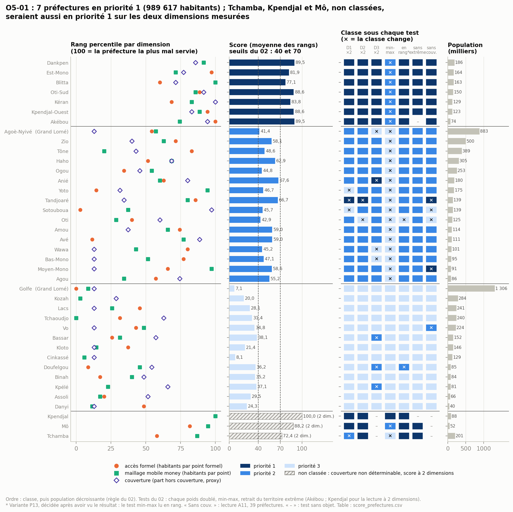
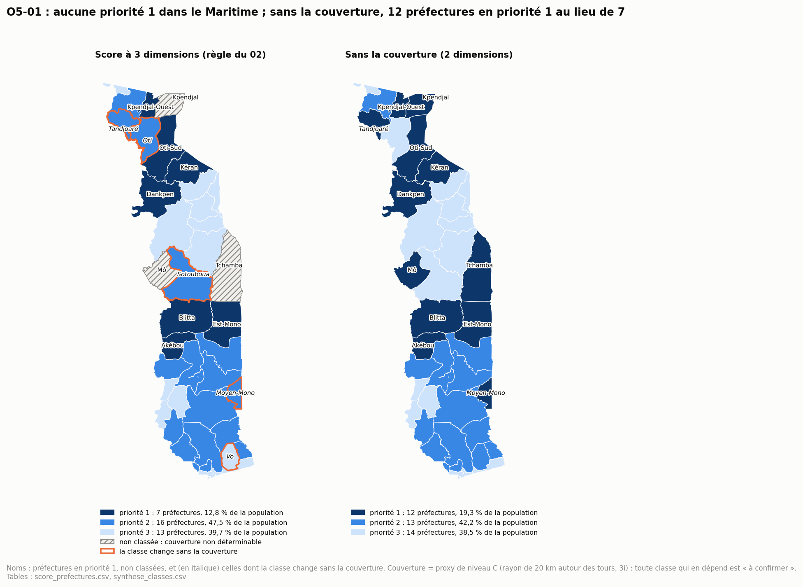

# 08 — Priorisation

*Par quelles préfectures commencer ? Le score O5-01, décomposé, testé, avec sa population à côté.*

Ce document correspond à l'étape 09 de la procédure, « scoring / priorisation ». La procédure en attend un score décomposé, un rang, une catégorie, une sensibilité aux pondérations, une robustesse et un niveau de confiance. Il calcule l'indicateur O5-01 du 02 à partir des indicateurs du 07, avec les décisions A11 et H6 validées le 27/09/2026.

**Périmètre** : le score O5-01 par préfecture. Le diagnostic par territoire relève de l'étape 10, les recommandations (O5-02 à O5-04) de l'étape 11.

**Ce que le 08 ne fait pas** : aucune cause (étape 10), aucune action (étape 11). Une priorité dit où regarder d'abord, pas quoi faire.

**Reproductible** : `python3 analyse/p08_score.py` puis `python3 analyse/figures_08.py`. Chaque chiffre renvoie à une table de `data/analysis/08_priorisation/` (nom entre crochets). Toutes les règles sont écrites en tête du script, avant le calcul.

**Règles communes** :
1. **Les règles du 02 sont appliquées telles quelles.** Un écart décidé après avoir vu le résultat est montré à côté, jamais à la place (P13, validé le 27/09/2026).
2. **Intensité et volume sont deux lectures.** Le score mesure l'intensité du sous-équipement ; la population est affichée à côté et ne départage qu'à classe égale.
3. **Donnée manquante n'est pas zéro** : une couverture non déterminable sort la préfecture du classement à 3 dimensions, jamais vers 0 %.
4. **Couverture** : 3i reste un proxy de niveau C (A17). Toute classe qui en dépend est « à confirmer ».

---

## Sommaire

1. Objectif du score
2. Territoire et variables
3. Normalisation et classes
4. Construction du score
5. Tests de cohérence
6. Résultats
7. Sensibilité
8. Limites et validation

---

## 1. Objectif du score

**Question du 02** : « Par quels territoires faut-il commencer ? » La décision attendue est d'ordonner la feuille de route et de rendre la priorisation **contestable parce qu'explicite** : chaque rang se décompose, chaque règle est écrite, chaque test est publié.

**Ce que mesure le score** : à quel point une préfecture est moins bien servie que les autres, en moyenne sur trois dimensions (accès formel, maillage mobile money, couverture réseau). C'est une mesure **relative** : une préfecture en priorité 3 n'est pas « bien servie », elle est mieux placée que les autres.

**Ce qu'il ne mesure pas** : le nombre de personnes concernées. Une préfecture peu peuplée et très mal servie passe avant une préfecture très peuplée et moyennement servie. La population est affichée à côté du score ; à classe égale, c'est elle qui départage (règle du 02).

**À quoi il sert** : choisir les préfectures que l'étape 10 diagnostique en premier et que l'étape 11 cible.

**Ce que le score couvre, objectif par objectif** :

| Objectif | Dans le score ? | Comment |
| -------- | --------------- | ------- |
| 1 — Usage d'Internet | **non**, indirectement | D3 mesure une condition de l'usage (le réseau), pas l'usage. O1-01 est national ; O1-05 et O1-06 sont régionaux (6 régions) : aucune mesure d'usage n'existe à la préfecture |
| 2 — Marché des télécommunications | en partie | D3 (O2-06, couverture). Parts de marché, chiffre d'affaires, prix (O2-01 à O2-05) sont nationaux |
| 3 — Cartographie de l'offre | oui | D1 et D2 reposent sur les points recensés (O3-01, O3-03) |
| 4 — Rapport à la population | oui, directement | D1 (O4-01) et D2 (O4-04) ; O4-05 et O4-06 en segments |
| 5 — Recommandations | oui | le score est O5-01, l'entrée des étapes 10 et 11 |

**Le score O5-01 priorise les préfectures pour l'accès financier et la couverture réseau, pas pour l'usage d'Internet.** Pour l'usage (objectif 1), les recommandations s'appuieront sur O1-05 (accès par région) et O1-06 (freins par région), pas sur le score.

**Les dimensions sont déséquilibrées** : deux pour l'inclusion financière (D1, D2), une pour Internet (D3). Ce déséquilibre tient aux données, pas à un choix de pondération : aucune mesure d'usage d'Internet n'existe à la préfecture. À poids égaux, l'inclusion financière pèse les deux tiers du score : il est plus adapté à prioriser l'inclusion financière que l'accès à Internet. Le test « poids de D3 doublé » (section 7) donne à la couverture autant de poids qu'aux deux dimensions financières réunies ; les 7 préfectures en priorité 1 n'y changent pas de classe.

---

## 2. Territoire et variables

**Maille** : les 39 préfectures, comme le fixe le 02. Le 06 a montré que le déficit d'accès formel est local, entre chefs-lieux et campagnes d'une même préfecture (S1 : Moran ≈ 0). La préfecture efface donc une partie des écarts. Les signaux communaux sont gardés à côté du score (segments ci-dessous et section 6.5), jamais dedans.

**Dimensions** (orientées : plus haut = plus mal servi) :

| # | Dimension | Indicateur du 02 | Construit sur | Objectifs servis | Mesure | Source (preuve) |
| - | --------- | ---------------- | ------------- | ---------------- | ------ | --------------- |
| D1 | Accès formel | O4-01 | O3-01 (points formels) et population | 3 et 4 | habitants par point formel (banques, IMF, assurances ; DAB exclus) | recensement PRISE 2021/2022 (A), RGPH 2022 (A) |
| D2 | Maillage mobile money | O4-04 | O3-03 (points mobile money) et population | 3 et 4 | habitants par point mobile money (des points, pas des agents : A8) | idem |
| D3 | Couverture réseau | O2-06 | couche des tours (3i) | 2 ; condition de l'usage pour 1 | part de la population hors couverture = 100 − proxy 3i | 3i, PRISE 2021/2022 (C) : couverture théorique, toutes technologies, rayon de 20 km |

**Millésimes** : points, tours et population datent de 2021-2022. L'écart est inférieur à 2 ans : le croisement est valide (règle des millésimes du 02).

**Exclus du score, par le 02** :
- O4-03 (points mobile money par guichet) : c'est le rapport de D1 et D2, donc redondant.
- O4-05 (statut) et O4-06 (matrice) : catégoriels, tirés des mêmes données. Ils **segmentent**, ils ne s'additionnent pas.
- La population : lecture séparée.

**Segments affichés à côté du score** [score_prefectures] : statut O4-05 et cellule O4-06 de la préfecture ; communes sans point formel ; communes en cellule critique ; communes à couverture douteuse (P6) ou non déterminable (A13).

**Donnée manquante** : la couverture de Mô, Kpendjal et Tchamba est « non déterminable » (A13 : 3i y donne 0 % ou 0,05 % alors que 32 à 205 points mobile money y fonctionnent). Ces trois préfectures sont **hors du classement à 3 dimensions** et lues avec le score à 2 dimensions (section 6.3).

**Grand Lomé** : Golfe et Agoè-Nyivé sont classées comme des préfectures (02). L'avertissement de P2 s'applique : population résidente, pas fréquentation. Les habitants d'Agoè-Nyivé utilisent aussi les points de Golfe ; son nombre d'habitants par point est probablement surestimé.

---

## 3. Normalisation et classes

**Rang percentile** : pour chaque dimension, rang percentile = 100 × (rang − 1) / (n − 1). Le rang est compté du mieux servi (1) au plus mal servi (n) ; 100 = la préfecture la plus mal servie, 0 = la mieux servie. Les ex aequo reçoivent le rang moyen : les 10 préfectures couvertes à 100 % ont toutes 12,9 sur D3.

**Pourquoi pas le min-max** : le min-max se fait écraser par un seul extrême (procédure, étape 08). Sur D1, les préfectures vont de 6 528 habitants par point formel (Golfe) à 73 830 (Akébou), avec une médiane de 13 641. En min-max, la moitié des préfectures tiendraient entre 0 et 11 : Akébou seule étirerait l'échelle. Le min-max reste un test de sensibilité (section 7).

**0 point formel** : rang le plus défavorable (règle du 02, pas une estimation). Seule Kpendjal est concernée ; elle est hors du classement à 3 dimensions, la règle ne joue que dans la lecture à 2 dimensions.

**Base du rang** : les 36 préfectures classées pour le score à 3 dimensions ; les 39 pour la lecture à 2 dimensions.

**Classes du 02**, sur la valeur non arrondie :

| Score | Classe | Lecture |
| ----- | ------ | ------- |
| 70 ou plus | priorité 1 | plus mal placée que 70 % des préfectures, en moyenne sur les dimensions |
| 40 à moins de 70 | priorité 2 | |
| moins de 40 | priorité 3 | |

---

## 4. Construction du score

**Formule** : score = (R1 + R2 + R3) / 3, où R est le rang percentile de chaque dimension. **Poids égaux** : l'exploration n'a donné aucune raison d'en préférer un autre (02 : toute autre pondération serait justifiée et fixée avant le calcul, jamais ajustée après lecture du classement).

**Décision A11, validée le 27/09/2026** : la couverture reste la 3e dimension, avec trois précautions :
- (a) les territoires non déterminables sont marqués : 3 préfectures hors classement ; les 9 communes non déterminables sont listées dans leur préfecture ;
- (b) la couverture est affichée à part : marqueur creux sur la figure 1, colonnes séparées dans la table ;
- (c) un score sans elle (D1 et D2, les 39 préfectures) est calculé comme lecture de sensibilité. Une préfecture « dépend de la couverture » si sa classe y change.

**Décision H6, validée le 27/09/2026** : si la corrélation de rang de D3 avec D1 ou avec D2 dépasse 0,7 sur les préfectures classées, D3 est fusionnée avec cette dimension (moyenne des deux rangs) et le score n'a plus que 2 dimensions. Résultat : pas de fusion (section 5).

**Robustesse** (02) : une classe est « robuste » si elle ne change sous aucun des tests du 02 (section 7), sinon « instable ».

**Niveau de confiance**, fixé avant le calcul :

| Confiance | Condition |
| --------- | --------- |
| faible | classe instable |
| moyenne | classe robuste, mais qui dépend de la couverture, ou couverture de la préfecture tirée en partie d'une commune douteuse (P6) ou non déterminable (A13) |
| élevée | classe robuste, indépendante de la couverture, sans commune douteuse |
| non classée | couverture non déterminable : lecture à 2 dimensions seulement |

**Ordre final** : classe, puis population décroissante (02 : à classe égale, la population exposée départage). Le rang du score est affiché à côté.

[regles_score] rappelle les règles appliquées au calcul.

---

## 5. Tests de cohérence

[h6_correlations] Corrélations de rang (Spearman) sur les 36 préfectures classées :

| Paire | Corrélation | Règle |
| ----- | ----------- | ----- |
| D3 couverture × D1 accès formel | 0,20 | pas de fusion (sous 0,7) |
| D3 couverture × D2 maillage mobile money | 0,40 | pas de fusion (sous 0,7) |
| D1 accès formel × D2 maillage mobile money | 0,53 | information |
| D3 couverture × densité de population | −0,69 | information |

- **H6 se retrouve à la maille préfectorale** : plus une préfecture est dense, moins sa population est hors couverture (−0,69 ; le 06 trouvait 0,64 entre couverture et densité par commune). La couverture suit bien la densité.
- **Mais elle ne double pas le score** : la densité n'est pas une dimension du score, et D3 est peu liée à D1 (0,20) et modérément à D2 (0,40). La couverture apporte une information que les deux autres dimensions n'ont pas. La règle H6 ne fusionne rien.
- **D1 et D2 sont liées sans être redondantes** (0,53) : les deux suivent l'urbanisation, mais une préfecture peut avoir peu de guichets et un réseau mobile money dense (Tône : 83 sur D1, 20 sur D2). Le 02 les garde séparées ; c'est leur rapport (O4-03) qu'il exclut comme redondant.

---

## 6. Résultats

### 6.1 Synthèse

*Figure 1 [score_prefectures, sensibilite_tests].*

| Classe (3 dimensions, 36 préfectures) | Préfectures | Population | Part de la population classée | Robustes (02) | Robustes (variante P13) | Segment : communes sans point formel (habitants) | Segment : communes en cellule critique O4-06 (habitants) |
| ------------------------------------- | ----------- | ---------- | ----------------------------- | ------------- | ----------------------- | ------------------------------------------------ | -------------------------------------------------------- |
| priorité 1 | 7 | 989 617 | 12,8 % | 0 | 7 | 6 (268 508) | 6 (261 656) |
| priorité 2 | 16 | 3 685 497 | 47,5 % | 0 | 8 | 6 (253 029) | 2 (106 878) |
| priorité 3 | 13 | 3 078 986 | 39,7 % | 10 | 10 | 8 (149 697) | 0 |
| **Non classées** (couverture non déterminable) | 3 : Tchamba, Kpendjal, Mô | 341 398 | — | — | — | 2 (88 365) | 0 |

[synthese_classes] La colonne « Robustes (02) » applique la règle du 02 à la lettre ; la section 7 explique pourquoi elle ne retient presque rien, et ce que montre la variante P13 (validée : c'est sa confiance qui sert aux étapes 10 et 11).

**Les 39 préfectures, avec leurs segments** [score_prefectures]. Ordre du 02 : classe, puis population décroissante. Les segments disent où agir sous la préfecture ; ils ne modifient pas le score.

| # | Préfecture | Classe | Score | Confiance (02 / P13) | Population | Statut O4-05 | Segments communaux |
| - | ---------- | ------ | ----- | -------------------- | ---------- | ------------ | ------------------ |
| 1 | Dankpen | priorité 1 | 89,5 | faible / élevée | 185 662 | mobile money dominant | cellule critique : Dankpen 2 ; sans point formel : Dankpen 2, Dankpen 3 |
| 2 | Est-Mono | priorité 1 | 81,9 | faible / élevée | 164 460 | mobile money dominant | — |
| 3 | Blitta | priorité 1 | 77,1 | faible / moyenne | 163 272 | desserte faible | cellule critique : Blitta 3 ; sans point formel : Blitta 3 |
| 4 | Oti-Sud | priorité 1 | 88,6 | faible / élevée | 150 376 | mobile money dominant | cellule critique : Oti-Sud 2 |
| 5 | Kéran | priorité 1 | 83,8 | faible / moyenne | 128 687 | desserte faible | cellule critique : Kéran 2 ; sans point formel : Kéran 2, Kéran 3 |
| 6 | Kpendjal-Ouest | priorité 1 | 88,6 | faible / élevée | 123 330 | mobile money dominant | cellule critique : Kpendjal-Ouest 1 |
| 7 | Akébou | priorité 1 | 89,5 | faible / élevée | 73 830 | mobile money dominant | cellule critique : Akébou 2 ; sans point formel : Akébou 2 |
| 8 | Agoè-Nyivé (Grand Lomé) | priorité 2 | 41,4 | faible / faible | 882 695 | mobile money dominant | — |
| 9 | Zio | priorité 2 | 58,1 | faible / élevée | 500 032 | mobile money dominant | — |
| 10 | Tône | priorité 2 | 48,6 | faible / élevée | 388 775 | mobile money dominant | sans point formel : Tône 2, Tône 4 |
| 11 | Haho | priorité 2 | 62,9 | faible / élevée | 305 096 | mobile money dominant | sans point formel : Haho 3 |
| 12 | Ogou | priorité 2 | 44,8 | faible / élevée | 253 467 | mobile money dominant | — |
| 13 | Anié | priorité 2 | 67,6 | faible / faible | 180 158 | mobile money dominant | cellule critique : Anié 2 |
| 14 | Yoto | priorité 2 | 46,7 | faible / faible | 174 851 | desserte faible | — |
| 15 | Tandjoaré ¹ | priorité 2 | 66,7 | faible / faible | 138 867 | mobile money dominant | — |
| 16 | Sotouboua ¹ | priorité 2 | 45,7 | faible / faible | 138 864 | desserte faible | — |
| 17 | Oti ¹ | priorité 2 | 42,9 | faible / faible | 124 848 | mobile money dominant | — |
| 18 | Amou | priorité 2 | 59,0 | faible / élevée | 114 172 | mobile money dominant | — |
| 19 | Avé | priorité 2 | 59,0 | faible / élevée | 111 214 | desserte faible | — |
| 20 | Wawa | priorité 2 | 45,2 | faible / faible | 101 300 | mobile money dominant | sans point formel : Wawa 2, Wawa 3 |
| 21 | Bas-Mono | priorité 2 | 47,1 | faible / faible | 94 860 | mobile money dominant | — |
| 22 | Moyen-Mono ¹ | priorité 2 | 58,6 | faible / moyenne | 90 505 | desserte faible | — |
| 23 | Agou | priorité 2 | 55,2 | faible / élevée | 85 793 | mobile money dominant | cellule critique : Agou 2 ; sans point formel : Agou 2 |
| 24 | Golfe (Grand Lomé) | priorité 3 | 7,1 | élevée / élevée | 1 305 681 | mobile money dominant | — |
| 25 | Kozah | priorité 3 | 20,0 | élevée / élevée | 283 738 | mobile money dominant | sans point formel : Kozah 3, Kozah 4 |
| 26 | Lacs | priorité 3 | 28,1 | élevée / élevée | 241 247 | mobile money dominant | — |
| 27 | Tchaoudjo | priorité 3 | 31,4 | élevée / élevée | 240 360 | mobile money dominant | sans point formel : Tchaoudjo 2, Tchaoudjo 3, Tchaoudjo 4 |
| 28 | Vo ¹ | priorité 3 | 34,8 | moyenne / moyenne | 224 411 | mobile money dominant | — |
| 29 | Bassar | priorité 3 | 38,1 | faible / faible | 152 065 | mobile money dominant | sans point formel : Bassar 4 |
| 30 | Kloto | priorité 3 | 21,4 | élevée / élevée | 145 986 | mobile money dominant | — |
| 31 | Cinkassé | priorité 3 | 8,1 | élevée / élevée | 128 959 | mobile money dominant | — |
| 32 | Doufelgou | priorité 3 | 36,2 | faible / faible | 84 767 | desserte faible | — |
| 33 | Binah | priorité 3 | 35,2 | élevée / élevée | 84 199 | mobile money dominant | — |
| 34 | Kpélé | priorité 3 | 37,1 | faible / faible | 80 939 | mobile money dominant | — |
| 35 | Assoli | priorité 3 | 29,5 | élevée / élevée | 66 394 | mobile money dominant | sans point formel : Assoli 2, Assoli 3 |
| 36 | Danyi | priorité 3 | 24,3 | élevée / élevée | 40 240 | mobile money dominant | — |
| — | Kpendjal | non classée (priorité 1 à 2 dimensions) | 100,0 (2 dim.) | non classée | 88 365 | mobile money uniquement | sans point formel : Kpendjal 1, Kpendjal 2 |
| — | Mô | non classée (priorité 1 à 2 dimensions) | 88,2 (2 dim.) | non classée | 52 448 | desserte faible | — |
| — | Tchamba | non classée (priorité 1 à 2 dimensions) | 72,4 (2 dim.) | non classée | 200 585 | desserte faible | — |

*¹ La classe change sans la couverture : à confirmer (section 7). « Cellule critique » : mobile money uniquement ou dominant et couverture sous 50 % (O4-06), toujours à confirmer.*

*Figure 2 [score_prefectures, synthese_classes].*

### 6.2 Les 7 préfectures en priorité 1

Ordre du 02 : population décroissante.

| Préfecture | Région | Population | Score | D1 : habitants par point formel (rang) | D2 : habitants par point mobile money (rang) | D3 : hors couverture (rang) | Statut O4-05 | Confiance (02 / P13) |
| ---------- | ------ | ---------- | ----- | -------------------------------------- | -------------------------------------------- | --------------------------- | ------------ | -------------------- |
| Dankpen | Kara | 185 662 | 89,5 | 30 944 (91) | 977 (91) | 36,2 % (86) | mobile money dominant | faible / élevée |
| Est-Mono | Plateaux | 164 460 | 81,9 | 54 820 (97) | 787 (71) | 25,5 % (77) | mobile money dominant | faible / élevée |
| Blitta | Centrale | 163 272 | 77,1 | 16 327 (60) | **1 814 (100)** | 12,8 % (71) | desserte faible | faible / moyenne |
| Oti-Sud | Savanes | 150 376 | 88,6 | 30 075 (89) | 946 (86) | 41,4 % (91) | mobile money dominant | faible / élevée |
| Kéran | Kara | 128 687 | 83,8 | 18 384 (69) | 926 (83) | **78,6 % (100)** | desserte faible | faible / moyenne |
| Kpendjal-Ouest | Savanes | 123 330 | 88,6 | 41 110 (94) | 956 (89) | 36,0 % (83) | mobile money dominant | faible / élevée |
| Akébou | Plateaux | 73 830 | 89,5 | **73 830 (100)** | 849 (74) | 41,8 % (94) | mobile money dominant | faible / élevée |

[score_prefectures]
- **Aucune dans le Maritime ni dans le Grand Lomé** : 2 dans les Plateaux, 2 à Kara, 2 dans les Savanes, 1 dans la Centrale.
- **Aucune dimension n'explique seule le classement.** Akébou a le pire accès formel (un seul point pour 73 830 habitants), Blitta le maillage mobile money le plus mince, Kéran la plus forte part hors couverture. Les autres cumulent trois rangs élevés.
- **Deux classes reposent sur une couverture fragile** : Kéran (Kéran 2 douteuse, Kéran 3 non déterminable) et Blitta (Blitta 3 douteuse). Sans la couverture, elles restent en priorité 1 (section 7) ; leur confiance est « moyenne ».
- **Les signaux communaux s'y concentrent** : 6 des 8 communes en cellule critique d'O4-06 (261 656 habitants) et 6 des 22 communes sans point formel (268 508 habitants) sont dans ces 7 préfectures.

### 6.3 Les trois préfectures non classées, et le cas de Kpendjal

Leur couverture est inconnue (A13). Le 02 interdit de la mettre à 0 : elles sont hors du classement à 3 dimensions. Sur les deux dimensions mesurées, elles seraient **toutes en priorité 1** :

| Préfecture | Population | Score à 2 dimensions | Robustesse (02 / P13) | Statut O4-05 |
| ---------- | ---------- | -------------------- | --------------------- | ------------ |
| Kpendjal | 88 365 | 100,0 : la plus mal servie sur D1 (aucun point formel) et sur D2 (2 155 habitants par point mobile money) | robuste / robuste | **mobile money uniquement** |
| Mô | 52 448 | 88,2 | instable (min-max) / robuste | desserte faible |
| Tchamba | 200 585 | 72,4 | instable / instable (poids D1 doublé : priorité 2) | desserte faible |

**Hors classement ne veut pas dire hors priorité.** Ces trois préfectures sont portées à l'étape 10 dans une liste à part, « non classées, priorité 1 à 2 dimensions, à confirmer », jamais mêlées au classement (P14, validé).

**Kpendjal relève de deux logiques à la fois** :
- **non classée** pour le score : sa couverture est non déterminable (A13) ;
- **priorité absolue** pour O5-03 : c'est la seule préfecture « mobile money uniquement », sans aucun point formel pour 88 365 habitants. Le 02 donne une priorité absolue à ces territoires. Cette priorité ne dépend ni du score ni de la couverture.

Kpendjal ne peut donc pas disparaître des recommandations parce qu'elle manque au classement. À la maille communale, 22 communes sont aussi « mobile money uniquement » (liste de P15) : l'étape 11 dira si la priorité absolue d'O5-03 s'applique aussi à cette maille.

### 6.4 Priorités 2 et 3

- **Priorité 2 : 16 préfectures, 47,5 % de la population classée.** Elles vont d'Agoè-Nyivé (41,4 : juste au-dessus du seuil, instable) à Anié (67,6 : juste en dessous du seuil de 70, en priorité 1 si l'on double le poids de la couverture). Anié contient Anié 2, commune en cellule critique ; Agou contient Agou 2.
- **Priorité 3 : 13 préfectures.** Golfe (7,1), Cinkassé (8,1), Kozah (20,0) et Tchaoudjo (31,4) : les pôles urbains et leurs préfectures. 10 des 13 sont robustes.
- **Grand Lomé** : Golfe en priorité 3, Agoè-Nyivé en priorité 2 de justesse. L'avertissement de P2 (population résidente) tire Agoè-Nyivé vers le haut.

### 6.5 Intensité et volume

- **Le score mesure l'intensité, la population le volume.** Les 7 préfectures en priorité 1 comptent 989 617 habitants (12,8 %). Les plus grosses populations sont en priorité 2 ou 3 : Golfe (1,31 million), Agoè-Nyivé (0,88 million), Zio (0,50 million).
- **La règle qui tranche entre les deux est celle du 02** : la classe d'abord, la population ensuite, à l'intérieur de la classe. Dans la priorité 1, Dankpen (185 662 habitants) vient donc avant Akébou (73 830), bien qu'elles aient le même score.
- **La préfecture cache des communes** (S1 du 06) : 8 des 22 communes sans point formel (149 697 habitants) sont dans des préfectures en priorité 3, autour de Sokodé et de Kara : Tchaoudjo 2, 3 et 4, Kozah 3 et 4, Assoli 2 et 3, Bassar 4. Leur chef-lieu concentre les points (H4 du 06) ; le score préfectoral ne les voit pas (point P15).

---

## 7. Sensibilité

[sensibilite_tests] Les trois tests du 02, puis la lecture sans couverture (A11) :

| Test | Préfectures | Classes qui changent | Corrélation de rang avec le score principal |
| ---- | ----------- | -------------------- | ------------------------------------------- |
| Poids de D1 doublé | 36 | 3 | 0,97 |
| Poids de D2 doublé | 36 | 2 | 0,98 |
| Poids de D3 doublé | 36 | 7 | 0,95 |
| Min-max au lieu du rang percentile | 36 | **23** | 0,96 |
| Retrait du territoire extrême (Akébou, D1) | 35 | 0 | 1,00 |
| *Variante P13 : min-max lu en rang* | 36 | 2 | 0,96 |
| Sans la couverture (A11, 2 dimensions) | 39 | 5 sur 36 | — |

**Pondérations** : doubler un poids change 2 à 7 classes, toujours d'une seule classe et près d'un seuil. Le poids de la couverture est le plus sensible : le doubler fait passer Anié en priorité 1, Agoè-Nyivé, Wawa et Bas-Mono en priorité 3, et Bassar, Doufelgou et Kpélé en priorité 2. Doubler D1 ou D2 fait passer Tandjoaré en priorité 1. **Aucune des 7 préfectures en priorité 1 ne change de classe sous un poids doublé.**

**Territoire extrême** : Akébou, dont l'accès formel s'écarte de la médiane de 6,3 écarts interquartiles (73 830 habitants pour un point). La retirer ne change aucune classe.

**Min-max : l'ordre tient, l'échelle non.**
- Les 7 préfectures en tête sont les mêmes avec les deux normalisations. Le plus grand déplacement est celui de Sotouboua, du 19e au 8e rang : sa part hors couverture (73 %) est une valeur extrême que le min-max amplifie.
- Mais le min-max comprime l'échelle : le score le plus haut y vaut 64,8 et la médiane 14,9. **Aucune préfecture n'atteint 70.** Les seuils du 02 ont un sens pour des rangs (« plus mal placée que 70 % des préfectures »), pas pour un min-max. Toutes les priorités 1 y passent en priorité 2, toutes les priorités 2 en priorité 3.
- **Conséquence, à la lettre du 02 : aucune préfecture en priorité 1 ou 2 n'est robuste** (0 sur 23), et leur confiance est « faible ». Ce n'est pas le classement qui est fragile, c'est la lecture du test.
- **Variante P13, décidée après avoir vu le résultat** : lire le test min-max en rang. Les 7 premiers du classement min-max sont en priorité 1, les 16 suivants en priorité 2 (mêmes effectifs que le score principal). Seules Oti et Doufelgou y changent de classe. Avec cette lecture, les 7 priorités 1 sont robustes, ainsi que 8 priorités 2 sur 16. Parce qu'elle vient après le résultat, la variante est affichée à côté de la règle du 02, jamais à sa place (point P13).

**Sans la couverture (A11)** : **les 7 priorités 1 le restent.** Cinq préfectures changent de classe ; leur classe dépend du proxy, elle est « à confirmer » :

| Préfecture | Avec la couverture | Sans la couverture | Raison |
| ---------- | ------------------ | ------------------ | ------ |
| Tandjoaré | priorité 2 | priorité 1 | accès formel et mobile money faibles, bien couverte (99,8 %) |
| Moyen-Mono | priorité 2 | priorité 1 | maillage mobile money très mince (rang 97), couverte à 100 % |
| Sotouboua | priorité 2 | priorité 3 | seule sa couverture (27 %) la classe ; bien dotée en points formels |
| Oti | priorité 2 | priorité 3 | c'est la couverture (92,8 %, rang 60) qui la classe ; accès et maillage dans la moitié la mieux servie |
| Vo | priorité 3 | priorité 2 | couverte à 100 % ; accès et maillage moyens |

**Niveau de confiance** (règle de la section 4) :

| Classe | Confiance selon le 02 (élevée / moyenne / faible) | Confiance avec la variante P13 |
| ------ | ------------------------------------------------- | ------------------------------ |
| priorité 1 | 0 / 0 / 7 | 5 / 2 / 0 |
| priorité 2 | 0 / 0 / 16 | 7 / 1 / 8 |
| priorité 3 | 9 / 1 / 3 | 9 / 1 / 3 |

---

## 8. Limites et validation

### 8.1 Ce que le score permet, et ce qu'il ne permet pas

**Il permet** :
- d'ordonner les 36 préfectures classées par l'intensité relative de leur sous-équipement, sur trois dimensions mesurées ;
- de désigner un noyau stable : les 7 priorités 1, qui le restent sous tous les poids, sans le territoire extrême et sans la couverture ; et les 3 préfectures non classées, en priorité 1 sur les deux dimensions mesurées ;
- de dire quelles classes dépendent du proxy de couverture (5 préfectures) et lesquelles sont proches d'un seuil.

**Il ne permet pas** :
- de prioriser l'usage d'Internet : aucune mesure d'usage n'existe à la préfecture. Pour l'objectif 1, les recommandations partiront d'O1-05 et d'O1-06, par région (section 1) ;
- de mesurer un besoin absolu : le rang est relatif. Une préfecture en priorité 3 peut contenir des communes sans aucun point formel (section 6.5) ;
- de voir sous la préfecture : 8 communes sans point formel sont dans des préfectures en priorité 3 (S1) ;
- de mesurer le coût, les compétences ou l'usage du mobile money : ces données n'existent qu'au niveau national ou régional (O1-06, O3-05, O3-06) ;
- de compter des agents : D2 compte des points (A8) ;
- de mesurer la couverture réelle : D3 est une couverture théorique de niveau C, sans distinction 2G, 3G ou 4G ;
- de dire pourquoi une préfecture est prioritaire (étape 10) ni quoi y faire (étape 11).

### 8.2 Validation par les analyses communales

[controle_communes_signalees] Le score est calculé par préfecture, sans regarder les communes. On vérifie qu'il retrouve les territoires que le 06 et le 07 avaient signalés commune par commune :

| Signal communal | Communes | Préfecture en priorité 1 | Préfecture non classée (priorité 1 à 2 dimensions) | Préfecture en priorité 2 ou 3 |
| --------------- | -------- | ------------------------ | -------------------------------------------------- | ----------------------------- |
| Cumul de trois signaux (06, section 9) | 5 | 3 : Akébou 2, Dankpen 2, Kéran 2 | 2 : Kpendjal 1, Kpendjal 2 | 0 |
| Cellule critique O4-06 (07) | 8 | 6 | 0 | 2 : Agou 2, Anié 2 (priorité 2) |

**Le contrôle est concluant** : les 5 communes qui cumulent trois signaux sont toutes dans une préfecture en priorité 1 ou non classée. Les deux cellules critiques hors priorité 1 sont dans des préfectures en priorité 2, dont Anié, qui passe en priorité 1 si l'on double le poids de la couverture.

### 8.3 Points à valider

| # | Question | Proposition | Objectif concerné |
| - | -------- | ----------- | ----------------- |
| P13 | Test min-max : à la lettre du 02, il rend instables toutes les priorités 1 et 2, parce que le min-max comprime l'échelle (score maximal 64,8), alors que l'ordre tient (corrélation de 0,96 ; mêmes 7 préfectures en tête) | Garder la règle du 02 comme lecture principale et afficher à côté la variante « min-max lu en rang », déclarée **décidée après avoir vu le résultat**. Utiliser la confiance de la variante pour les étapes 10 et 11, en le disant. **Validé (27/09/2026)** | 5 |
| P14 | Mô, Kpendjal et Tchamba sont hors classement (couverture non déterminable) mais en priorité 1 sur les deux dimensions mesurées | Les porter à l'étape 10 dans une liste à part, « non classées, priorité 1 à 2 dimensions, à confirmer », jamais mêlées au classement. Kpendjal relève en plus de la priorité absolue d'O5-03 (mobile money uniquement). **Validé (27/09/2026)** | 4, 5 |
| P15 | La préfecture cache des communes : 8 communes sans point formel sont dans des préfectures en priorité 3 | Joindre au diagnostic de l'étape 10 la liste des communes signalées (22 sans point formel, 8 en cellule critique) avec la classe de leur préfecture, sans calculer de score communal. **Validé (27/09/2026)** | 4, 5 |

**Pour la suite** :
- **Document 09, diagnostic (étape 10)** : une phrase par préfecture en priorité 1, puis pour les 3 préfectures non classées et les communes de P15. Partir de la décomposition (quelle dimension place la préfecture en tête), des segments et de la confiance de la variante P13.
- **Recommandations (étape 11)** : cibler d'abord les priorités 1 et Kpendjal (O5-03) ; pour l'usage d'Internet, partir d'O1-05 et d'O1-06 par région ; compter en habitants, jamais en rangs.
- **Dashboard (étape 12)** : les poids sont modifiables par le lecteur (02) ; afficher la classe, la confiance, la population, les segments et la mention « couverture théorique (proxy) » sur la même vue.
