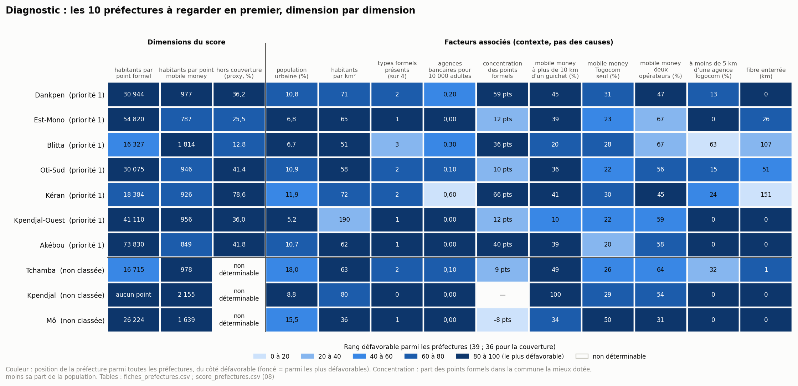
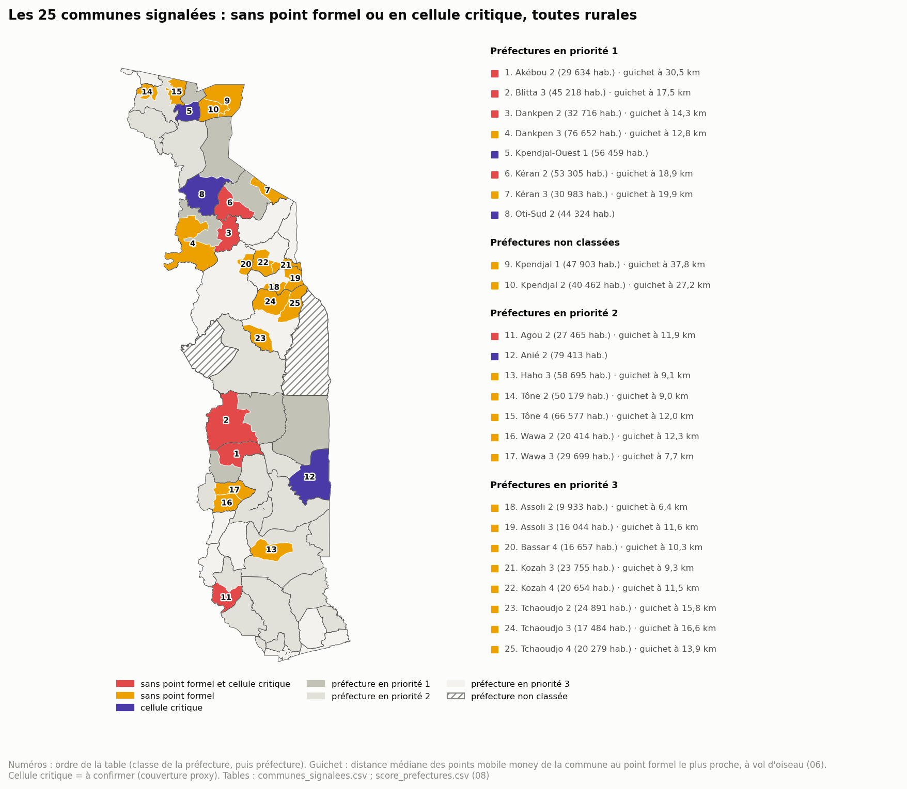

# 09 — Diagnostic territorial

*Pourquoi ces territoires, et pas seulement à quel rang ? Une fiche par préfecture prioritaire, les communes signalées, ce qui se répète.*

Ce document correspond à l'étape 10 de la procédure, « cross-analysis & diagnostic ». La procédure en attend **une phrase de diagnostic par territoire prioritaire** : passer de « la préfecture a un score de 89 » à « elle cumule peu de guichets, un réseau mobile money éloigné des guichets et une couverture faible ». Le décideur agit sur un déficit, pas sur un rang.

**Périmètre** : les 7 préfectures en priorité 1 et les 3 non classées du 08 (P14, validé) ; les 25 communes signalées (P15, validé) ; l'usage d'Internet à la maille régionale (section 5).

**Ce que le 09 ne fait pas** : aucun nouveau score, aucun nouveau classement (il part du 08, il ne le refait pas) ; aucune recommandation (étape 11) ; **aucune cause démontrée**. Les données disent où et de quelle nature est le déficit, et ce qui l'accompagne ; elles ne disent pas pourquoi il existe.

**Reproductible** : `python3 analyse/p09_diagnostic.py` puis `python3 analyse/figures_09.py`. Chaque chiffre renvoie à une table de `data/analysis/09_diagnostic/` (nom entre crochets) ou du 08. Les règles sont écrites en tête du script, avant le calcul.

**Règles communes** :
1. **Nature du déficit, pas cause.** Une dimension du score est un « déficit marqué » si son rang est de 75 ou plus (le quart le plus mal servi). Le « moteur » est la dimension au rang le plus haut.
2. **Facteurs associés, jamais explicatifs.** Chaque facteur de contexte est situé parmi les 39 préfectures. « Associé à » n'est jamais « dû à ».
3. **Le contexte régional reste régional.** Accès à Internet, alphabétisation et usage du mobile money (EHCVM 2021/22, niveau B) sont connus pour 6 régions : ils décrivent la région de la préfecture, pas la préfecture.
4. **Confiance** : celle de la variante P13 (validée). Toute information de couverture est un proxy (niveau C) ; toute cellule critique est « à confirmer ».

**Écarts au plan proposé** :

| Plan proposé | Ce qui a été fait | Raison |
| ------------ | ----------------- | ------ |
| « Causes possibles » | « Nature du déficit » et « facteurs associés » | Aucune donnée ne permet d'établir une cause ; la procédure demande d'agir sur un déficit identifié |
| Méthode en 4 angles | 4 angles définis, et une règle écrite pour chacun | Rendre chaque fiche comparable et vérifiable |
| Une page par fiche | Une demi-page, sur un modèle fixe, et une figure commune (figure 1) | Dix fiches lisibles ; les chiffres complets sont dans la table |
| — | Ajout : section 8, limites et points à valider | Comme dans les autres documents |
| — | Ajouts validés le 27/09/2026 : opérateurs et marché dans chaque fiche ; section 5, diagnostic régional de l'usage d'Internet ; dans la synthèse, ce que le marché apporte et les leviers possibles | Couvrir les objectifs 1, 2 et 3 dans le diagnostic, avant l'étape 11 |

---

## Sommaire

1. Objet et périmètre
2. Méthode
3. Les 7 préfectures en priorité 1
4. Les 3 préfectures non classées
5. Diagnostic régional de l'usage d'Internet
6. Les communes signalées
7. Synthèse transversale
8. Limites et points à valider

---

## 1. Objet et périmètre

| Étape | Document | Question | Réponse |
| ----- | -------- | -------- | ------- |
| 09 | 08 (score) | Où regarder en premier ? | 7 préfectures en priorité 1, 3 non classées, 25 communes signalées |
| 10 | **09 (diagnostic)** | **De quelle nature est le déficit, et qu'est-ce qui l'accompagne ?** | Une phrase et une fiche par territoire |
| 11 | à venir | Que faire, où, pour combien d'habitants ? | Actions ciblées et chiffrées |

**Territoires diagnostiqués** : 10 préfectures (1 331 015 habitants) et 25 communes (939 795 habitants), dont 10 sont dans ces préfectures.

**Ce que le diagnostic couvre** : l'accès financier (formel et mobile money) et la couverture réseau, comme le score. Pour l'usage d'Internet (objectif 1), seul le contexte régional est disponible (règle 3) ; les recommandations s'appuieront sur O1-05 et O1-06 (08, section 1).

---

## 2. Méthode

Chaque territoire est lu sous quatre angles, toujours dans le même ordre :

| # | Angle | Question | Mesures | Source |
| - | ----- | -------- | ------- | ------ |
| 1 | Nature du déficit | Quelle dimension le place en tête ? | rangs de D1 (accès formel), D2 (maillage mobile money), D3 (couverture) ; déficits marqués (rang de 75 ou plus) ; moteur | 08 |
| 2 | Offre présente | Qu'y a-t-il, et où ? | banques, IMF, assurances, DAB, bureaux de poste, points mobile money ; part des points formels dans la commune la mieux dotée, face à sa part de la population | 07 |
| 3 | Sous la préfecture | Quelles communes décrochent ? | communes signalées ; distance des points mobile money au guichet le plus proche ; grappes locales | 06, 07 |
| 4 | Réseau, opérateurs et contexte | Sur quoi repose l'accès numérique ? | couverture (et sa fiabilité) ; fibre ; opérateurs du mobile money ; agences Togocom (3i) ; contexte régional | 06, 07, 3i |

**Modèle de fiche** : une phrase de diagnostic ; les chiffres clés ; les quatre angles ; ce qui reste incertain ; la question que l'étape 11 devra trancher.

**Leviers possibles** [leviers_possibles] : chaque déficit marqué est relié à une famille de leviers par une correspondance fixe, reprise du tableau des leviers du 05 : accès formel → infrastructure financière (points formels) ; maillage mobile money → réseau d'agents ; couverture → infrastructure réseau, toujours conditionnée à la confirmation de la couverture réelle. Ce sont des pistes à instruire à l'étape 11, pas des recommandations.

**Facteurs associés** [facteurs_repetition] : dix mesures de contexte (dont, depuis le 27/09/2026, les points servis par les deux opérateurs et la proximité d'une agence Togocom), chacune située parmi les 39 préfectures. Un facteur « se répète » s'il est du côté défavorable de la médiane dans au moins 6 des 7 préfectures en priorité 1 ; « partagé » pour 4 ou 5 ; « non commun » en dessous.

---

## 3. Les 7 préfectures en priorité 1

*Figure 1 [fiches_prefectures ; score_prefectures du 08]. Foncé = parmi les préfectures les plus défavorables sur cette mesure.*

Ordre du 08 : population décroissante.

### 3.1 Dankpen — Kara, 185 662 habitants

> **Diagnostic** : Dankpen cumule les trois déficits (rangs de 86 à 91). Tous ses points formels sont à Dankpen 1, qui n'abrite que 41 % de la population, et 45 % de ses points mobile money sont à plus de 10 km d'un guichet.

| Score | Confiance | Moteur | Déficits marqués | Statut O4-05 |
| ----- | --------- | ------ | ---------------- | ------------ |
| 89,5 | élevée | accès formel et mobile money, à égalité | les trois : accès formel (91), mobile money (91), couverture (86) | mobile money dominant |

- **Offre** : 2 banques, 4 IMF, aucune assurance, aucun DAB, 1 bureau de poste ; 190 points mobile money. Un point formel pour 30 944 habitants, un point mobile money pour 977.
- **Sous la préfecture** : Dankpen 2 (32 716 habitants) et Dankpen 3 (76 652) n'ont aucun point formel ; leurs guichets les plus proches sont à 14,3 et 12,8 km en médiane. Dankpen 3 est la plus peuplée des 22 communes sans point formel. Dankpen 2 est en cellule critique (couverture 47,7 %).
- **Réseau et contexte** : couverture théorique 63,8 %. Aucune fibre enterrée ; Dankpen 2 et 3 n'ont aucune fibre recensée. Région de Kara : 21,2 % d'accès à Internet, 60,2 % d'alphabétisation.
- **Opérateurs et marché** : points mobile money servis par les deux opérateurs 46,9 %, par Togocom seul 31,1 %, par Moov seul 4,2 %, sans opérateur renseigné 17,9 %. Commune où Togocom seul sert au moins la moitié des points : Dankpen 2. Près d'un point sur cinq sans opérateur renseigné, comme ailleurs dans la région de Kara : la lecture par opérateur y est incertaine. Réseau commercial : 1 agence Togocom, 12,6 % des habitants à moins de 5 km.
- **Incertain** : la couverture est un proxy ; Dankpen 2 est « à confirmer ».
- **Pour l'étape 11** : le déficit est d'abord la distance au guichet, pour les 109 368 habitants de Dankpen 2 et 3.

### 3.2 Est-Mono — Plateaux, 164 460 habitants

> **Diagnostic** : Est-Mono n'a aucune agence bancaire : 3 IMF, une par commune, pour 164 460 habitants (54 820 par point formel, la deuxième plus mal servie des préfectures classées). Son réseau mobile money est plus dense (rang 71), mais 39 % de ses points sont à plus de 10 km d'un guichet.

| Score | Confiance | Moteur | Déficits marqués | Statut O4-05 |
| ----- | --------- | ------ | ---------------- | ------------ |
| 81,9 | élevée | accès formel | accès formel (97), couverture (77) | mobile money dominant |

- **Offre** : 0 banque, 3 IMF, aucune assurance, aucun DAB, 1 bureau de poste ; 209 points mobile money (787 habitants par point).
- **Sous la préfecture** : aucune commune sans point formel, mais Est-Mono 2 (101 866 habitants) n'a qu'une IMF, et ses points mobile money sont à 16,7 km d'un guichet en médiane (55 % à plus de 10 km). Est-Mono 2 est dans une grappe « faible entourée de faibles » pour le mobile money.
- **Réseau et contexte** : couverture théorique 74,5 % (Est-Mono 2 : 55,3 %). 26 km de fibre enterrée ; deux communes sans fibre recensée. Région des Plateaux : 19,6 % d'accès à Internet ; la règle d'O1-06 y présume un frein de capacité et un frein de coût.
- **Opérateurs et marché** : points mobile money servis par les deux opérateurs 67,0 %, par Togocom seul 23,0 %, par Moov seul 4,8 %, sans opérateur renseigné 5,3 %. Réseau commercial : aucune agence Togocom.
- **Incertain** : rien de propre à Est-Mono au-delà du proxy de couverture.
- **Pour l'étape 11** : le déficit est l'absence de banque, et l'éloignement des guichets dans Est-Mono 2.

### 3.3 Blitta — Centrale, 163 272 habitants

> **Diagnostic** : Blitta a le réseau mobile money le plus mince des préfectures classées (1 814 habitants par point), alors que son accès formel est moyen (rang 60). Blitta 3 n'a ni guichet ni couverture fiable.

| Score | Confiance | Moteur | Déficits marqués | Statut O4-05 |
| ----- | --------- | ------ | ---------------- | ------------ |
| 77,1 | moyenne (Blitta 3 douteuse) | maillage mobile money | mobile money (100) | desserte faible |

- **Offre** : 3 banques, 7 IMF, aucune assurance, 1 DAB (le seul des 10 préfectures), 2 bureaux de poste ; 90 points mobile money seulement. Blitta 1 concentre 80 % des points formels pour 44 % de la population.
- **Sous la préfecture** : Blitta 2 (46 515 habitants) n'a que 9 points mobile money, Blitta 3 (45 218) n'en a que 6 et aucun point formel (guichet à 17,5 km). Blitta 2 est dans une grappe « faible entourée de faibles » pour le mobile money.
- **Réseau et contexte** : couverture théorique 87,2 %, mais 9,9 % seulement à Blitta 3, valeur douteuse (P6). 107 km de fibre enterrée. Région Centrale : l'usage du mobile money le plus bas (19,9 % des 15 ans et plus).
- **Opérateurs et marché** : points mobile money servis par les deux opérateurs 66,6 %, par Togocom seul 27,8 %, par Moov seul 4,4 %, sans opérateur renseigné 1,1 %. Commune où Togocom seul sert au moins la moitié des points : Blitta 3. Réseau commercial : 1 agence Togocom, 62,9 % des habitants à moins de 5 km.
- **Incertain** : la couverture de Blitta 3.
- **Pour l'étape 11** : ici, le déficit est le réseau d'agents mobile money, pas les guichets.

### 3.4 Oti-Sud — Savanes, 150 376 habitants

> **Diagnostic** : Oti-Sud cumule les trois déficits (rangs de 86 à 91), la couverture en tête : 41 % de la population est hors couverture théorique. Oti-Sud 2 a un guichet, mais 20 % de couverture.

| Score | Confiance | Moteur | Déficits marqués | Statut O4-05 |
| ----- | --------- | ------ | ---------------- | ------------ |
| 88,6 | élevée | couverture | les trois : accès formel (89), mobile money (86), couverture (91) | mobile money dominant |

- **Offre** : 1 banque, 4 IMF, aucune assurance, aucun DAB, 1 bureau de poste ; 159 points mobile money. Les points formels suivent la population (Oti-Sud 1 : 80 % des points, 71 % des habitants).
- **Sous la préfecture** : Oti-Sud 2 (44 324 habitants) : une IMF, 39 points mobile money dont 62 % à plus de 10 km d'un guichet, couverture 20,2 % : cellule critique.
- **Réseau et contexte** : couverture théorique 58,6 %. 51 km de fibre enterrée. Région des Savanes : l'accès à Internet le plus faible (14,3 %), l'alphabétisation la plus faible (41,2 %) ; frein de capacité et frein de coût présumés (O1-06).
- **Opérateurs et marché** : points mobile money servis par les deux opérateurs 56,0 %, par Togocom seul 22,0 %, par Moov seul 12,0 %, sans opérateur renseigné 10,0 %. Réseau commercial : 1 agence Togocom, 14,8 % des habitants à moins de 5 km.
- **Incertain** : la cellule critique d'Oti-Sud 2 repose sur le proxy.
- **Pour l'étape 11** : le déficit est d'abord le réseau (couverture), puis les guichets.

### 3.5 Kéran — Kara, 128 687 habitants

> **Diagnostic** : Kéran est en tête surtout par la couverture : 78,6 % de la population hors couverture théorique, le taux le plus élevé. Mais ce taux vient de communes à valeur douteuse ou inconnue, et ses agences bancaires sont au-dessus de la médiane, toutes à Kéran 1.

| Score | Confiance | Moteur | Déficits marqués | Statut O4-05 |
| ----- | --------- | ------ | ---------------- | ------------ |
| 83,8 | moyenne (Kéran 2 douteuse, Kéran 3 non déterminable) | couverture | mobile money (83), couverture (100) | desserte faible |

- **Offre** : 4 banques et 3 IMF, toutes à Kéran 1 (34,5 % de la population) ; 0,6 agence pour 10 000 adultes, au-dessus de la médiane (0,33). Aucune assurance, aucun DAB ; 139 points mobile money.
- **Sous la préfecture** : Kéran 2 (53 305 habitants) et Kéran 3 (30 983) n'ont aucun point formel ; guichet à 18,9 et 19,9 km en médiane. Kéran 2 est en cellule critique.
- **Réseau et contexte** : 3i donne 1,5 % de couverture à Kéran 2, où 38 points mobile money fonctionnent (valeur douteuse, P6), et rien à Kéran 3 (non déterminable) ; Kéran 1 lui-même n'est couvert qu'à 44,7 %. 151 km de fibre enterrée. Région de Kara.
- **Opérateurs et marché** : points mobile money servis par les deux opérateurs 44,6 %, par Togocom seul 30,2 %, par Moov seul 2,2 %, sans opérateur renseigné 23,0 %. La part sans opérateur renseigné est la plus élevée des 10 préfectures. Réseau commercial : 2 agences Togocom, 23,5 % des habitants à moins de 5 km.
- **Incertain** : c'est la priorité 1 la moins sûre. Sans la couverture, Kéran reste en priorité 1, mais de justesse (71,0) ; à 2 dimensions, doubler le poids de l'accès formel la fait passer en priorité 2 (08, section 7).
- **Pour l'étape 11** (P16, validé) : Kéran reste en priorité 1. Les actions sur les guichets de Kéran 2 et 3 n'attendent pas : l'éloignement des guichets est certain. Les actions sur le réseau sont conditionnées à la confirmation de la couverture réelle.

### 3.6 Kpendjal-Ouest — Savanes, 123 330 habitants

> **Diagnostic** : Kpendjal-Ouest n'a aucune banque (3 IMF pour 123 330 habitants), dans une préfecture pourtant dense (190 habitants au km², deux fois la médiane). Ses deux communes forment avec Kpendjal 2 une grappe « faible entourée de faibles » pour les points formels.

| Score | Confiance | Moteur | Déficits marqués | Statut O4-05 |
| ----- | --------- | ------ | ---------------- | ------------ |
| 88,6 | élevée | accès formel | les trois : accès formel (94), mobile money (89), couverture (83) | mobile money dominant |

- **Offre** : 0 banque, 3 IMF, aucune assurance, aucun DAB, **aucun bureau de poste** (la seule des 10) ; 129 points mobile money.
- **Sous la préfecture** : les points mobile money sont proches des IMF (10 % à plus de 10 km, sous la médiane nationale) : le déficit n'est pas la distance, c'est le nombre de guichets. Kpendjal-Ouest 1 (56 459 habitants, une IMF, couverture 45,5 %) est en cellule critique.
- **Réseau et contexte** : couverture théorique 64,0 %. Aucune fibre recensée dans ses deux communes. Région des Savanes (14,3 % d'accès à Internet, 41,2 % d'alphabétisation).
- **Opérateurs et marché** : points mobile money servis par les deux opérateurs 58,9 %, par Togocom seul 22,5 %, par Moov seul 17,8 %, sans opérateur renseigné 0,8 %. Réseau commercial : aucune agence Togocom.
- **Incertain** : la cellule critique repose sur le proxy.
- **Pour l'étape 11** : le déficit est le nombre de guichets pour une population dense et proche ; c'est aussi le voisinage de Kpendjal (section 4.1).

### 3.7 Akébou — Plateaux, 73 830 habitants

> **Diagnostic** : Akébou a l'accès formel le plus faible des préfectures classées : un seul point formel, une IMF, pour 73 830 habitants. Akébou 2 est à 30,5 km d'un guichet en médiane, avec 27 % de couverture.

| Score | Confiance | Moteur | Déficits marqués | Statut O4-05 |
| ----- | --------- | ------ | ---------------- | ------------ |
| 89,5 | élevée | accès formel | accès formel (100), couverture (94) | mobile money dominant |

- **Offre** : 0 banque, 1 IMF (Akébou 1), aucune assurance, aucun DAB, 1 bureau de poste ; 87 points mobile money (849 habitants par point).
- **Sous la préfecture** : Akébou 2 (29 634 habitants) n'a aucun point formel ; ses 24 points mobile money sont tous à plus de 10 km d'un guichet (30,5 km en médiane, la deuxième plus longue des 22 communes sans point formel, après Kpendjal 1). Cellule critique. Akébou 1 est dans une grappe « faible entourée de faibles » pour les points formels, Akébou 2 pour le mobile money.
- **Réseau et contexte** : couverture théorique 58,2 % (Akébou 2 : 27,2 %). Aucune fibre recensée dans ses deux communes. Région des Plateaux.
- **Opérateurs et marché** : points mobile money servis par les deux opérateurs 57,5 %, par Togocom seul 19,5 %, par Moov seul 4,6 %, sans opérateur renseigné 18,4 %. Réseau commercial : aucune agence Togocom.
- **Incertain** : la cellule critique d'Akébou 2 repose sur le proxy.
- **Pour l'étape 11** : le déficit est l'absence presque totale de guichets, et l'isolement d'Akébou 2 (30 km).

---

## 4. Les 3 préfectures non classées

Leur couverture est inconnue (A13). Elles sont lues sur deux dimensions (08, section 6.3), et restent hors du classement.

### 4.1 Kpendjal — Savanes, 88 365 habitants

> **Diagnostic** : Kpendjal n'a aucun point formel : ses 41 points mobile money sont tous à plus de 10 km d'un guichet (27 à 38 km en médiane selon la commune), et sa couverture est inconnue.

| Score à 2 dimensions | Robustesse | Moteur | Déficits marqués | Statut O4-05 |
| -------------------- | ---------- | ------ | ---------------- | ------------ |
| 100,0 | robuste | accès formel | accès formel (100), mobile money (100) | **mobile money uniquement** |

- **Deux logiques** : non classée pour le score ; **priorité absolue** pour O5-03 (seule préfecture « mobile money uniquement »). Cette priorité ne dépend ni du score ni de la couverture.
- **Offre** : aucune banque, aucune IMF, aucune assurance, aucun DAB ; 1 bureau de poste (Kpendjal 1). 41 points mobile money : 36 à Kpendjal 1 (47 903 habitants), **5 à Kpendjal 2** (40 462), soit un point pour 8 092 habitants.
- **Sous la préfecture** : les guichets les plus proches sont à Kpendjal-Ouest, à 37,8 km (Kpendjal 1) et 27,2 km (Kpendjal 2) en médiane. Kpendjal 2 est dans la grappe « faible entourée de faibles » des points formels, avec Kpendjal-Ouest.
- **Réseau et contexte** : 3i donne 0 % de couverture alors que 41 points mobile money fonctionnent : la couche des tours est incomplète (A13). Aucune fibre recensée. Région des Savanes.
- **Opérateurs et marché** : points mobile money servis par les deux opérateurs 53,7 %, par Togocom seul 29,3 %, par Moov seul 12,2 %, sans opérateur renseigné 4,9 %. Réseau commercial : aucune agence Togocom.
- **Incertain** : la couverture.
- **Pour l'étape 11** : le seul territoire sans aucun accès formel ; Kpendjal et Kpendjal-Ouest forment un même bloc.

### 4.2 Mô — Centrale, 52 448 habitants

> **Diagnostic** : Mô a le troisième réseau mobile money le plus mince du pays (1 639 habitants par point) et deux IMF pour tout accès formel. La moitié de ses points mobile money ne sont servis que par Togocom, et sa couverture est inconnue.

| Score à 2 dimensions | Robustesse (02 / P13) | Moteur | Déficits marqués | Statut O4-05 |
| -------------------- | --------------------- | ------ | ---------------- | ------------ |
| 88,2 | instable (min-max) / robuste | maillage mobile money | accès formel (82), mobile money (95) | desserte faible |

- **Offre** : 0 banque, 2 IMF (une par commune), aucune assurance, aucun DAB, 1 bureau de poste ; 32 points mobile money. La densité de population la plus faible des 10 (36 habitants au km²).
- **Sous la préfecture** : Mô 2 (21 926 habitants) n'a que 7 points mobile money, dont 5 servis par Togocom seul (71 %).
- **Réseau et contexte** : aucune fibre recensée. Couverture inconnue (3i : 0 %). Région Centrale (usage du mobile money le plus bas, 19,9 %).
- **Opérateurs et marché** : points mobile money servis par les deux opérateurs 31,3 %, par Togocom seul 50,0 %, par Moov seul 0,0 %, sans opérateur renseigné 18,8 %. Commune où Togocom seul sert au moins la moitié des points : Mô 2. C'est la plus forte dépendance à un seul opérateur des 10 préfectures. Réseau commercial : aucune agence Togocom.
- **Incertain** : la couverture.
- **Pour l'étape 11** : le déficit est un réseau mobile money mince et dépendant d'un opérateur, sur un territoire peu peuplé.

### 4.3 Tchamba — Centrale, 200 585 habitants

> **Diagnostic** : Tchamba a beaucoup d'IMF (11) mais une seule banque, et un réseau mobile money mince (rang 87) dont la moitié des points (49 %) sont à plus de 10 km d'un guichet. Sa couverture est inconnue dans ses trois communes.

| Score à 2 dimensions | Robustesse | Moteur | Déficits marqués | Statut O4-05 |
| -------------------- | ---------- | ------ | ---------------- | ------------ |
| 72,4 | instable (poids de l'accès formel doublé : priorité 2) | maillage mobile money | mobile money (87) | desserte faible |

- **Offre** : 1 banque, 11 IMF, aucune assurance, aucun DAB, 3 bureaux de poste ; 205 points mobile money. Un point formel pour 16 715 habitants (rang 58 : dans la moyenne).
- **Sous la préfecture** : deux déficits distincts. Le réseau mobile money est mince à Tchamba 1 (82 451 habitants, 52 points : 1 586 habitants par point), qui a pourtant 6 des 12 points formels. Tchamba 2 (64 930 habitants) a un réseau mobile money dense (764 habitants par point) mais une seule IMF : ses points sont à 28,8 km d'un guichet en médiane (72 % à plus de 10 km).
- **Réseau et contexte** : 3i donne 0,05 % de couverture alors que 205 points mobile money fonctionnent (A13). 0,8 km de fibre enterrée ; deux communes sans fibre recensée. Région Centrale.
- **Opérateurs et marché** : points mobile money servis par les deux opérateurs 64,4 %, par Togocom seul 25,9 %, par Moov seul 0,5 %, sans opérateur renseigné 9,3 %. Réseau commercial : 2 agences Togocom, 32,1 % des habitants à moins de 5 km.
- **Incertain** : la couverture, et la classe elle-même (instable, juste au-dessus de 70).
- **Pour l'étape 11** : un réseau d'agents mince à Tchamba 1 ; des guichets éloignés à Tchamba 2 et, en partie, à Tchamba 3 (46 % de ses points mobile money à plus de 10 km d'un guichet).

---

## 5. Diagnostic régional de l'usage d'Internet

Le score et les fiches ne mesurent pas l'usage d'Internet : aucune mesure d'usage n'existe à la préfecture. Les données existent pour 6 régions (EHCVM 2021/22, niveau B). Cette section fait le diagnostic à cette maille et le relie aux préfectures des fiches. **Chaque mesure garde son dénominateur** : la couverture porte sur la population dans un rayon de 20 km d'une tour (3i, niveau C) ; l'accès et l'usage portent sur les 15 ans et plus qui les déclarent. Les deux ne sont jamais soustraits.

[internet_regions] Régions triées par accès croissant :

| Région | Accès à Internet déclaré, 2021/22 (intervalle à 95 %) | Depuis 2018/19 | Couverture théorique de la population (proxy) | Alphabétisation, 15 ans et plus (depuis 2018/19) | Compétences TIC, femmes / hommes 15-49 ans (2017) | Usage du mobile money | Lecture O1-06 (règle du 02) | Préfectures des fiches (habitants) |
| ------ | ---------------------------------------------------- | -------------- | --------------------------------------------- | ------------------------------------------------ | ------------------------------------------------ | --------------------- | --------------------------- | ---------------------------------- |
| Savanes | **14,3 %** (11,9 à 16,8) | +7,3 points | 89,1 % (2 communes non déterminables) | **41,2 %** (+2,1) | 0,4 % / 4,1 % | 23,5 % | frein de capacité et frein de coût présumés | Oti-Sud, Kpendjal-Ouest, Kpendjal (362 071) |
| Plateaux | 19,6 % (17,1 à 22,1) | +8,9 | 86,1 % | 68,8 % (+7,3) | 1,0 % / 4,0 % | 30,0 % | frein de capacité et frein de coût présumés | Est-Mono, Akébou (238 290) |
| Kara | 21,2 % (17,6 à 24,9) | +9,8 | 82,0 % (1 non déterminable) | 60,2 % (+3,0) | 2,5 % / 9,6 % | 28,5 % | aucun frein affirmé : couverture de 85 % ou moins | Dankpen, Kéran (314 349) |
| Maritime hors Grand Lomé | 25,3 % (20,6 à 30,1) | +12,5 | 96,3 % | 69,0 % (+4,3) | 2,1 % / 7,1 % | 31,6 % | frein de coût présumé | — |
| Centrale | 25,6 % (21,8 à 29,4) | +9,1 | 75,5 % (6 non déterminables) | 67,8 % (+8,1) | 1,6 % / 6,5 % | **19,9 %** | aucun frein affirmé : couverture de 85 % ou moins | Blitta, Tchamba, Mô (416 305) |
| Grand Lomé | 66,7 % (63,0 à 70,3) | +14,7 | 100 % | 90,2 % (+2,9) | — | 57,4 % | aucun frein recherché : usage non faible | — |

- **Déficit d'usage partout hors du Grand Lomé** (classes de O1-01, indicatives : « avoir accès » n'est pas « avoir utilisé ») : de 14,3 % à 25,6 %, contre 66,7 %. Toutes les régions progressent depuis 2018/19, les Savanes le moins (+7,3 points) : leur écart au Grand Lomé passe de 45,0 à 52,4 points.
- **Couverture et usage ne se confondent pas.** Dans les Savanes, 89,1 % de la population est dans la couverture théorique, et 14,3 % des 15 ans et plus déclarent un accès à Internet. Là où la couverture dépasse 85 %, la règle d'O1-06 cherche un autre frein : capacité (Savanes, Plateaux) et coût (partout, car 1 Go coûte 5,30 % du revenu mensuel, au niveau national).
- **Kara et Centrale : la règle ne conclut pas.** Leur couverture théorique est de 85 % ou moins (82,0 % et 75,5 %, avec 7 communes non déterminables à elles deux). Le réseau peut y limiter l'usage ; ce n'est pas démontré.
- **Centrale : l'accès à Internet n'y est pas faible** par rapport aux autres régions (25,6 %, au niveau du Maritime hors Grand Lomé, intervalles qui se recoupent), mais l'usage du mobile money y est le plus bas (19,9 %). Pour Blitta, Tchamba et Mô, le déficit financier n'est pas un déficit d'accès à Internet (06, H3).
- **Où les deux déficits se superposent : les Savanes.** Accès à Internet le plus faible, alphabétisation la plus faible et qui progresse le moins, frein de capacité présumé ; et 3 des 10 préfectures des fiches (362 071 habitants), dont Kpendjal.
- **Limites** : 6 régions, rien sous la région ; alphabétisation = proxy de compétence ; compétences TIC de 2017 (15-49 ans) ; smartphone connu au niveau national seulement (O1-06).

---

## 6. Les communes signalées

*Figure 2 [communes_signalees].*

**25 communes (939 795 habitants)** : les 22 sans point formel, et 3 communes qui ont un guichet mais sont en cellule critique (Kpendjal-Ouest 1, Oti-Sud 2, Anié 2). **Toutes sont rurales.**

[communes_signalees_synthese]

| Préfecture (classe du 08) | Communes | Habitants | Sans point formel et en cellule critique | Sans point formel seulement | Cellule critique seulement |
| ------------------------- | -------- | --------- | ---------------------------------------- | --------------------------- | -------------------------- |
| priorité 1 | 8 | 369 291 | Akébou 2, Blitta 3, Dankpen 2, Kéran 2 | Dankpen 3, Kéran 3 | Kpendjal-Ouest 1, Oti-Sud 2 |
| non classée | 2 | 88 365 | — | Kpendjal 1, Kpendjal 2 | — |
| priorité 2 | 7 | 332 442 | Agou 2 | Haho 3, Tône 2, Tône 4, Wawa 2, Wawa 3 | Anié 2 |
| priorité 3 | 8 | 149 697 | — | Assoli 2, Assoli 3, Bassar 4, Kozah 3, Kozah 4, Tchaoudjo 2, Tchaoudjo 3, Tchaoudjo 4 | — |

**Deux situations très différentes parmi les communes sans point formel** [communes_signalees] :
- **Dans les préfectures prioritaires** (8 communes, dont Kpendjal 1 et 2) : guichet à **12,8 à 37,8 km** en médiane, et couverture sous 50 % ou inconnue, sauf Dankpen 3 (65,6 %). C'est l'isolement : ni guichet proche, ni réseau sûr.
- **Dans les préfectures en priorité 2 ou 3** (14 communes, 402 726 habitants). Pour 13 d'entre elles (375 261 habitants) : guichet à **6,4 à 16,6 km** en médiane, et couverture de 81 à 100 %, sauf Tchaoudjo 4 (56,9 %). Pour 11 d'entre elles, le guichet le plus proche est dans une autre commune de la même préfecture (Tône 1, Kozah 1, Tchaoudjo 1, Assoli 1…). Le réseau est là ; le guichet est dans une autre commune. Le 06 l'avait vu autour de Sokodé et de Kara (H4) ; le score préfectoral ne le voit pas (S1). **Agou 2 fait exception** : couverture de 38,1 % (cellule critique), guichet à 11,9 km.

**Priorité absolue à la maille communale (P17, validé)** : la règle d'O5-03 s'applique à la maille où le territoire est défini. Les **22 communes « mobile money uniquement »** (759 599 habitants) relèvent donc de la priorité absolue, quelle que soit la classe de leur préfecture ; 14 d'entre elles (402 726 habitants) sont dans des préfectures en priorité 2 ou 3. [communes_signalees, colonne priorite_absolue_O5_03_commune]

**Les trois cellules critiques qui ont un guichet** : Kpendjal-Ouest 1 (45,5 % de couverture), Oti-Sud 2 (20,2 %) et Anié 2 (5,2 %, valeur douteuse). Elles ont un point formel, mais le réseau est faible ou incertain. Anié 2 (79 413 habitants) est la plus peuplée des 25 communes signalées ; sa préfecture passe en priorité 1 si l'on double le poids de la couverture (08).

---

## 7. Synthèse transversale

### 7.1 Les dix phrases de diagnostic

| Territoire | Habitants | Diagnostic |
| ---------- | --------- | ---------- |
| Dankpen | 185 662 | Cumule les trois déficits ; tous les guichets à Dankpen 1 (41 % des habitants) ; 45 % des points mobile money à plus de 10 km d'un guichet |
| Est-Mono | 164 460 | Aucune banque, 3 IMF ; réseau mobile money plus dense, mais loin des guichets à Est-Mono 2 |
| Blitta | 163 272 | Le réseau mobile money le plus mince des préfectures classées ; accès formel moyen ; Blitta 3 sans guichet ni couverture fiable |
| Oti-Sud | 150 376 | Cumule les trois déficits, la couverture en tête (41 % hors couverture) ; Oti-Sud 2 couvert à 20 % |
| Kéran | 128 687 | En tête par la couverture (78,6 % hors couverture), sur des valeurs fragiles ; banques au-dessus de la médiane, toutes à Kéran 1 |
| Kpendjal-Ouest | 123 330 | Aucune banque pour une population dense ; les guichets manquent, pas la proximité ; bloc avec Kpendjal |
| Akébou | 73 830 | Un seul point formel pour 73 830 habitants ; Akébou 2 à 30 km d'un guichet |
| Kpendjal | 88 365 | Aucun point formel ; tous les points mobile money à plus de 10 km d'un guichet ; couverture inconnue ; priorité absolue (O5-03) |
| Mô | 52 448 | Réseau mobile money mince, à moitié Togocom seul ; 2 IMF ; couverture inconnue |
| Tchamba | 200 585 | Beaucoup d'IMF, une banque ; réseau mobile money mince à Tchamba 1, guichets éloignés à Tchamba 2 (29 km) ; couverture inconnue |

### 7.2 Ce qui se répète

[facteurs_repetition] Médianes des 7 préfectures en priorité 1 face aux 29 autres préfectures classées :

| Facteur | Priorité 1 | Autres préfectures classées | Priorités 1 du côté défavorable | Lecture |
| ------- | ---------- | --------------------------- | ------------------------------- | ------- |
| Points mobile money à plus de 10 km d'un guichet | **39 %** | 6 % | 6 sur 7 | se répète |
| Part de la population urbaine | 10,7 % | 21,1 % | 7 sur 7 | se répète |
| Densité de population | 65 hab./km² | 138 hab./km² | 6 sur 7 | se répète |
| Types de points formels présents (sur 4) | 2 | 3 | 6 sur 7 | se répète |
| Agences bancaires pour 10 000 adultes | 0,14 | 0,42 | 5 sur 7 | partagé |
| Concentration des points formels dans une commune | 36 points | 22 points | 4 sur 7 | partagé |
| Fibre enterrée recensée | 26 km | 49 km | 4 sur 7 | partagé |
| Points mobile money servis par Togocom seul | 23 % | 21 % | 3 sur 7 | non commun |
| Points mobile money servis par les deux opérateurs | 58 % | 64 % | 5 sur 7 | partagé |
| Habitants à moins de 5 km d'une agence Togocom | 12,6 % | 28,9 % | 5 sur 7 | partagé |

- **Le trait commun est la distance, pas l'absence de mobile money.** Les 10 préfectures ont toutes un réseau mobile money (32 à 209 points). Ce qui les distingue, c'est qu'une grande part de ces points est loin de tout guichet : 39 % en médiane, contre 6 % ailleurs (7,8 % au niveau national, 06).
- **Des préfectures rurales et peu denses**, avec peu de types de points : **aucune assurance** dans les 10 préfectures, un seul DAB (Blitta), aucune banque dans 5 d'entre elles (Est-Mono, Kpendjal-Ouest, Akébou, Kpendjal, Mô).
- **La dépendance à un seul opérateur n'est pas un trait commun** (3 sur 7) ; Mô est l'exception (50 %).
- **Le bureau de poste est présent dans 9 des 10 préfectures** (sauf Kpendjal-Ouest). Il est hors de l'accès formel du 02 (Q5) ; c'est un fait à porter à l'étape 11, pas une conclusion.
- **Toutes sont hors du Maritime et du Grand Lomé** : 3 dans les Savanes, 3 dans la Centrale, 2 à Kara, 2 dans les Plateaux. Les Savanes cumulent aussi, à l'échelle régionale, le plus faible accès à Internet (14,3 %) et la plus faible alphabétisation (41,2 %) ; c'est une association régionale, pas un attribut de ces préfectures.

### 7.3 Ce qui est propre à chaque territoire

Le déficit n'a pas la même nature partout. C'est ce qui compte pour l'étape 11 :

| Nature du déficit | Territoires |
| ----------------- | ----------- |
| Cumul des trois dimensions | Dankpen, Oti-Sud, Kpendjal-Ouest |
| Accès formel d'abord (peu ou pas de guichets) | Akébou, Est-Mono, Kpendjal |
| Réseau mobile money mince | Blitta, Mô, Tchamba |
| Couverture d'abord, sur un proxy fragile | Kéran (et Oti-Sud, en partie) |

**À surveiller hors des fiches** : Anié (priorité 2 ; Anié 2 en cellule critique, 79 413 habitants ; priorité 1 si l'on double le poids de la couverture) ; Tandjoaré et Moyen-Mono (priorité 1 sans la couverture) (08, section 7).

### 7.4 Ce que le marché apporte

Les données du marché des télécommunications (objectif 2) sont presque toutes nationales. Ce qu'elles permettent de dire sur les territoires prioritaires, et ce qu'elles ne permettent pas :

| Question | Réponse | Maille (preuve) |
| -------- | ------- | --------------- |
| L'investissement dans le réseau a-t-il ralenti ? | Oui, au niveau national : l'investissement passe de 36,9 % du chiffre d'affaires en 2018 à 16,3 % en 2025 ; les sites radio ajoutés chaque année, de 215 en 2022 à 21 en 2025 (07, O2-04 et O2-08) | national (A) |
| A-t-il ralenti davantage dans les préfectures prioritaires ? | **Non déterminable** : ni sites ni investissements par territoire (la couche des tours est privée, 3h) | — |
| La fibre y est-elle absente ? | Plus rare : 26 km de fibre enterrée en médiane dans les 7 priorités 1, contre 49 km ailleurs ; aucune fibre enterrée à Dankpen, Kpendjal-Ouest, Akébou, Kpendjal et Mô | préfecture (C) |
| Le réseau commercial des opérateurs y est-il présent ? | Moins : 5 des 10 préfectures n'ont aucune agence Togocom ; 12,6 % des habitants à moins de 5 km d'une agence dans les priorités 1 (médiane), contre 28,9 % ailleurs. Seules les agences Togocom sont recensées | préfecture (C) |
| Un seul opérateur y sert-il le mobile money ? | Pas plus qu'ailleurs : Togocom seul sert 23 % des points en médiane (21 % ailleurs), les deux opérateurs 58 % (64 %). Mô fait exception (50 % Togocom seul) | commune, préfecture (A) |
| La concurrence y est-elle plus faible ? | **Non mesurable** : aucune part de marché par territoire. Au niveau national, le duopole est très concentré (indice HHI au-dessus de 5 000, O2-01) | national (A) |
| La 3G et la 4G y sont-elles disponibles ? | **Non déterminable** : 3i ne distingue pas les technologies (A17) | — |

**Lecture** : dans les préfectures prioritaires, les infrastructures des opérateurs (fibre, agences) sont plus rares, alors que le mobile money y est présent partout. C'est une association, pas une explication. Pour l'étape 11, les leviers de marché restent nationaux : prix (O2-05), investissement (O2-04), sites (O2-08).

### 7.5 Territoires, nature du déficit, leviers possibles

[leviers_possibles] Pistes à instruire à l'étape 11, selon la correspondance de la section 2 : ni cible, ni chiffrage, ni ordre d'action. Chacune cite l'indicateur qui chiffrera l'écart, comme le 02 l'exige des recommandations.

| Territoire | Nature du déficit | Leviers possibles (indicateur) | Condition |
| ---------- | ----------------- | ------------------------------ | --------- |
| Dankpen | les trois dimensions | points formels, d'abord à Dankpen 2 et 3 (O4-01, O4-05) ; réseau d'agents (O4-04) ; infrastructure réseau (O2-06) | réseau : couverture à confirmer |
| Est-Mono | accès formel, couverture | points formels, aucune banque aujourd'hui (O4-01, O4-02) ; infrastructure réseau (O2-06) | réseau : couverture à confirmer |
| Blitta | maillage mobile money | réseau d'agents, à Blitta 2 et 3 (O4-04) ; point formel à Blitta 3 (O4-01) | — |
| Oti-Sud | les trois, la couverture en tête | infrastructure réseau (O2-06, O4-06) ; points formels (O4-01) ; réseau d'agents (O4-04) | réseau : couverture à confirmer (Oti-Sud 2 : 20,2 %) |
| Kéran | couverture, maillage mobile money | points formels à Kéran 2 et 3 (O4-01, O4-05) ; réseau d'agents (O4-04) ; infrastructure réseau (O2-06) | P16 : les guichets n'attendent pas ; le réseau attend la confirmation de la couverture |
| Kpendjal-Ouest | les trois | points formels, aucune banque aujourd'hui (O4-01) ; réseau d'agents (O4-04) ; infrastructure réseau (O2-06) | réseau : couverture à confirmer |
| Akébou | accès formel, couverture | points formels, dont Akébou 2 (O4-01, O4-05) ; infrastructure réseau (O2-06) | réseau : couverture à confirmer |
| Kpendjal | aucun point formel ; maillage mobile money | points formels, dans la préfecture et ses deux communes (O4-01, O4-05) ; réseau d'agents, d'abord à Kpendjal 2 (O4-04) | couverture inconnue : à mesurer avant toute action réseau |
| Mô | maillage mobile money, accès formel | réseau d'agents (O4-04) ; points formels (O4-01) | couverture inconnue ; la dépendance à un opérateur n'est pas un levier recevable en l'état (P19) |
| Tchamba | maillage mobile money | réseau d'agents à Tchamba 1 (O4-04) ; guichet plus proche à Tchamba 2 (O4-01) | couverture inconnue |
| 14 communes « mobile money uniquement » des préfectures en priorité 2 ou 3 | aucun guichet ; réseau présent, sauf Agou 2 | points formels de proximité (O4-01, O4-05) | priorité absolue d'O5-03 à la maille communale (P17) |
| Savanes et Plateaux (régions) | usage d'Internet faible, frein de capacité présumé | compétences numériques (O1-06) | proxy de compétence ; maille régionale |
| Toutes les régions | 1 Go = 5,30 % du revenu mensuel | tarification (O2-05b) | national |

---

## 8. Limites et points à valider

**Limites** :
- **Aucune cause n'est établie.** Les facteurs associés décrivent le contexte ; une préfecture rurale n'est pas mal servie « parce que » rurale.
- **Distances à vol d'oiseau** (06) : le temps d'accès réel est plus long, surtout en saison des pluies ; il n'est pas mesuré.
- **Des points, pas des agents** (A8), et un stock de 2021/2022.
- **Couverture** : proxy de niveau C ; inconnue pour 3 préfectures et 9 communes ; douteuse pour 3 communes. Les phrases qui la citent sont « à confirmer ».
- **Contexte régional** : 6 régions seulement ; rien ne dit que la préfecture ressemble à sa région.
- **Accès n'est pas usage** : la section 5 utilise l'accès déclaré (EHCVM, « a accès »). Le tableau de bord affichera deux libellés distincts : « Accès déclaré à Internet » (EHCVM) et « Usage d'Internet, toute fréquence » (Afrobaromètre), comme le 04 l'a signalé (V7).
- **Opérateurs** : jusqu'à 23 % des points sans opérateur renseigné dans la région de Kara.
- **Marché** : national, sauf la fibre et les agences Togocom (3i, niveau C) ; aucune donnée de sites, d'investissement ni de parts de marché par territoire.

**Points à valider** :

| # | Question | Proposition | Objectif concerné |
| - | -------- | ----------- | ----------------- |
| P16 | Kéran est la priorité 1 la moins sûre : elle doit sa place surtout à une couverture tirée de valeurs douteuses ou inconnues | Kéran reste en priorité 1. Les actions sur les guichets de Kéran 2 et 3 n'attendent pas. Les actions sur le réseau sont conditionnées à la confirmation de la couverture réelle. **Validé (27/09/2026)** | 2, 4, 5 |
| P17 | Les communes sans point formel des préfectures en priorité 2 ou 3 : cible à part, et priorité absolue d'O5-03 à la maille communale ? | Oui : ce sont des cibles communales à part, et la priorité absolue d'O5-03 s'applique à la maille communale. Chaque commune « mobile money uniquement » (22, dont 14 dans des préfectures en priorité 2 ou 3) est traitée en priorité, quelle que soit la classe de sa préfecture. **Validé (27/09/2026)** | 4, 5 |
| P18 | Suite | Passer à l'étape 11 après trois ajouts : diagnostic régional de l'usage d'Internet (section 5) ; ce que le marché apporte (section 7.4) ; opérateurs dans chaque fiche. **Validé (27/09/2026), ajouts faits** | 5 |
| P19 | Mô : la moitié des points mobile money ne sont servis que par Togocom. Le levier « interopérabilité ou concurrence » n'est chiffré par aucun indicateur du 02 ; le 05 l'a jugé non recevable en l'état | Le garder comme constat, pas comme levier. S'il doit devenir un levier, déclarer avant l'étape 11 un indicateur « part des points servis par un seul opérateur », comme écart au 02. **Validé (27/09/2026) : gardé comme constat** ; une recommandation sans indicateur qui la chiffre est rejetée (02) | 3, 5 |
| P20 | Suite | Passer à l'étape 11 : partir des dix phrases (7.1), de la nature du déficit (7.3) et des leviers possibles (7.5) ; chaque recommandation cite son indicateur (règle du 02) et compte en habitants. **Validé (27/09/2026)** | 5 |
