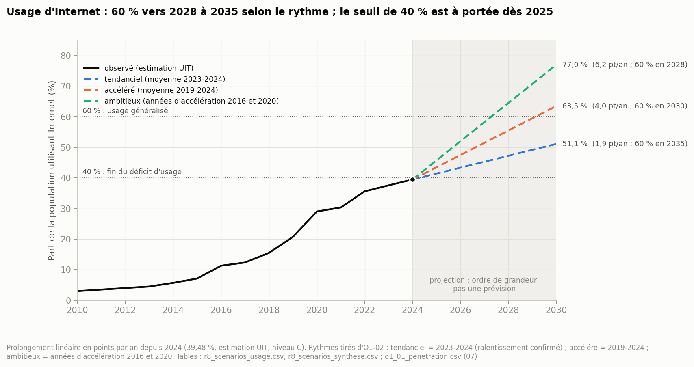

# 10 — Recommandations

*Quoi faire, où, pour combien d'habitants, dans quel ordre : douze recommandations tirées du diagnostic, chacune chiffrée par un indicateur du 02.*

Ce document correspond à l'étape 11 de la procédure, « recommendations & ciblage ». La procédure en attend, pour chaque recommandation, une chaîne **fait → écart → impact → action → priorité** reliée au diagnostic (09), et une **cible chiffrée** : « porter X de a à b ; population concernée : Z habitants ». Il répond aux indicateurs O5-02 (volet Internet), O5-03 (volet inclusion financière) et O5-04 (cibles et suivi) du 02.

**Ce que le 10 ne fait pas** : aucun coût, aucun devis (le coût n'est pas dans les données) ; aucun choix de site précis (P23) ; aucune cause nouvelle. Une cible dit où il faut arriver, pas par quel instrument.

**Reproductible** : `python3 analyse/p10_recommandations.py` puis `python3 analyse/figures_10.py`. Chaque chiffre renvoie à une table de `data/analysis/10_recommandations/` (nom entre crochets). Les règles sont écrites en tête du script, avant le calcul.

**Règles communes** :
1. **Partir du diagnostic** : les dix phrases (09, section 7.1), la nature du déficit (7.3), les leviers possibles (7.5).
2. **Recevabilité (02)** : chaque recommandation cite l'indicateur qui chiffre son écart. Sans indicateur, elle est rejetée (section 9).
3. **Chiffrer la cible, pas le résultat.** La cible est le seuil de la classe supérieure du 02 (O5-04). Un territoire déjà dans la meilleure classe, mais dans le quart le plus mal servi au 08, vise la médiane des préfectures.
4. **Compter en habitants**, jamais en rangs. Les points se comptent comme des lieux, pas comme des agents (A8).
5. **Immédiat ou conditionnel (P16)** : points formels et points mobile money n'attendent pas ; le réseau attend la confirmation de la couverture réelle.
6. **Priorité absolue d'O5-03 (P17)** : les 22 communes « mobile money uniquement », quelle que soit la classe de leur préfecture. Elles ont toutes le même statut : la population départage (règle du 02 à classe égale).
7. **Horizons du 02** : 1, 3 et 5 ans. Leur répartition est une convention (P21).

**Correspondance avec le plan demandé** :

| Ce que l'étape 11 doit faire | Où |
| ---------------------------- | -- |
| Partir des 10 phrases de diagnostic | sections 3 à 5 : chaque recommandation cite la phrase et le déficit du 09 |
| Choisir les leviers par la nature du déficit | accès formel → R1, R2 ; maillage mobile money → R3 ; couverture → R4 ; freins d'usage → R6, R7, R7b ; frais → R5 ; investissement et infrastructures → R8, R9, R10 |
| Chiffrer avec l'indicateur cité | colonne « indicateur » de chaque recommandation ; suivi en section 7 |
| Compter en habitants | colonne « habitants » partout |
| Distinguer immédiat et conditionnel | colonne « nature » ; R4 en deux temps (mesurer, puis étendre) |
| Priorité absolue aux 22 communes | R1, rang 1 de l'ordre d'action |
| Ajouts validés le 27/09/2026 | R7b (équipement), R8 (investissement), R9 (fibre), R10 (sites radio) ; section 8, « Qui agit ? » ; variante d'ordre par isolement (P21) ; Sotouboua dans R4a (P24) |

---

## Sommaire

1. Vue d'ensemble
2. Ordre d'action
3. Inclusion financière (O5-03)
4. Internet (O5-02) : réseau, prix, compétences, équipement
5. Investissement et infrastructures (objectif 2)
6. Scénarios d'usage d'Internet
7. Suivi des cibles (O5-04)
8. Qui agit ?
9. Ce qui n'est pas recommandé
10. Limites et points à valider

---

## 1. Vue d'ensemble

[synthese_recommandations]

| # | Recommandation | Indicateur | Où | Habitants | Nature | Horizon | Cible |
| - | -------------- | ---------- | -- | --------- | ------ | ------- | ----- |
| R1 | Un premier point formel dans chaque commune « mobile money uniquement » | O4-01, O4-05 | 22 communes | 759 599 | immédiate | 1 an | 22 points ; 34 au seuil « tendu » à 3 ans |
| R2 | Des points formels jusqu'au seuil de la classe supérieure | O4-01 | 7 préfectures en priorité 1, 3 non classées | 1 331 015 | immédiate | 3 ans | 38 points, dont 7 apportés par R1 |
| R3 | Des points mobile money là où le maillage est insuffisant ou parmi les plus faibles | O4-04 | 8 préfectures, dont 3 communes au maillage insuffisant | 1 092 725 | immédiate | 3 ans | 633 points pour les préfectures (P22), 9 pour les 3 communes |
| R4a | Mesurer la couverture réelle là où elle est inconnue ou douteuse | O2-06 | 14 communes | 689 181 | immédiate | 1 an | une couverture déterminable dans chaque commune |
| R4b | Étendre le réseau dans les préfectures prioritaires sous 85 % | O2-06, O4-06 | 6 préfectures en priorité 1 | 347 866 hors couverture théorique | **conditionnelle** | 5 ans | 178 873 habitants de plus dans la couverture |
| R5 | Ramener les frais du petit retrait sous le repère de 3 % | O3-06 | national, d'abord là où le mobile money est seul ou dominant | 6 054 427 (74,8 %) | immédiate | 5 ans | retrait de 1 000 FCFA : de 75 à 30 FCFA au plus |
| R6 | Ramener le coût de 1 Go sous 2 % du revenu mensuel | O2-05b | national | 8 095 498 | immédiate | 5 ans | de 5,30 % à 2 % : baisse de 62 % à revenu constant |
| R7 | Relever les compétences numériques dans les régions à frein de capacité | O1-06 | Savanes, Plateaux | 1 509 047 (15 ans et plus) | immédiate | 5 ans | sortir du quartile inférieur |
| R7b | Réduire le frein de coût sur le smartphone | O1-06 (équipement) | national | 1 514 288 adultes citant le coût | immédiate | 5 ans | baisse de la part (32,1 %) ; pas de seuil du 02 |
| R8 | Garder l'investissement au-dessus du seuil de sous-investissement | O2-04 | national | 8 095 498 | veille | chaque année | 15 % du chiffre d'affaires au moins (16,3 % en 2025) |
| R9 | Étendre la fibre aux préfectures non raccordées | O2-07 | 8 préfectures | 738 429 | immédiate | 5 ans | chaque préfecture « raccordée » |
| R10 | Relancer les ajouts nets de sites radio | O2-08 | national, d'abord vers les zones blanches | 8 095 498 | veille | 1 à 3 ans | 50 ajouts nets par an au moins (seuil déclaré) |

- **Les recommandations territoriales fines** (commune, préfecture) portent sur l'inclusion financière (R1 à R3) et sur le réseau (R4). Celles sur l'usage d'Internet sont nationales ou régionales (R6, R7) : l'usage n'est mesuré qu'à la région (08, section 1).
- **R8 et R10 sont des veilles avec déclencheur** : le 02 prévoit une décision si le seuil est franchi (fonds de service universel pour O2-04 ; « gel » constaté pour O2-08).
- **Les cibles ne s'additionnent pas toujours.** R1 (maille communale) et R2 (maille préfectorale) se recoupent : les 7 premiers points de R1 comptent déjà pour R2.

---

## 2. Ordre d'action

| Rang | Quoi | Où | Habitants | Horizon | Nature |
| ---- | ---- | -- | --------- | ------- | ------ |
| 1 | R1 : un premier point formel | les 22 communes « mobile money uniquement », par population décroissante | 759 599 | 1 an | immédiate |
| 1 | R4a : mesurer la couverture réelle | 14 communes, dont Mô, Kpendjal, Tchamba et Sotouboua entières | 689 181 | 1 an | immédiate, préalable au réseau |
| 2 | R2 et R3 : points formels et points mobile money | les 7 préfectures en priorité 1 (ordre du 08 : Dankpen, Est-Mono, Blitta, Oti-Sud, Kéran, Kpendjal-Ouest, Akébou), puis Kpendjal, Mô, Tchamba | 1 331 015 | 3 ans | immédiate |
| 3 | R4b : étendre le réseau | 6 préfectures en priorité 1 sous 85 % de couverture théorique | 347 866 hors couverture | 5 ans | conditionnelle : après R4a |
| 3 | R9 : étendre la fibre | 8 préfectures non raccordées, dans l'ordre du 08 | 738 429 | 5 ans | immédiate |
| 4 | R5, R6, R7, R7b : frais, prix de la data, compétences, équipement | national ; Savanes et Plateaux | national | 5 ans | immédiate, en parallèle |
| 4 | R8, R10 : investissement, sites radio | national | national | chaque année | veille avec déclencheur |

**Pourquoi cet ordre** : le rang 1 applique la priorité absolue d'O5-03 (P17) et lève l'incertitude qui bloque le réseau (P16). Le rang 2 suit le classement du 08, lu en habitants. Le rang 3 attend le rang 1. Le rang 4 est national : il ne dépend d'aucun territoire et se mène en parallèle.

---

## 3. Inclusion financière (O5-03)

### R1 — Un premier point formel dans chaque commune « mobile money uniquement »

| Maillon | Contenu |
| ------- | ------- |
| Fait | 22 communes n'ont aucun point formel (banque, IMF, assurance), toutes rurales ; elles ont 965 points mobile money. Leur guichet le plus proche est à 6,4 à 37,8 km en médiane (09, section 6) |
| Écart | O4-01 « non défini et critique » ; O4-05 « mobile money uniquement » |
| Impact | **759 599 habitants** (9,4 % de la population) |
| Action | un point formel dans chaque commune la première année (22 points) ; puis le seuil « tendu », 30 000 habitants par point au plus, à 3 ans (34 points au total) |
| Priorité | absolue (O5-03, P17), rang 1 ; ordre par population |
| Indicateur de suivi | O4-05 (la commune quitte « mobile money uniquement ») ; O4-01 |

[r1_communes_mobile_money_uniquement]

| Ordre : population (isolement) | Commune | Préfecture (classe du 08) | Habitants | Points mobile money | Guichet le plus proche (médiane) | Couverture (proxy) | Points formels : 1 an / « tendu » / « bien desservi » |
| ------------------------------ | ------- | ------------------------- | --------- | ------------------- | -------------------------------- | ------------------ | ----------------------------------------------------- |
| 1 (11) | Dankpen 3 | Dankpen (priorité 1) | 76 652 | 37 | 12,8 km (Bassar 2) | 65,6 % | 1 / 3 / 8 |
| 2 (13) | Tône 4 | Tône (priorité 2) | 66 577 | 175 | 12,0 km (Tône 1) | 100,0 % | 1 / 3 / 7 |
| 3 (19) | Haho 3 | Haho (priorité 2) | 58 695 | 105 | 9,1 km (Haho 1) | 96,0 % | 1 / 2 / 6 |
| 4 (5) | Kéran 2 | Kéran (priorité 1) | 53 305 | 38 | 18,9 km (Oti-Sud 2) | 1,5 % (cellule critique) | 1 / 2 / 6 |
| 5 (20) | Tône 2 | Tône (priorité 2) | 50 179 | 76 | 9,0 km (Tône 1) | 100,0 % | 1 / 2 / 6 |
| 6 (1) | Kpendjal 1 | Kpendjal (non classée) | 47 903 | 36 | 37,8 km (Kpendjal-Ouest 2) | non déterminable | 1 / 2 / 5 |
| 7 (6) | Blitta 3 | Blitta (priorité 1) | 45 218 | 6 | 17,5 km (Blitta 1) | 9,9 % (cellule critique) | 1 / 2 / 5 |
| 8 (3) | Kpendjal 2 | Kpendjal (non classée) | 40 462 | 5 | 27,2 km (Kpendjal-Ouest 1) | non déterminable | 1 / 2 / 5 |
| 9 (9) | Dankpen 2 | Dankpen (priorité 1) | 32 716 | 31 | 14,3 km (Doufelgou 3) | 47,7 % (cellule critique) | 1 / 2 / 4 |
| 10 (4) | Kéran 3 | Kéran (priorité 1) | 30 983 | 10 | 19,9 km (Kéran 1) | non déterminable | 1 / 2 / 4 |
| 11 (21) | Wawa 3 | Wawa (priorité 2) | 29 699 | 56 | 7,7 km (Akébou 1) | 100,0 % | 1 / 1 / 3 |
| 12 (2) | Akébou 2 | Akébou (priorité 1) | 29 634 | 24 | 30,5 km (Akébou 1) | 27,2 % (cellule critique) | 1 / 1 / 3 |
| 13 (14) | Agou 2 | Agou (priorité 2) | 27 465 | 50 | 11,9 km (Avé 1) | 38,1 % (cellule critique) | 1 / 1 / 3 |
| 14 (8) | Tchaoudjo 2 | Tchaoudjo (priorité 3) | 24 891 | 45 | 15,8 km (Tchaoudjo 1) | 81,0 % | 1 / 1 / 3 |
| 15 (18) | Kozah 3 | Kozah (priorité 3) | 23 755 | 34 | 9,3 km (Kozah 1) | 99,8 % | 1 / 1 / 3 |
| 16 (16) | Kozah 4 | Kozah (priorité 3) | 20 654 | 35 | 11,5 km (Kozah 1) | 100,0 % | 1 / 1 / 3 |
| 17 (12) | Wawa 2 | Wawa (priorité 2) | 20 414 | 16 | 12,3 km (Wawa 1) | 100,0 % | 1 / 1 / 3 |
| 18 (10) | Tchaoudjo 4 | Tchaoudjo (priorité 3) | 20 279 | 33 | 13,9 km (Tchamba 1) | 56,9 % | 1 / 1 / 3 |
| 19 (7) | Tchaoudjo 3 | Tchaoudjo (priorité 3) | 17 484 | 65 | 16,6 km (Tchaoudjo 1) | 99,9 % | 1 / 1 / 2 |
| 20 (17) | Bassar 4 | Bassar (priorité 3) | 16 657 | 29 | 10,3 km (Bassar 3) | 100,0 % | 1 / 1 / 2 |
| 21 (15) | Assoli 3 | Assoli (priorité 3) | 16 044 | 28 | 11,6 km (Assoli 1) | 100,0 % | 1 / 1 / 2 |
| 22 (22) | Assoli 2 | Assoli (priorité 3) | 9 933 | 31 | 6,4 km (Assoli 1) | 100,0 % | 1 / 1 / 1 |
| | **Total** | | **759 599** | 965 | | | **22 / 34 / 87** |

- **Deux situations** (09, section 6) : 8 communes sont isolées (préfectures en priorité 1 ou non classées : guichet à 12,8 à 37,8 km, couverture sous 50 % ou inconnue, sauf Dankpen 3 à 65,6 %) ; les 14 autres ont un guichet à 6,4 à 16,6 km et, sauf Agou 2 (38,1 %), une couverture de 56,9 à 100 %. La priorité est la même ; l'ordre suit la population (règle du 02).
- **Variante par isolement** (P21, validée ; entre parenthèses dans le tableau) : par distance au guichet décroissante, Kpendjal 1 (37,8 km), Akébou 2 (30,5), Kpendjal 2 (27,2), Kéran 3, Kéran 2 et Blitta 3 viennent en tête, toutes dans des préfectures en priorité 1 ou non classées.
- **Le seuil « bien desservi »** (moins de 10 000 habitants par point) demanderait 87 points : c'est une information, pas une cible à 5 ans.
- **Le type de point n'est pas choisi.** Le 02 agrège banques, IMF et assurances ; les données ne disent pas lequel est le plus adapté. La Poste reste hors du compte (Q5), bien que Kpendjal 1 ait un bureau.

### R2 — Des points formels dans les préfectures prioritaires

| Maillon | Contenu |
| ------- | ------- |
| Fait | les 7 préfectures en priorité 1 et les 3 non classées ont de 0 à 12 points formels ; 5 n'ont aucune banque (Est-Mono, Kpendjal-Ouest, Akébou, Kpendjal, Mô) |
| Écart | O4-01 : 6 préfectures « sous-desservies » ou sans point, 4 « tendues » |
| Impact | **1 331 015 habitants** |
| Action | atteindre la classe supérieure : « tendu » (30 000 habitants par point au plus) pour 6 préfectures, « bien desservi » (moins de 10 000) pour 4 : **38 points**, dont 7 apportés par la première année de R1, soit **31 de plus** |
| Priorité | rang 2, dans l'ordre du 08 |
| Indicateur de suivi | O4-01 par préfecture |

[r2_prefectures_points_formels]

| Préfecture | Habitants | Points formels (dont banques) | Habitants par point | Classe O4-01 | Cible | Points à ajouter | dont R1 | Reste après R1 |
| ---------- | --------- | ----------------------------- | ------------------- | ------------ | ----- | ---------------- | ------- | -------------- |
| Dankpen | 185 662 | 6 (2) | 30 944 | sous-desservi | tendu (30 000 ou moins) | 1 | 1 | 0 |
| Est-Mono | 164 460 | 3 (0) | 54 820 | sous-desservi | tendu (30 000 ou moins) | 3 | 0 | 3 |
| Blitta | 163 272 | 10 (3) | 16 327 | tendu | bien desservi (moins de 10 000) | 7 | 1 | 6 |
| Oti-Sud | 150 376 | 5 (1) | 30 075 | sous-desservi | tendu (30 000 ou moins) | 1 | 0 | 1 |
| Kéran | 128 687 | 7 (4) | 18 384 | tendu | bien desservi (moins de 10 000) | 6 | 2 | 4 |
| Kpendjal-Ouest | 123 330 | 3 (0) | 41 110 | sous-desservi | tendu (30 000 ou moins) | 2 | 0 | 2 |
| Akébou | 73 830 | 1 (0) | 73 830 | sous-desservi | tendu (30 000 ou moins) | 2 | 1 | 1 |
| Kpendjal (non classée) | 88 365 | 0 (0) | aucun point | non défini et critique (0 point) | tendu (30 000 ou moins) | 3 | 2 | 1 |
| Mô (non classée) | 52 448 | 2 (0) | 26 224 | tendu | bien desservi (moins de 10 000) | 4 | 0 | 4 |
| Tchamba (non classée) | 200 585 | 12 (1) | 16 715 | tendu | bien desservi (moins de 10 000) | 9 | 0 | 9 |
| **Total** | **1 331 015** | 49 | | | | **38** | 7 | **31** |

- **Kéran** (P16) : ses 6 points n'attendent pas la confirmation de la couverture ; 2 viennent de R1 (Kéran 2 et 3).
- **Tchamba** demande le plus de points (9), parce qu'elle est déjà « tendue » et vise « bien desservi » ; Dankpen et Oti-Sud n'ont besoin que d'un point pour passer « tendues ».

### R3 — Des points mobile money là où le maillage est mince

| Maillon | Contenu |
| ------- | ------- |
| Fait | Blitta a le réseau mobile money le plus mince des préfectures classées (1 814 habitants par point) ; 3 communes dépassent 5 000 habitants par point (Blitta 2, Blitta 3, Kpendjal 2) (09, fiches) |
| Écart | O4-04 : 3 communes « insuffisantes » ; Blitta, Kpendjal et Mô « acceptables » ; Dankpen, Oti-Sud, Kéran, Kpendjal-Ouest et Tchamba « denses » mais dans le quart le plus mal servi |
| Impact | **1 092 725 habitants** (8 préfectures) |
| Action | 9 points pour sortir les 3 communes du maillage insuffisant ; 143 pour que Blitta, Kpendjal et Mô passent « denses » ; 490 pour que les 5 autres atteignent la médiane des préfectures (602 habitants par point) |
| Priorité | rang 2 |
| Indicateur de suivi | O4-04 |

[r3_maillage_mobile_money]

| Territoire | Habitants | Points mobile money | Habitants par point | Classe O4-04 | Cible | Points à ajouter |
| ---------- | --------- | ------------------- | ------------------- | ------------ | ----- | ---------------- |
| Blitta 2 (commune) | 46 515 | 9 | 5 168 | maillage insuffisant | acceptable (5 000 ou moins) | 1 |
| Blitta 3 (commune) | 45 218 | 6 | 7 536 | maillage insuffisant | acceptable (5 000 ou moins) | 4 |
| Kpendjal 2 (commune) | 40 462 | 5 | 8 092 | maillage insuffisant | acceptable (5 000 ou moins) | 4 |
| Dankpen | 185 662 | 190 | 977 | maillage dense | médiane des préfectures (602) | 119 |
| Blitta | 163 272 | 90 | 1 814 | acceptable | dense (moins de 1 000) | 74 |
| Oti-Sud | 150 376 | 159 | 946 | maillage dense | médiane des préfectures (602) | 91 |
| Kéran | 128 687 | 139 | 926 | maillage dense | médiane des préfectures (602) | 75 |
| Kpendjal-Ouest | 123 330 | 129 | 956 | maillage dense | médiane des préfectures (602) | 76 |
| Kpendjal | 88 365 | 41 | 2 155 | acceptable | dense (moins de 1 000) | 48 |
| Mô | 52 448 | 32 | 1 639 | acceptable | dense (moins de 1 000) | 21 |
| Tchamba | 200 585 | 205 | 978 | maillage dense | médiane des préfectures (602) | 129 |

- **Ce sont des points, pas des agents** (A8) : un point peut réunir plusieurs agents ; les opérateurs décident où ils s'installent.
- **Les 490 points de la médiane sont un ordre de grandeur discutable** : ces cinq préfectures sont déjà dans la meilleure classe du 02. C'est le point P22.

### R5 — Des frais de petit retrait sous le repère de 3 %

| Maillon | Contenu |
| ------- | ------- |
| Fait | retirer 1 000 FCFA chez un agent Flooz coûte 75 FCFA (7,5 %), retirer 100 000 FCFA en coûte 1 000 (1,0 %) : la structure est régressive (07, O3-06) |
| Écart | O3-06 : 7,5 %, contre un repère indicatif de 3 % |
| Impact | national ; d'abord les **6 054 427 habitants** (74,8 %) des communes où le mobile money est seul ou dominant (O4-05), où le frais n'a pas d'alternative |
| Action | ramener le frais du retrait de 1 000 FCFA à 30 FCFA au plus (−60 %) ; publier la grille du retrait Mixx, aujourd'hui absente |
| Priorité | rang 4 |
| Indicateur de suivi | O3-06 |

[r5_frais_mobile_money] **Limites** : le repère de 3 % vient de l'ODD 10.c, conçu pour les transferts internationaux ; une seule grille (Flooz) est complète ; les grilles n'ont pas d'historique (instantané du 26/09/2026).

---

## 4. Internet (O5-02)

### R4 — Mesurer la couverture, puis étendre le réseau

| Maillon | Contenu |
| ------- | ------- |
| Fait | la couverture théorique est inconnue dans 3 préfectures (Mô, Kpendjal, Tchamba) et douteuse dans 3 communes ; 6 des 7 préfectures en priorité 1 sont sous 85 % (09) |
| Écart | O2-06 : Kéran en zone blanche (21,4 %) ; 5 en couverture partielle (58,2 à 74,5 %) |
| Impact | 689 181 habitants dans les communes à mesurer ; **347 866 habitants hors couverture théorique** dans les 6 préfectures |
| Action | **R4a, immédiate** : mesurer la couverture réelle dans 14 communes. **R4b, conditionnelle** : atteindre 50 % à Kéran et 85 % ailleurs, soit **178 873 habitants** de plus dans la couverture |
| Priorité | R4a au rang 1 ; R4b au rang 3, après R4a |
| Indicateur de suivi | O2-06 (sur la couverture réelle), O4-06 |

[r4_couverture, r4_communes_a_mesurer]

| Préfecture (classe du 08) | Habitants | Couverture théorique | Classe O2-06 | Cible | Hors couverture théorique | À couvrir pour la cible | Action |
| ------------------------- | --------- | -------------------- | ------------ | ----- | ------------------------- | ----------------------- | ------ |
| Dankpen (priorité 1) | 185 662 | 63,8 % | couverture partielle | 85 % | 67 247 | 39 397 | conditionnelle |
| Est-Mono (priorité 1) | 164 460 | 74,5 % | couverture partielle | 85 % | 41 872 | 17 203 | conditionnelle |
| Oti-Sud (priorité 1) | 150 376 | 58,6 % | couverture partielle | 85 % | 62 271 | 39 714 | conditionnelle |
| Kéran (priorité 1) | 128 687 | 21,4 % | zone blanche | 50 % | 101 199 | 36 856 | conditionnelle |
| Kpendjal-Ouest (priorité 1) | 123 330 | 64,0 % | couverture partielle | 85 % | 44 423 | 25 924 | conditionnelle |
| Akébou (priorité 1) | 73 830 | 58,2 % | couverture partielle | 85 % | 30 854 | 19 779 | conditionnelle |
| Kpendjal (non classée) | 88 365 | inconnue | non déterminable (A13) | mesurer la couverture réelle | — | — | immédiate : mesure |
| Mô (non classée) | 52 448 | inconnue | non déterminable (A13) | mesurer la couverture réelle | — | — | immédiate : mesure |
| Tchamba (non classée) | 200 585 | inconnue | non déterminable (A13) | mesurer la couverture réelle | — | — | immédiate : mesure |
| Sotouboua (priorité 2) | 138 864 | 27,0 % | zone blanche | 50 % | 101 343 | 31 911 | mesure (R4a) ; hors R4b (P24) |

- **Communes à mesurer** (R4a) : Anié 2, Blitta 3, Kéran 2 (valeurs douteuses, P6) ; Kéran 3, Kpendjal 1 et 2, Mô 1 et 2, Sotouboua 2, Tchamba 1, 2 et 3 (non déterminables, A13) ; Sotouboua 1 et 3 (P24 : toute la préfecture).
- **Kéran** (P16) : la zone blanche vient de valeurs douteuses ou inconnues ; l'extension du réseau attend la mesure.
- **Financement possible** : le fonds du service universel finance « la desserte des localités éligibles » (décret n° 2018-070, art. 12). Son montant n'est pas dans les données.
- **Sotouboua** (priorité 2) est aussi en zone blanche (27,0 %, 101 343 habitants hors couverture théorique). P24 (validé) : elle est mesurée (R4a), mais reste hors de l'extension (R4b) tant qu'elle n'est pas prioritaire.
- **Limite** : couverture théorique toutes technologies ; ni la 3G ni la 4G ne sont mesurées par territoire (A17).

### R6 — Un coût de 1 Go sous 2 % du revenu

| Maillon | Contenu |
| ------- | ------- |
| Fait | 1 Go de data mobile coûte 5,30 % du revenu mensuel moyen en 2025 (5,85 % en 2023) ; le Findex cite le coût parmi les freins (07, O2-05b, O1-06) |
| Écart | 3,3 points au-dessus du seuil d'accessibilité de 2 % |
| Impact | national, 8 095 498 habitants ; frein de coût présumé dans toutes les régions où la règle d'O1-06 s'applique |
| Action | ramener le coût à 2 % : **baisse de 62 %** du prix de 1 Go à revenu constant |
| Priorité | rang 4 |
| Indicateur de suivi | O2-05b |

[r6_cout_data] **Au rythme 2023-2025** (−0,275 point par an), le seuil serait atteint vers **2037**. Pour l'atteindre en 2030, il faudrait −0,66 point par an, **2,4 fois** le rythme actuel. **Limite** : trois points de série seulement ; revenu moyen par habitant (UIT), pas revenu médian.

### R7 — Des compétences numériques dans les Savanes et les Plateaux

| Maillon | Contenu |
| ------- | ------- |
| Fait | les Savanes ont l'accès à Internet le plus faible (14,3 %) et l'alphabétisation la plus faible (41,2 %, +2,1 points depuis 2018/19) ; les Plateaux ont les compétences TIC les plus faibles avec les Savanes (09, section 5) |
| Écart | O1-06 : quartile inférieur, donc frein de capacité présumé |
| Impact | **1 509 047 habitants de 15 ans et plus** (Savanes 591 519, Plateaux 917 528) |
| Action | sortir du quartile inférieur : alphabétisation au-dessus de 62,05 % dans les Savanes ; compétences TIC au-dessus de 1,3 % (femmes) et 5,3 % (hommes) dans les deux régions |
| Priorité | rang 4 |
| Indicateur de suivi | O1-06 |

[r7_competences]

| Région | Alphabétisation (seuil 62,05 %) | Compétences TIC, femmes (seuil 1,3 %) | Compétences TIC, hommes (seuil 5,3 %) |
| ------ | ------------------------------ | ------------------------------------- | ------------------------------------- |
| Savanes | 41,2 % : **20,9 points d'écart** | 0,4 % | 4,1 % |
| Plateaux | 68,8 % : pas de frein | 1,0 % | 4,0 % |

- **La cible d'alphabétisation des Savanes est hors d'atteinte au rythme observé** : +0,7 point par an en moyenne entre 2018/19 et 2021/22, soit une trentaine d'années pour combler 20,9 points. La cible est juste ; l'horizon de 5 ans ne l'est pas.
- **Limites** : alphabétisation = proxy de compétence ; compétences TIC de 2017, 15-49 ans ; seuils calculés sur les régions (07, O1-06).

### R7b — Réduire le frein de coût sur le smartphone

| Maillon | Contenu |
| ------- | ------- |
| Fait | 45,1 % des adultes ont un smartphone comme téléphone principal ; 32,1 % des adultes citent le coût comme raison de ne pas en avoir (Findex 2024 ; 07, O1-06) |
| Écart | O1-06, composante équipement : frein de coût présumé. La règle du quartile inférieur ne s'applique pas : la mesure est nationale |
| Impact | **1 514 288 adultes** citent le coût (32,1 % des 4 721 820 adultes de 15 ans et plus : ordre de grandeur) |
| Action | faire baisser la part des adultes privés de smartphone par son coût |
| Priorité | rang 4 |
| Indicateur de suivi | O1-06, équipement (prochain Findex) |

[r7b_equipement] **Pas de seuil du 02** : la cible est une tendance, pas un seuil de classe (P27). R6 et R7b relèvent du même frein de coût (O1-06) : l'un porte sur la data, l'autre sur le terminal. **Limites** : Findex (niveau C), adultes de 15 ans et plus, national seulement.

---

## 5. Investissement et infrastructures (objectif 2)

Les indicateurs d'investissement du 02 sont nationaux (O2-04, O2-08) ou préfectoraux (O2-07). Ils ne désignent pas de commune ; ils fixent deux seuils de veille et une cible d'extension de la fibre.

### R8 — Garder l'investissement au-dessus du seuil de sous-investissement

| Maillon | Contenu |
| ------- | ------- |
| Fait | l'investissement des opérateurs passe de 36,9 % du chiffre d'affaires en 2018 à 32,1 % en 2023, puis 19,3 % en 2024 et 16,3 % en 2025 (07, O2-04) |
| Écart | O2-04 : « régime normal » (15 à 25 %), à 1,3 point du seuil de sous-investissement (15 %) |
| Impact | national |
| Action | veille annuelle ; si le taux passe sous 15 %, appliquer la décision prévue par le 02 : un mécanisme de financement. **Il existe déjà** : le fonds du service universel (décret n° 2018-070), géré par l'ARCEP et alimenté par les contributions des opérateurs. Il s'agit de le mobiliser, pas de le créer |
| Priorité | rang 4, veille avec déclencheur |
| Indicateur de suivi | O2-04 |

[r8_investissement] Si la baisse de 2024-2025 (−3,0 points) se répétait, le taux serait de 13,3 % en 2026, sous le seuil. Mais la série est cyclique (20,1 % en 2020, 32,1 % en 2023) : c'est une alerte, pas une prévision. **Limite** : investissement de l'ensemble du secteur, sans répartition territoriale.

### R9 — Étendre la fibre aux 8 préfectures non raccordées

| Maillon | Contenu |
| ------- | ------- |
| Fait | 8 préfectures sur 39 n'ont aucune fibre recensée, ni enterrée ni aérienne (3i, 2021/2022) |
| Écart | O2-07 : « non raccordées » au sens du 02 |
| Impact | **738 429 habitants** |
| Action | étendre le réseau de transport vers ces préfectures, comme le prévoit la décision du 02 ; cible : chaque préfecture « raccordée » |
| Priorité | rang 3 ; dans l'ordre du 08 (tableau ci-dessous) |
| Indicateur de suivi | O2-07 |

[r9_fibre_non_raccordees]

| Préfecture | Région | Classe du 08 | Habitants |
| ---------- | ------ | ------------ | --------- |
| Kpendjal-Ouest | Savanes | priorité 1 | 123 330 |
| Akébou | Plateaux | priorité 1 | 73 830 |
| Kpendjal | Savanes | non classée | 88 365 |
| Mô | Centrale | non classée | 52 448 |
| Yoto | Maritime hors Grand Lomé | priorité 2 | 174 851 |
| Bas-Mono | Maritime hors Grand Lomé | priorité 2 | 94 860 |
| Moyen-Mono | Plateaux | priorité 2 | 90 505 |
| Danyi | Plateaux | priorité 3 | 40 240 |
| **Total** | | | **738 429** |

- **4 des 8 sont parmi les 10 préfectures du diagnostic** (Kpendjal-Ouest, Akébou, Kpendjal, Mô).
- **La cible est la classe du 02, pas une longueur** : le 02 ne fixe aucun seuil en kilomètres. « Raccordée » veut dire qu'une fibre est recensée dans la préfecture ; ce n'est ni un raccordement d'abonnés ni une mesure de débit.
- **Réseau de transport et fibre d'accès ne s'additionnent pas** (02) : R9 porte sur le transport ; les abonnements FTTH (1,74 pour 100 habitants, 07) sont une autre mesure.

### R10 — Relancer les ajouts nets de sites radio

| Maillon | Contenu |
| ------- | ------- |
| Fait | 1 840 sites en 2025 ; ajouts nets de 215 (2022), 114 (2023), 84 (2024), puis 21 (2025) ; YAS perd un site en 2025 (07, O2-08, rapport d'activité 2025 de l'ARCEP) |
| Écart | O2-08 : le 02 lit un « gel » quand les ajouts nets sont proches de 0 deux ans de suite. Seuil déclaré : moins de 50 par an, la moitié de la médiane 2022-2025 (99) (P26). 2025 est la première année sous ce seuil |
| Impact | national ; l'extension du réseau dans les zones blanches (R4b) en dépend |
| Action | veille : revenir au-dessus de 50 ajouts nets par an ; si 2026 reste sous 50, le « gel » au sens du 02 est constaté. Orienter les nouveaux sites vers les zones blanches (décision du 02) |
| Priorité | rang 4, veille avec déclencheur ; lien avec R4b |
| Indicateur de suivi | O2-08 |

[r10_sites_radio] **Limites** : un site multi-technologies compte une fois ; national seulement ; l'emplacement des sites n'est pas public (couche des tours privée) : on ne peut pas vérifier que les nouveaux sites vont vers les zones blanches.

---

## 6. Scénarios d'usage d'Internet

*Figure 1 [r8_scenarios_usage, r8_scenarios_synthese].*

La procédure demande un scénario prospectif chiffré, étiqueté « ordre de grandeur, pas un devis ». L'usage d'Internet (O1-01) est prolongé depuis 2024 (39,48 %, estimation de l'UIT) à trois rythmes tirés d'O1-02, fixés avant le calcul :

| Scénario | Rythme | En 2030 | Classe du 02 en 2030 | 60 % atteint en |
| -------- | ------ | ------- | -------------------- | --------------- |
| Tendanciel : moyenne 2023-2024 (ralentissement confirmé) | +1,9 point par an | 51,1 % | rattrapage | 2035 |
| Accéléré : moyenne 2019-2024 | +4,0 points par an | 63,5 % | usage généralisé | 2030 |
| Ambitieux : moyenne des années d'accélération (2016, 2020) | +6,2 points par an | 77,0 % | usage généralisé | 2028 |

- **Le seuil de 40 % est à portée dès 2025 dans les trois scénarios** : le Togo sort du « déficit d'usage » au sens du 02, sur une série estimée.
- **L'usage généralisé (60 %) arrive entre 2028 et 2035** selon le rythme. Au rythme actuel, il faut attendre 2035.
- **Ce que les scénarios ne disent pas** : quel levier produit quel rythme. Les événements d'O1-02 sont des coïncidences, pas des causes (D-16). R4, R6, R7, R7b, R9 et R10 visent à sortir du rythme tendanciel ; aucune donnée ne chiffre leur effet.

---

## 7. Suivi des cibles (O5-04)

Base = dernier millésime ; cible = seuil de la classe supérieure du 02 ; succès = franchissement du seuil. Suivi annuel.

| Indicateur | Territoire | Base (millésime) | Cible | Horizon | Succès |
| ---------- | ---------- | ---------------- | ----- | ------- | ------ |
| O4-05, O4-01 | 22 communes « mobile money uniquement » | aucun point formel (2021/2022) | au moins 1 point formel | 1 an | la commune quitte « mobile money uniquement » |
| O4-01 | mêmes communes | aucun point formel | 30 000 habitants par point au plus (34 points) | 3 ans | commune « tendue » |
| O4-01 | 10 préfectures prioritaires | de 16 327 à 73 830 habitants par point ; Kpendjal : aucun point | « tendu » pour 6, « bien desservi » pour 4 (38 points) | 3 ans | franchissement du seuil de la préfecture |
| O4-04 | Blitta 2, Blitta 3, Kpendjal 2 | de 5 168 à 8 092 habitants par point | 5 000 au plus | 3 ans | commune « acceptable » |
| O4-04 | Blitta, Kpendjal, Mô | de 1 639 à 2 155 | moins de 1 000 | 3 ans | préfecture « dense » |
| O4-04 | Dankpen, Oti-Sud, Kéran, Kpendjal-Ouest, Tchamba | de 926 à 978 | 602 (médiane, P22) | 3 ans | médiane atteinte |
| O2-06 | 14 communes | inconnue ou douteuse | couverture mesurée | 1 an | valeur déterminable |
| O2-06, O4-06 | 6 préfectures en priorité 1 | de 21,4 à 74,5 % (théorique, 2021/2022) | 50 % (Kéran), 85 % (les autres) | 5 ans | franchissement, sur la couverture réelle |
| O3-06 | national | 7,5 % pour un retrait de 1 000 FCFA (grille du 26/09/2026) | 3 % au plus | 5 ans | frais de 30 FCFA au plus |
| O2-05b | national | 5,30 % du revenu mensuel (2025) | 2 % au plus | 5 ans | seuil d'accessibilité franchi |
| O1-06 | Savanes, Plateaux | alphabétisation 41,2 % (Savanes, 2021/22) ; compétences TIC 0,4 à 4,1 % (2017) | au-dessus du quartile inférieur | 5 ans | sortie du quartile inférieur |
| O1-06 (équipement) | national | 32,1 % des adultes sans smartphone pour raison de coût (Findex 2024) | baisse (pas de seuil du 02, P27) | 5 ans | baisse mesurée au Findex suivant |
| O2-04 | national | 16,3 % du chiffre d'affaires (2025) | 15 % au moins | chaque année | rester au-dessus du seuil de sous-investissement |
| O2-07 | 8 préfectures | aucune fibre recensée (3i, 2021/2022) | « raccordée » | 5 ans | fibre recensée dans la préfecture |
| O2-08 | national | 21 ajouts nets (2025) | 50 au moins par an (seuil déclaré, P26) | 1 à 3 ans | pas deux années de suite sous le seuil |
| O1-01 | national (résultat attendu, pas un levier) | 39,48 % (2024, estimation) | 40 %, puis 60 % | 2025 ; 2028 à 2035 | changement de classe |

---

## 8. Qui agit ?

Chaque recommandation est associée aux acteurs qui peuvent la porter. Les rôles ont été **confirmés le 27/09/2026 sur des sources publiques** (P28 ; journal de recherche, section 18). La colonne « fondement » dit d'où vient chaque rôle : données du projet ou texte officiel.

| Recommandation | Acteur principal | Acteurs associés | Fondement |
| -------------- | ---------------- | ---------------- | --------- |
| R1, R2 : points formels | banques, IMF, assurances | supervision : Commission bancaire de l'UMOA et BCEAO (banques) ; ministère chargé des finances (cellule CAS-IMEC), BCEAO et Commission bancaire (IMF) ; CRCA et Direction nationale des assurances (assurances) | données : établissements recensés (O3-01) ; supervision : BCEAO, loi n° 2011-009 sur les systèmes financiers décentralisés, Code CIMA |
| R3 : points mobile money | émetteurs de monnaie électronique : Moov Africa (Flooz), YAS Togo (Mixx) | leurs réseaux d'agents | données : points par opérateur (06, carte 10) |
| R4a : mesurer la couverture | ARCEP | opérateurs | données : centre de supervision des réseaux mobiles de l'ARCEP, mis en service en juin 2021 (chronologie) |
| R4b : étendre le réseau | opérateurs (Moov Africa, YAS Togo) | ministère chargé des communications électroniques (licences) ; ARCEP, qui gère le fonds du service universel | données : licences 4G par arrêtés (2018), sites par opérateur (O2-08) ; décret n° 2018-070 : le fonds finance « la desserte des localités éligibles » (art. 12) |
| R5 : frais du mobile money | émetteurs : Moov Africa (Flooz), YAS Togo (Mixx) | BCEAO, qui agrée les émetteurs et fixe leurs conditions d'exercice | données : grilles publiées (O3-06) ; BCEAO, instruction n° 008-05-2015. Aucun plafond de frais n'a été trouvé : les grilles restent fixées par les émetteurs |
| R6 : prix de la data | ARCEP | opérateurs | données : décisions tarifaires de l'ARCEP (plafonds USSD, 2020 ; principes tarifaires, 011/2021 ; offres de gros, 003/2025) |
| R7 : compétences numériques | ministère chargé du numérique | ministères de l'éducation | stratégie « Togo Digital » 2025-2030 en révision (2025) ; rôle des collectivités non documenté, retiré |
| R7b : équipement | opérateurs | ministère chargé du numérique | aucun texte trouvé sur un dispositif d'équipement : rôle général |
| R8 : investissement | ministère chargé des communications électroniques (ordonnateur du fonds) | ARCEP (gestion du fonds) ; opérateurs (contributeurs) | 02 (décision d'O2-04) ; décret n° 2018-070, art. 10 à 16 |
| R9 : fibre | Société d'infrastructures numériques (SIN, société d'État) | CSquared Woezon (SIN 44 %, CSquared 56 %), qui déploie le réseau national ; ARCEP (offres de gros, 003/2025) | décret n° 2016-166 (création de la SIN) ; décret de janvier 2021 sur la pose de fibre dans les travaux de génie civil ; presse et site de la SIN (niveau C) |
| R10 : sites radio | opérateurs (Moov Africa, YAS Togo) | ARCEP, qui publie le décompte des sites | données : rapport d'activité 2025 de l'ARCEP (O2-08) |

**Ce qui reste hors des données** : les budgets, les montants du fonds du service universel, et le rôle des collectivités. Ce tableau dit qui peut agir, pas qui doit payer.

---

## 9. Ce qui n'est pas recommandé

[non_retenues]

| Piste | Statut | Raison |
| ----- | ------ | ------ |
| Interopérabilité ou concurrence (Mô : 50 % des points Togocom seul) | rejetée comme recommandation (P19) | aucun indicateur du 02 ne la chiffre ; gardée comme constat |
| Usage du mobile money dans la Centrale (19,9 %) | non retenue en l'état | cause non établie (06, H3) : ni l'offre ni l'accès à Internet n'y sont faibles |
| Sensibilisation, demande d'Internet | non retenue | aucun indicateur du 02 ne mesure la demande ; l'écart d'accès (O1-05) est traité par ses freins (R6, R7, R7b) |
| Leviers tirés des événements d'O1-02 | rejetée | coïncidences, pas des causes (D-16) |
| Choix des sites parmi les lieux candidats (marchés, écoles, centres de santé) | non faite | aucune population sous la commune : le gain d'un site en habitants ne peut pas être calculé (P23) |

---

## 10. Limites et points à valider

**Limites** :
- **Pas de coût** : les cibles sont des volumes (points, habitants, points de pourcentage), pas des budgets.
- **Des points, pas des agents** (A8) ; un stock de 2021/2022 ; population RGPH 2022.
- **Couverture théorique** (niveau C) : R4b n'est engagée qu'après R4a.
- **Maille** : R5, R6, R7b, R8 et R10 sont nationales ; R7 est régionale ; R9 est préfectorale ; rien ne descend sous la commune.
- **DAB et assurances** : R2 les agrège avec les banques et les IMF, comme le 02 ; le tableau de bord les distinguera (un seul DAB dans les 10 préfectures du diagnostic ; assurances absentes de 105 communes).
- **Acteurs** : rôles confirmés sur des sources publiques (section 8) ; les montants du fonds du service universel et les budgets ne sont pas dans les données.
- **Scénarios** : prolongements linéaires d'une série estimée ; ordre de grandeur.
- **Accès n'est pas usage** : le tableau de bord distinguera « Accès déclaré à Internet » (EHCVM) et « Usage d'Internet, toute fréquence » (Afrobaromètre) (V7 du 04).

**Points à valider** :

| # | Question | Proposition | Objectif concerné |
| - | -------- | ----------- | ----------------- |
| P21 | Répartition des horizons du 02 (1, 3, 5 ans) et ordre des 22 communes | Convention : 1 an pour le premier point formel et la mesure de la couverture ; 3 ans pour les seuils des préfectures ; 5 ans pour le réseau et les leviers nationaux. Ordre par population, variante par isolement affichée à côté. **Validé (27/09/2026)** | 4, 5 |
| P22 | R3 : 5 préfectures déjà « denses » visent la médiane (602 habitants par point), soit 490 points | Médiane gardée comme ordre de grandeur, séparée des 152 points qui franchissent un seuil du 02. **Validé (27/09/2026)** | 4, 5 |
| P23 | Optimisation de localisation sur les lieux candidats | Pas d'optimisation : sans population sous la commune, le gain d'un site n'est pas mesurable. Variante possible, à déclarer comme écart si elle est demandée. **Validé (27/09/2026)** | 4, 5 |
| P24 | Sotouboua, en priorité 2, est en zone blanche (27,0 %) | Ajoutée à R4a (toute la préfecture), hors de R4b tant qu'elle n'est pas prioritaire. **Validé (27/09/2026)** | 2, 5 |
| P25 | Suite | Passer à l'étape 12 après les ajouts (R7b, R8, R9, R10, section 8). **Validé (27/09/2026), ajouts faits** | 5 |
| P26 | R10 : le 02 ne chiffre pas « proche de 0 » pour les sites radio ; il demande de recalibrer sur la série | Seuil déclaré de 50 ajouts nets par an (la moitié de la médiane 2022-2025), fixé après lecture de la série, comme le 02 le prévoit ; affiché comme écart déclaré. **Validé (27/09/2026)** | 2, 5 |
| P27 | R7b : aucun seuil du 02 pour l'équipement national | Suivi en tendance (baisse de 32,1 % au Findex suivant), sans seuil de classe ; ne pas inventer de cible chiffrée. **Validé (27/09/2026)** | 1, 5 |
| P28 | Section 8 : une partie des acteurs vient du cadre institutionnel, pas des données | Garder la colonne « fondement » ; faire confirmer les rôles marqués « à confirmer » avant le tableau de bord. **Validé (27/09/2026), fait** : rôles confirmés sur sources publiques ; le rôle des collectivités, non documenté, est retiré | 5 |
| P29 | Suite | Passer à l'étape 12 (tableau de bord) : les notes du 07 (section 6), les douze recommandations, le suivi (section 7) et les acteurs (section 8). **Validé (27/09/2026)** | 5 |
